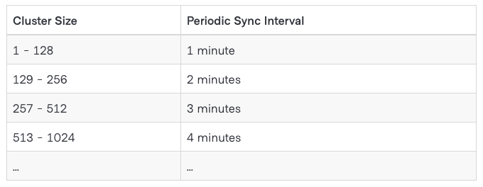

# 反熵

## 组件

### 代理（Agent）

每个Consul Agent都维护一个服务和注册检查以及健康信息的集合。agent主要负责本身的健康检查以及更新他们本地的状态。

代理的服务和检查都有一个配置的富集合。这是因为代理会生成它的服务和他们的健康检查的信息。

### 目录（Catalog）

Consul的服务发现是通过一个服务目录实现。目录通过汇总代理提交的信息。目录维护了集群的健康信息等。目录使用Consul提供的借口输出这些信息包括DNS和HTTP。

只有服务节点才会维护目录。

## 反熵

反熵策略用于维护集群状态的秩序。Consul区分全局服务目录和本地代理状态。反熵机制实现代理状态和全局目录之间的同步。如：当一个用户通过代理注册一个新服务或检查，代理通知目录这个新的检查，同样的从代理中删除一个检查，也需要从目录中删除。

反熵同样用于更新可用信息。当代理运行他们的代理检查时，他们的状态可能因为同步目录而改变。

在同步时，目录同样会检查正确性。如果有服务或者检查在目录中存在而代理没有。它就会移除该信息，保证正确反应代理的信息。

### 定期同步

反熵和代理运行一样有常驻进程定期同步状态，保证了目录和代理的状态保持一致。为了避免饱和，反熵执行周期根据集群的数量变化。

反熵机制可能会因为以下情况失败。如：配置错误、I/O问题、网络问题。

### 允许标签重写

服务注册的同步可以被部分修改从而允许外部的代理修改服务的标签。在外部监控服务作为标签信息的真实来源的情况下非常游泳。如：Redis和Redis哨兵。哨兵服务决定哪个Redis实例作为主节点。
