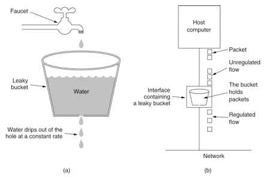
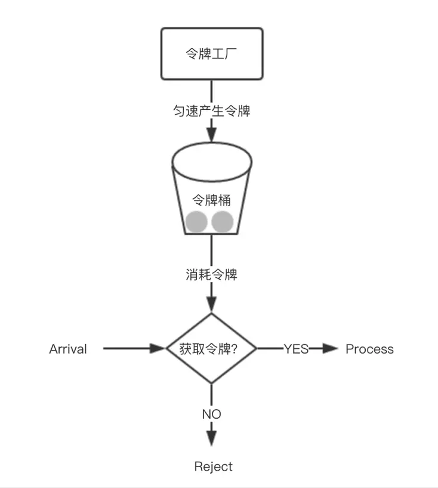

常见的限流算法有：计数器、漏桶、令牌桶。

## 计数器算法

采用计数器实现限流有点简单粗暴，一般我们会限制一秒钟的能够通过的请求书，比如限流qps为100，算法的实现思路就是从第一个请求进来开始计时，在接下去的1s内，每来一个请求，就把计数加1，如果累加的数字达到了100，那么后续的请求就会呗全部拒绝。等到1s结束后，把计数回复成0，重新开始计数。

## 漏桶算法

为了消除“突刺现象”，可以采用漏桶算法实现限流。算法内部有一个容器，类似生活用到的漏斗，当请求进来时，相当于水倒入漏斗，然后从下端小口慢慢匀速的流出。不管上面流量多大，下面流出的速度始终保持不变。
不管服务调用方多么不稳定，通过漏桶算法进行限流，每10毫秒处理一次请求。因为处理的速度是固定的，请求进来的速度是未知的，可能突然进来很多请求，没来得及处理的请求就先放在桶里，既然是个桶，肯定是有容量上线，如果桶满了，那么新进来的请求就丢弃。

算法实现方面，可以准备一个队列，用来保存请求，另外通过一个线程池定期从队列中获取请求并执行，可以一次性获取多个并发执行。

## 令牌桶算法

在令牌桶算法中，存在一个桶，用来存放固定数量的令牌。算法中存在一种机制，以一定的塑料往令牌桶中放令牌。每次请求调用需要先获取令牌，只有拿到令牌，才有机会继续执行，否则选择等待可用的令牌、或者直接拒绝。
放令牌这个动作是持续不断的进行，如果桶中令牌数达到上限就对其令牌，所以就存在这种情况，桶中一直有大量的可用令牌，这是进来的请求就可以直接拿到令牌执行，比如设置qps为100，那么限流器初始化完成一秒后，桶中就已经有100个令牌了，这时服务还没完全启动好，等启动完成堆外提供服务时，该限流器可以抵挡瞬时的100个请求。

