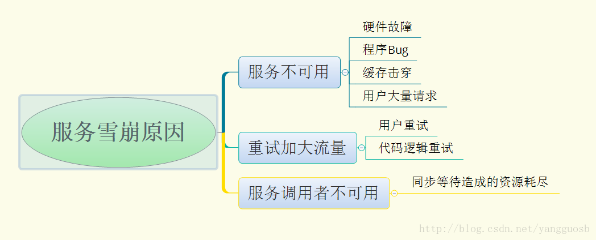
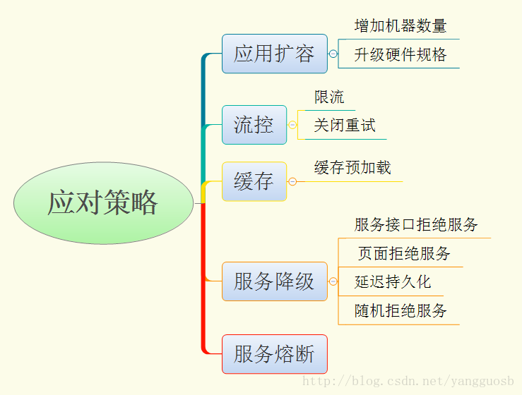

## 定义

服务血本效应是一种因“服务提供者的不可用”导致“服务调用者不可用”，并将不可用逐渐放大的现象。

### 形成原因

服务雪崩的过程可以分为三个阶段：

1. 服务提供者不可用；
2. 重试加大请求流量；
3. 服务调用者不可用；

### 产生雪崩的几种场景

1. 流量激增：比如异常流量、用户重试导致系统负载升高；
1. 缓存刷新：假设A为client端，B为Server端，假设A系统请求都流向B系统，请求超出了B系统的承载能离，就会造成B系统崩溃；
1. 程序有Bug：代码循环调用的逻辑问题，资源未释放引起的内存泄露等问题；
1. 硬件故障：比如宕机，机房断电，光纤呗挖断等。
1. 线程同步等待：系统间经常采用同步服务调用模式，核心服务和非核心服务共用一个线程和消息队列。如果一个核心业务线程调用非核心线程，这个非核心线程交友第三方系统完成，当第三方系统本身出现问题，导致核心线程阻塞，一直处于等待状态，而进程间的调用是有超时限制的，最终这条线程将断掉，也可能引发雪崩；

### 应对策略	

