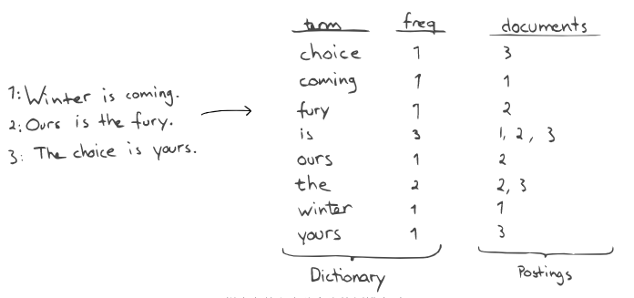

# 倒排索引

反向索引将词映射到包含该词的文档（可能还有文档中的位置）。由于字典中的词已排序，因此我们可以快速找到一个词，然后在postings-structure中找到它。这与“正向索引”相反，后者列出了与特定文档有关的词。

然后，通过查找所有词及其出现项，并使用多个出现项的交集（对于AND搜索）或并集（对于OR搜索）进行简单搜索，即可得到结果文档列表。更复杂的查询类型显然更加复杂，但是方法是相同的：首先，对字典进行操作以找到候选词，然后对相应的出现项，位置等进行操作。

因此，索引词是搜索的单位。我们生成的词决定了我们可以（和不能）有效地进行哪些类型的搜索。例如，使用上图中的字典，我们可以有效地找到所有以“ c” 开头的词。但是，我们无法有效地搜索包含 “我们的”的所有内容。为此，我们必须遍历所有词，以发现“您的”还包含子字符串。当索引比较大的时候，这是非常昂贵的。就复杂性而言，按其前缀查找词是O(log(n))，而通过任意子字符串查找条件是O(n).

换句话说，我们可以有效地找到给定词prefix的事物。当我们只有倒排索引时，我们希望所有内容看起来都像字符串前缀问题。以下是此类转换的一些示例。有些简单，最后一个与魔术接壤。

- 要查找以“ tastic” 结尾的所有内容，我们可以为反向索引（例如“ fantastic”→“ citsatnaf”）并搜索以“ citsat”开头的所有内容。
- 查找子字符串通常涉及将词分成称为“ n-gram”的较小词。例如，“yours”可以分为“^yo”，“you”，“our”，“urs”，“rs$”，这意味着我们可以通过搜索“ours”和“urs”。
- 对于带有复合词的语言，例如挪威语和德语，我们需要将“Donaudampfschiff”等词“分解”为例如{“donau”，“dampf”，“schiff”}，以便在搜索“ schiff”时找到它。
- 地理坐标点（例如（60.6384，6.5017））可以转换为“地理哈希”，在这种情况下为“u4u8gyykk”。字符串越长，精度越高。
- 为了启用语音匹配，这对于人们的姓名非常有用，例如，Metaphone这样的算法会将“ Smith”转换为{“SM0”，“XMT”}，将“Schmidt”转换为{“XMT”，“SMT”}。
- 当处理数字数据（以及时间戳）时，Lucene会以类似于trie的方式自动生成具有不同精度的多个项，因此可以高效地进行范围搜索。简化后，数字123可以存储为“1”-百，“12”-十和“123”。因此，搜索范围为[100，199]的所有内容就是匹配“1”百项的所有内容。当然，这与搜索以“1”开头的所有内容不同，因为搜索内容中还包括“1234”，依此类推。
- 搜索“Did you mean？”并找到与输入内容接近的拼写，可以构建“Levenshtein”自动机以有效遍历字典。

## 创建索引

在建立倒排索引时，我们需要确定一些优先事项：搜索速度，索引紧凑性，索引速度以及修改生效时间。

搜索速度和索引紧凑性相关：在较小的索引上进行搜索时，需要处理的数据较少，并且更多的数据将适合内存。正如我们将看到的，两者（特别是紧凑性）都以索引速度为代价。

为了最小化索引大小，使用了各种压缩技术。例如，在存储postings时（可能会变得很大），Lucene会使用可变数量的字节（例如，可以用一个字节保存少量数字）来完成诸如增量编码（例如，[42, 100, 666]存储为[42, 58, 566]）之类的技巧。

保持数据结构小巧紧凑意味着牺牲了有效更新数据的可能性。实际上，Lucene根本不会更新它们：Lucene写入的索引文件是不可变的，即它们永远不会更新。例如，这与B树完全不同，后者可以进行更新，并且通常可以让您指定填充因子以指示您期望进行多少更新。

例外是删除。当您从索引中删除文档时，该文档会在一个特殊的删除文件中被标记为此类文件，实际上这只是一个位图，更新成本很低。索引结构本身不会更新。

因此，更新先前索引的文档是删除操作，然后重新插入该文档。请注意，这意味着更新文档比添加文档还要昂贵。因此，将诸如快速变化的计数器之类的内容存储在Lucene索引中通常不是一个好主意。

当添加新文档时（可能通过更新），索引更改首先存储在内存中。最终，索引文件将全部刷新到磁盘。请注意，这是“刷新”的Lucene含义。Elasticsearch的刷新操作涉及Lucene提交以及其他事务，在事务日志部分中进行了介绍。

刷新的时间取决于多种因素：修改生效时间，可用于缓冲的内存，I/O等。通常，对于索引速度，较大的缓冲区要好一些，只要它们足够小以使I/O可以跟上。

写入的文件构成一个索引段。

## 索引段

Lucene索引由一个或多个不变的索引段组成，该索引段本质上是“迷你索引”。当您进行搜索时，Lucene会在每个细分上进行搜索，过滤掉所有删除内容，然后合并所有细分中的结果。显然，随着细分市场数量的增加，这变得越来越乏味。为了保持段的数量管理，Lucene在添加新索引段的时候根据合并索引段。Lucene-hacker Michael McCandless在一篇出色的文章中对段合并进行了解释和可视化。当段合并时，标记为已删除的文档最终将被丢弃。这就是为什么添加更多文档实际上可以减小索引大小的原因：它可以触发合并。

当合并段时，Elasticsearch和Lucene通常会很好地处理。可以通过配置合并设置来调整Elasticsearch的策略。您还可以使用optimize API强制合并。

在将段刷新到磁盘之前，修改会保存在内存中。在过去（Lucene <2.3），每个添加的文档实际上都作为其自己的小片段存在，并且所有文档都在刷新时合并。如今，有一个DocumentsWriter可以从一批文档中分割出更大的内存段。使用Lucene 4，每个线程现在可以有一个，通过允许并发刷新来提高索引性能。（以前，索引编制必须等待刷新完成。）

创建新段时（由于刷新或合并），它们还会导致某些缓存无效，这可能会对搜索性能产生负面影响。诸如字段和过滤器缓存之类的缓存是按段划分的。Elasticsearch具有一个 warmer-API，因此可以在使新段可用于搜索之前“预热”必要的缓存。

使用Elasticsearch进行刷新的最常见原因可能是连续刷新索引，默认情况下每秒刷新一次。当刷新新段时，它们可用于搜索，从而启用（近）实时搜索。尽管刷新不像提交那样昂贵（因为它不需要等待已确认的写入），但确实会导致创建新的段，使某些缓存无效并可能触发合并。

当索引吞吐量很重要时（例如，批量重建索引时），花费大量时间冲洗和合并小片段并不是很有效。因此，在这些情况下，暂时增加refresh_interval-setting甚至完全禁用自动刷新通常是一个好主意。总是可以手动刷新和/或在完成索引后刷新。

## Elasticsearch索引

Elasticsearch索引由一个或多个shards组成，这些shards可以具有零个或多个副本。这些都是单独的Lucene索引。也就是说，Elasticsearch索引由许多Lucene索引组成，而Lucene索引又由索引段组成。当您搜索Elasticsearch索引时，搜索将在所有shards（然后依次是所有段）上执行并合并。当搜索多个Elasticsearch索引时，情况也是如此。实际上，搜索每个具有一个shard的两个Elasticsearch索引与搜索具有两个shards的索引几乎相同。在这两种情况下，都将搜索两个底层Lucene索引。

从本文的这一点开始，当我们单独引用“索引”时，是指Elasticsearch索引。

“shard”是Elasticsearch的基本缩放单位。将文档添加到索引后，它会路由到sharp。默认情况下，这是基于文档id的哈希以轮询方式完成的。在本系列的第二部分中，我们将进一步研究碎片如何移动。但是，重要的是要知道，sharp的数量是在索引创建时指定的，以后不能更改。谢伊（Shay）早期在Elasticsearch上的演讲很好地介绍了为什么sharp实际上是完整的Lucene索引，以及与其他方法相比的各种好处和折衷。

可以通过多种方式自定义哪些Elasticsearch索引以及将搜索请求发送到哪些sharp（和副本）。通过组合索引模式，索引别名以及文档和搜索路由，可以实现许多不同的分区和数据流策略。我们在这里不做介绍，但是我们可以推荐Zachary Tong的有关定制文档路由的文章和Shay Banon关于大数据，搜索和分析的演示。为了给您一些想法，下面是一些示例：

- 许多数据是基于时间的，例如日志，推文等。通过每天（或每周，每月，…）创建索引，我们可以有效地将搜索限制在特定时间范围内-并删除旧数据。请记住，我们不能高效地从现有索引中删除，但是删除整个索引很快。
- 当必须将搜索限制为某个用户时（例如“search your messages”），将该用户的所有文档路由到同一sharp以减少必须搜索的索引数可能很有用。

## 事务

尽管Lucene有事务的概念，但是Elasticsearch却没有。Elasticsearch中的所有操作都添加到同一时间轴，由于刷新依赖于时序，因此在节点之间不一定完全一致。

在分布式系统中跨节点的索引之间管理不同段、缓存等的隔离和可见性非常困难。与其尝试这样做，不如说它是快速的。

Elasticsearch有一个“事务日志”，该日志中附加了要建立索引的文档。追加到日志文件比构建段便宜很多，因此，Elasticsearch可以将文档写入索引以在持久的位置进行索引-除了内存缓冲区外，该缓冲区在崩溃时会丢失。您还可以指定索引时所需的一致性级别。例如，您可以要求每个副本在索引操作返回之前已对文档建立索引。

## 总结

总而言之，当涉及到Lucene如何在单个节点上构建，更新和搜索索引时，这些是要意识到的重要属性：

- 我们如何处理索引的文本决定了我们如何进行搜索。正确的文本分析很重要。
- 首先在内存中建立索引，然后偶尔将其分段刷新到磁盘。
- 索引段是不可变的。删除的文档被标记为原样。
- 索引由多个段组成。在每个段上进行搜索，并合并结果。
- 段偶尔会合并。
- 字段和过滤器缓存按段划分。
- Elasticsearch没有交易。
