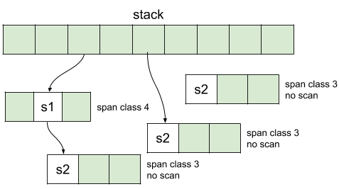
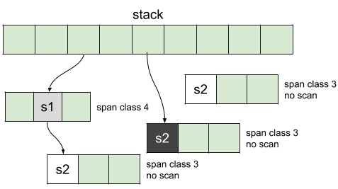
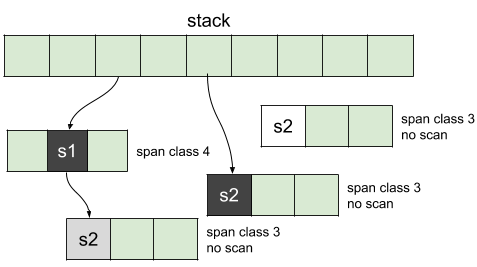
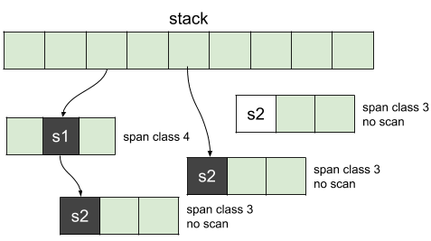
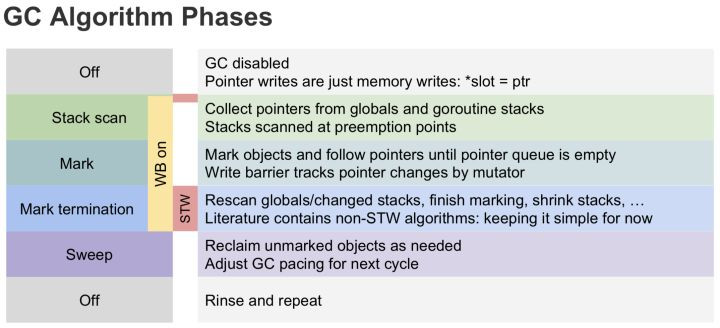

# gc

## 三色标记法

The garbage collector uses a tri-color algorithm that works as follows:
all objects are considered white at the beginning
the root objects (stacks, heap, global variables) will be colored in grey
Once this primary step is done, the garbage collector will:
pic a grey object, color it as black
follow all the pointers from this object and color all referenced objects in grey
Then, it will repeat those two steps until there are no more objects to color. From this point, the objects are either black or white. The white set represents objects that are not referenced by any other object and ready to be collected.

### 例子



As a first state, all objects are considered white. Then, the objects are traversed and the ones reachable will turn grey. If an object is in a span marked as no scan, it can be painted in black since it does not need to be scanned:



Grey objects are now enqueued to be scanned and turn black:



The same thing happens for the objects enqueue until there are no more objects to process:



At the end of the process, black objects are the ones in-use in memory when white objects are the ones to be collected. As we can see, since the instance of struct2 has been created in an anonymous function and is not reachable from the stack, it stays white and can be cleaned.

The colors are internally implemented thanks to a bitmap attribute in each span called gcmarkBits that traces the scan with setting to 1 the corresponding bit:


color implementation with a bitmap

As we can see, the black and the grey color works the same way. The difference in the process is that the grey color enqueues an object to be scanned when black objects end the chain.
The garbage finally stops the world, flushes the changes made on each write barrier to the work pool and performs the remaining marking.

## 版本变化

- 1.3以前的版本使用标记-清扫的方式，整个过程都需要STW。
- 1.3版本分离了标记和清扫的操作，标记过程STW，清扫过程并发执行。
- 1.5版本在标记过程中使用三色标记法。回收过程主要有四个阶段，其中，标记和清扫都并发执行的，但标记阶段的前后需要STW一定时间来做GC的准备工作和栈的re-scan。

    - Sweep Termination: 收集根对象，清扫上一轮未清扫完的span，启用写屏障和辅助GC，辅助GC是将一定量的标记和清扫工作交给用户goroutine来执行，写屏障在后面会详细说明。
    - Mark: 扫描所有根对象和根对象可以到达的对象，并标记它们
    - Mark Termination: 完成标记工作，重新扫描部分根对象(要求STW)，关闭写屏障和辅助GC
    - Sweep: 按标记结果清扫对象
- 1.8版本引入了混合写屏障机制（hybrid write barrier），避免了对栈re-scan的过程，极大的减少了STW的时间。

## 触发时机

- gcTriggerAlways: 强制触发GC，没找到什么情况下使用这个
- gcTriggerHeap: 当前分配的内存达到一定值（动态计算）就触发GC
- gcTriggerTime: 当一定时间（2分钟）没有执行过GC就触发GC
- gcTriggerCycle: 要求启动新一轮的GC, 已启动则跳过, 手动触发GC的runtime.GC()会使用这个条件

## 屏障技术

当回收器满足下面两种情况之一时，即可保证不会出现对象丢失问题。

弱三色不变式：所有被黑色对象引用的白色对象都处于灰色保护状态（直接或间接从灰色对象可达）。 强三色不变式：不存在黑色对象到白色对象的指针。

强三色不变式很好理解，强制性的不允许黑色对象引用白色对象即可。而弱三色不变式中，黑色对象可以引用白色对象，但是这个白色对象仍然存在其他灰色对象对它的引用，或者可达它的链路上游存在灰色对象。

三色抽象除了可以用于描述对象的状态的，还可用来描述赋值器的状态，如果一个赋值器已经被回收器扫描完成，则认为它是黑色的赋值器，如果尚未扫描过或者还需要重新扫描，则认为它是灰色的赋值器。

在强三色不变式中，黑色赋值器只存在到黑色对象或灰色对象的指针，因为此时所有黑色对象到白色对象的引用都是被禁止的。 在弱三色不变式中，黑色赋值器允许存在到白色对象的指针，但这个白色对象是被保护的。

上述这些可以通过屏障技术来保证。

### 根节点

是一个有限的指针集合，程序可不经过其他对象直接访问这些指针，堆中的对象被加载时，需要先加载根中的指针。在Go中，一般为goroutine自己的栈空间和全局栈空间。

### 插入屏障

插入屏障拦截将白色指针插入黑色对象的操作，标记其对应对象为灰色状态，这样就不存在黑色对象引用白色对象的情况了，满足强三色不变式，如上图例中，在插入指针f时将C对象标记为灰色。Go1.5版本使用的Dijkstra写屏障就是这个原理，伪代码如下：

```
writePointer(slot, ptr):
    shade(ptr)
    *slot = ptr
```

在Golang中，对栈上指针的写入添加写屏障的成本很高，所以Go选择仅对堆上的指针插入增加写屏障，这样就会出现在扫描结束后，栈上仍存在引用白色对象的情况，这时的栈是灰色的，不满足三色不变式，所以需要对栈进行重新扫描使其变黑，完成剩余对象的标记，这个过程需要STW。这期间会将所有goroutine挂起，当有大量应用程序时，时间可能会达到10～100ms。

### 删除屏障

删除屏障也是拦截写操作的，但是是通过保护灰色对象到白色对象的路径不会断来实现的。如上图例中，在删除指针e时将对象C标记为灰色，这样C下游的所有白色对象，即使会被黑色对象引用，最终也还是会被扫描标记的，满足了弱三色不变式。这种方式的回收精度低，一个对象即使被删除了最后一个指向它的指针也依旧可以活过这一轮，在下一轮GC中被清理掉。Yuasa屏障伪代码如下：

```
writePointer(slot, ptr):
    if (isGery(slot) || isWhite(slot))
        shade(*slot)
    *slot = ptr
```

在这种实现方式中，回收器悲观的认为所有被删除的对象都可能会被黑色对象引用。

需要在标记开始前stw，扫描整个堆栈，保存初始快照。在标记过程中删除栈对堆的引用时不触发删除写屏障，然后被删除对象再被引用，但是被删除对象就会丢失，所以需要在开始前记录初始快照，保证这个被删除对象以及下游对象不会丢失。

### 混合写屏障

插入屏障和删除屏障各有优缺点

- Dijkstra的插入写屏障在标记开始时无需STW，可直接开始，并发进行，但结束时需要STW来重新扫描栈，标记栈上引用的白色对象的存活；
- Yuasa的删除写屏障则需要在GC开始时STW扫描堆栈来记录初始快照，这个过程会保护开始时刻的所有存活对象，但结束时无需STW。

Go1.8版本引入的混合写屏障结合了Yuasa的删除写屏障和Dijkstra的插入写屏障，结合了两者的优点，伪代码如下：

```
writePointer(slot, ptr):
    shade(*slot)
    if current stack is grey:
        shade(ptr)
    *slot = ptr
```

这里使用了两个shade操作，shade(*slot)是删除写屏障的变形，例如，一个堆上的灰色对象B，引用白色对象C，在GC并发运行的过程中，如果栈已扫描置黑，而赋值器将指向C的唯一指针从B中删除，并让栈上其他对象引用它，这时，写屏障会在删除指向白色对象C的指针的时候就将C对象置灰，就可以保护下来了，且它下游的所有对象都处于被保护状态。 如果对象B在栈上，引用堆上的白色对象C，将其引用关系删除，且新增一个黑色对象到对象C的引用，那么就需要通过shade(ptr)来保护了，在指针插入黑色对象时会触发对对象C的置灰操作。如果栈已经被扫描过了，那么栈上引用的对象都是灰色或受灰色保护的白色对象了，所以就没有必要再进行这步操作。

Golang中的混合写屏障满足的是变形的弱三色不变式，同样允许黑色对象引用白色对象，白色对象处于灰色保护状态，但是只由堆上的灰色对象保护。由于结合了Yuasa的删除写屏障和Dijkstra的插入写屏障的优点，只需要在开始时并发扫描各个goroutine的栈，使其变黑并一直保持，这个过程不需要STW，而标记结束后，因为栈在扫描后始终是黑色的，也无需再进行re-scan操作了，减少了STW的时间。

## 引用

1. [Golang GC算法](https://www.jianshu.com/p/a5b84b16a6c9)
1. [Go: How Does the Garbage Collector Mark the Memory?](https://medium.com/a-journey-with-go/go-how-does-the-garbage-collector-mark-the-memory-72cfc12c6976)
1. [Golang垃圾回收 屏障技术](https://zhuanlan.zhihu.com/p/74853110)
