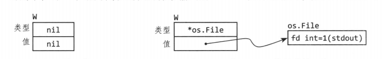
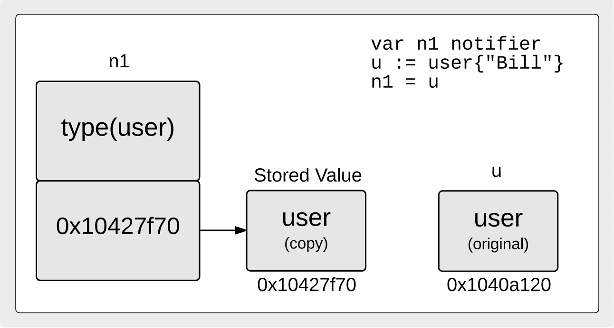
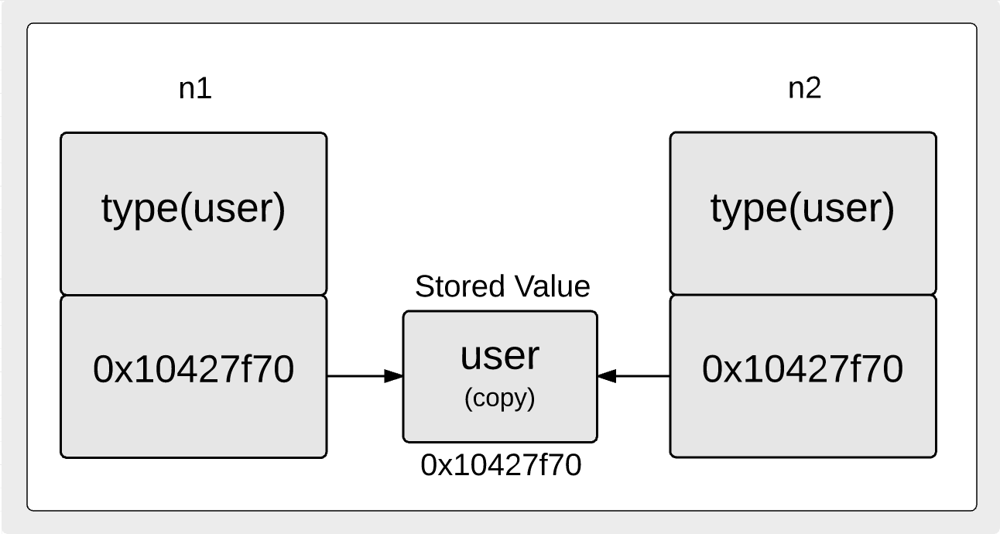

# Interface

#### 可取代性（substitutability）

可以把一种类型替换为满足同一接口的另一种类型的特性。

#### 接口值

一个接口类型的值有两个部分：一个具体类型和该类型的一个值。称为接口的**动态类型**和**动态值**。

接口的零值就是把它的动态类型的值都设置为nil。

一个接口值是否是nil取决于它的动态类型，所以现在是一个nil的接口值。

## 接口值复制

```
package main

import (
    "fmt"
    "unsafe"
)

// notifier provides support for notifying events.
type notifier interface {
    notify()
}

// user represents a user in the system.
type user struct{
    name string
}

// notify implements the notifier interface.
func (u user) notify() {
    fmt.Println("Alert", u.name)
}

// inspect allows us to look at the value stored
// inside the interface value.
func inspect(n *notifier, u *user) {
    Word := uintptr(unsafe.Pointer(n)) + uintptr(unsafe.Sizeof(&u))
    value := (**user)(unsafe.Pointer(word))
    fmt.Printf("Addr User: %p  Word Value: %p  Ptr Value: %v\n", u, *value, **value)
}

func main() {
    // Create a notifier interface and concrete type value.
    var n1 notifier
    u := user{"bill"}

    // Store a copy of the user value inside the notifier
    // interface value.
    n1 = u

    // We see the interface has its own copy.
    // Addr User: 0x1040a120  Word Value: 0x10427f70  Ptr Value: {bill}
    inspect(&n1, &u)

    // Make a copy of the interface value.
    n2 := n1

    // We see the interface is sharing the same value stored in
    // the n1 interface value.
    // Addr User: 0x1040a120  Word Value: 0x10427f70  Ptr Value: {bill}
    inspect(&n2, &u)

    // Store a copy of the user address value inside the
    // notifier interface value.
    n1 = &u

    // We see the interface is sharing the u variables value
    // directly. There is no copy.
    // Addr User: 0x1040a120  Word Value: 0x1040a120  Ptr Value: {bill}
    inspect(&n1, &u)
}
```

当我们将 user 的值分配给该接口之后，这个接口内部结构是什么样的。



当接口值被拷贝后，这两个接口值的内部构造。



## 引用

1. [Go 中接口值的复制](https://www.jishuwen.com/d/2JNP)
