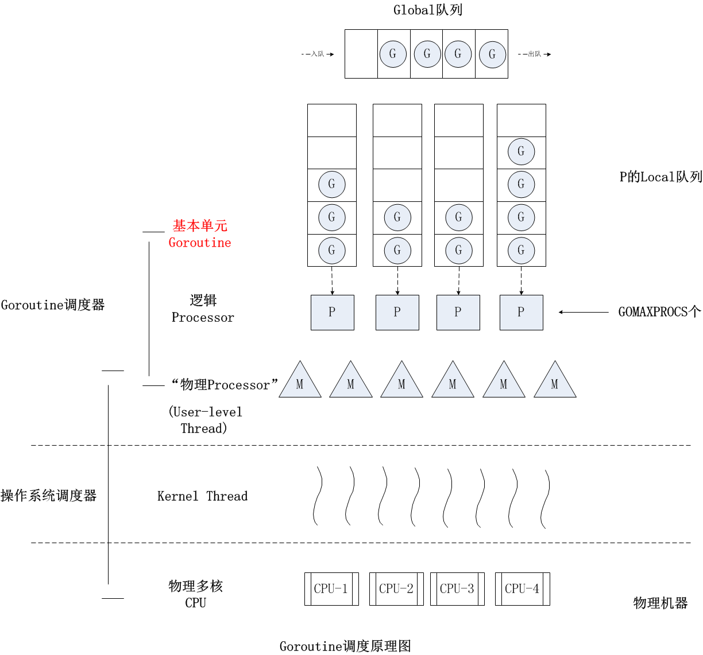
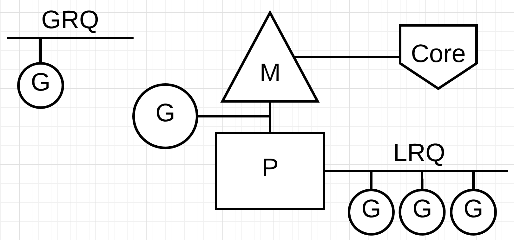

# scheduler

## 调度

### 系统调度器

- 三个状态：Waiting Runnable Executing。
- 抢占式调度，无法预测线程的执行顺序（按时间片调度线程）。
- 线程被切换出去的情况：
- 执行阻塞操作，如：IO请求。

### Goroutine调度器

- 演化过程
- 12年Go1.0中，只是用G-M模型，goroutine对应runtime中的结构G，系统线程对应结构M。

这个结构存在一些问题

- 单一全局互斥锁，创建、调度都需要上锁。
- M之间传递G导致延时增大和性能损耗。
- M缓存太大导致内存占用大，数据局部性较差。
- 因为系统调用造成的阻塞会导致额外的性能损耗。
- G-P-M模型，GO1.1中实现了G-P-M模型和work stealing算法，沿用至今。（拆分出一个P，其思想应该是和Memory Allocator一样的，是为了降低锁的粒度，以及调度的级别。）



- 抢占调度，原理是在每个函数或方法的入口加上额外的代码，让runtime有机会检查是否需要执行抢占式调度。G也可以被抢占，程序运行时会创建一个sysmon线程，这个线程检查到G运行太久（>10ms）就会向这个G发出抢占调度。
- sysmon（系统监控线程）
- 释放闲置超过5分钟的span物理内存；
- 如果超过2分钟没有垃圾回收，强制执行；
- 将长时间未处理的netpoll结果添加到任务队列；
- 向长时间运行的G任务发出抢占调度（监控协程找到长时间执行的go协程，实现类似时间片轮转）；
- 收回因syscall长时间阻塞的P；

```
runtime.schedule() {
    // only 1/61 of the time, check the global runnable queue for a G.
    // if not found, check the local queue.
    // if not found,
    //     try to steal from other Ps.
    //     if not, check the global runnable queue.
    //     if not found, poll network.
}
```

#### 当 g 执行遇到阻塞时

1. 系统调度引起阻塞：

如系统GC，M会解绑P，出让控制权给其他M，让该P维护的G运行队列不至于阻塞。

2. 用户态的阻塞：

当goroutine因为管道操作或者系统IO、网络IO而阻塞时，对应的G会被放置到某个等待队列，该G的状态由运行时变为等待状态，而M会跳过该G尝试获取并执行下一个G，如果此时没有可运行的G供M运行，那么M将解绑P，并进入休眠状态；当阻塞的G被另一端的G2唤醒时，如管道通知，G又被标记为可运行状态，**尝试加入G2所在P局部队列的队头**，然后再是G全局队列。

3. 当存在空闲的P时，窃取其他队列的G：

当P维护的局部队列全部运行完毕，它会尝试在全局队列获取G，直到全局队列为空，再向其他局部队列窃取一般的G。

### 基本概念：

- M，系统线程，为runtime2.go中的type m。保存了锁、mcache、阻塞状态等。
- P，Logical Processer，为runtime2.go中的type p。保存了G队列、cache、mcache、锁、gc状态等。
- G，表示goroutine，为rumtime2.go中的type g。保存执行栈信息、状态（gc状态、抢占、调度状态等）、锁、任务函数等。
- 调度器组件图：



## 个人理解

网上大多数博客都把M比作机器、P比作线程这样去理解。我觉得从编码角度去看会比较好理解。
- 首先在程序运行起来后用M这个结构体保存锁、mcache等数据。
- 让后用一个P结构体来批量保存G。
- G里面保存了我们写的各种函数。
- 一开始是没有P，用M直接管理G会出现许多问题：
- M需要保存大量的G状态。
- G在不同的M之间切换导致大量的缓存（也就是保存的状态）以及锁的开销。
- 为了降低锁的粒度，以及提高缓存的利用率，在M和G之间加了一个P。M调度G的时候直接调用相应的P。P保存了G运行的上下文。每个P保存了一个G队列，所以G在P之间切换比较少见，只有在进行（stealing schedule）这样特殊时候才会发生。

## 泄露

1. 向未初始化或者已经关闭的 channel 写入数据。
1. 向未初始化或者已经关闭的 channel 读数据。
1. 死循环。