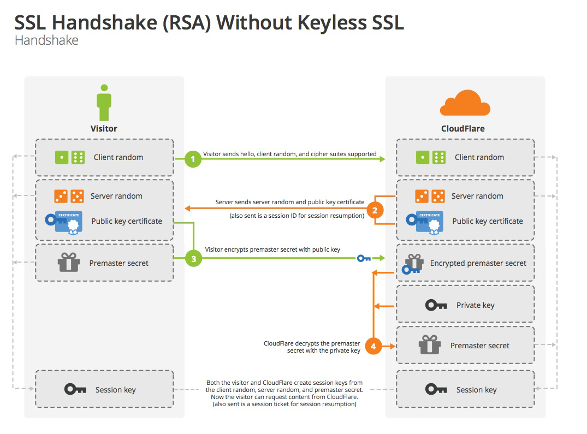
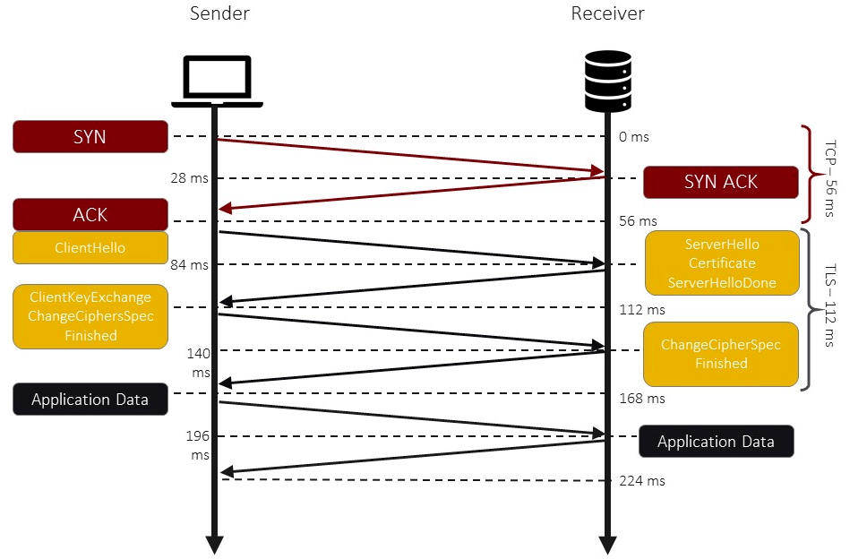

# SSL Handshake

1. 客户端发起请求，带上客户端随机数，协议版本，支持的加密方法。
1. 服务端返回选择的加密方法，服务端随机数，ca证书。
1. 客户端验证证书，获取服务端公钥，生成随机数，使用公钥加密随机数发给服务端。
1. 服务端使用私钥获取客户端加密的随机数。
1. 客户端和服务端使用三个随机数生成对称加密的密钥加密后续的对话。

## CA证书的作用

保证公钥是服务端给出的。

## CA证书如何保证公钥是服务端给出的

建立在客户端信任CA证书机构的基础上，浏览器内置CA证书的根证书。服务端的证书是由CA认证机构用私钥加密的。只要CA认证机构私钥不泄露，那么CA证书就无法伪造。

## HTTPS连接建立过程

