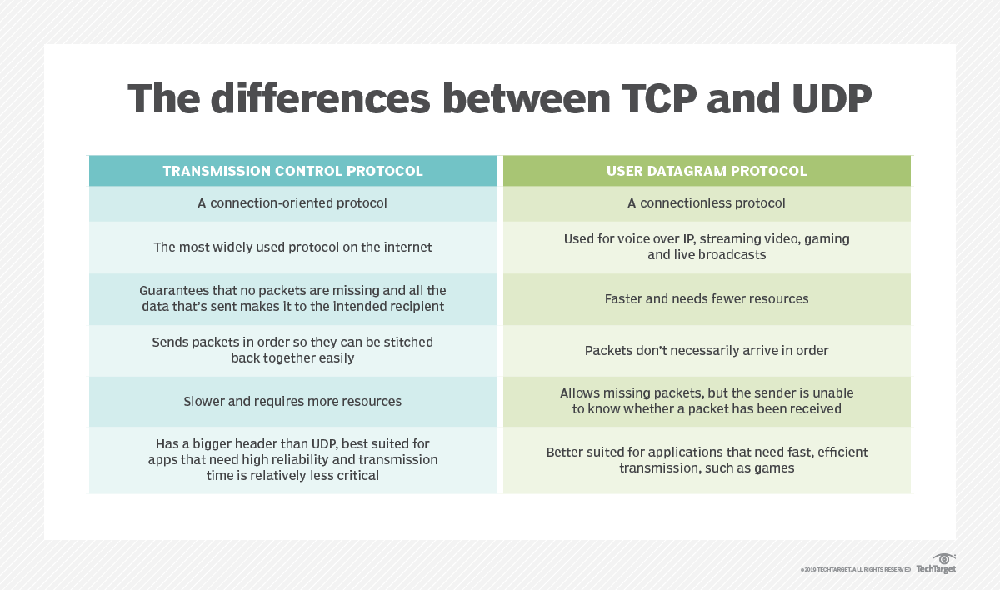

### UDP and TCP
UDP (User Datagram Protocol) is an alternative comminications protocol to Transmission Control Protocol (TCP) used primarily for establishing low-latency and loss-tolerating connections between applications on the internet.

Both UDP and TCP run on top of the Internet Protocol (IP) and are sometimes referred to as UDP/IP or TCP/IP. But there are important differences between the two.

Where UDP enables process-to-process cominication, TCP supports host-to-host comminication. TCP sends individual packets and is considered a reliable transport medium; UDP sends messages, called datagrams, and is considered a best-effort mode of communications.

In addition, where TCP provides error and flow control, no such mechanisms are supported in UDP. UDP is considered a connectionledd protocol because it doesn`t require a virtual circuit be established before any data transfer occurs.

UDP provides two services not procided by the IP layer. It provides port numbers to help distinguish different user requests and, optionally, a checksum capability to verfy that the data arrived intact.

TCP has emerged as the dominant protocol used for the bulk of internet connectivity due to its ability to break large data sets into individual packets, check for and resend lost packets, and reassemble packets in the correct sequence. But these additional services come at a cost in terms of additional data overhead and delays called latency.

In contrast, UDP just sends the packets, which means that it has much lower bandwidth overhead and latency. With UDP, packets may take different paths between sender and receiver and, as a result, some packets may be lost or received out of order.

### User Datagram Protocol features

The User datagram protocol has attributes that make it advantageous for use with applications that can tolerate lost data.

- It allows packets to be dropped and received in a different order than they were transmitted, making it suitable for real-time applications where latency might be a concern.
- It can be used for transaction-based protocols, such as DNS or Network Time Protocol (NTP).
- It can be used where a large number of clients are connected and where real-time error correction isn`t necessary, such as gaming, coive or video conferencing and straming media.

### UDP header composition

UDP uses headers as part of packaging message data to transfer over network connections. UDP headers contain a set of parameters called fields defined by the technical specifications of the protocol.

The User Datagram Protocol header has four fields, each of which is 2 bytes. They are:
- <strong>source port number</strong>, which is number of the sender;
- <strong>destination port number</strong>, the port the datagram is addressed to;
- <strong>length</strong>, the length in bytes of the UDP header and any encapsulated data;
- <strong>checksum</strong>, which is used in error checking. its use is required in IPv6 and optional in IPv4.

### How UDP works

UDP uses the Internet Protocol to get a datagram (data unit) from one computer to another. UDP works by encapsulating data in a UDP packet and adding its own header information to the packet. This data consists of the source and destination ports to communicate on, the packet length and a checksum. After UDP packets are encapsulated in an Internet Protocol packet, they`re sent off to their destinations.

Unlike TCP, UDP doesn't guarantee that the packets will get to the right destinations. That means that UDP does't connect to the receiving computer directly as TCP does. Rather, it sends the data out and relies on the devices in between the sending and receiving computers to get the data where it's supposed to go correctlly.

Most applications that use UDP just wait for any replies that are expected as a result of packets sent via UDP. If an application doesn't receive a reply within a certain timeframe, the application sends the packet again or it stops trying.

UDP uses a simple transmission model that doesn't include handshaking dialogues to provide reliability, ordering or data integrity. Consequently, UDP's service is unreliable and packets may arrive out of order, appear to have duplicates or disappear without warning.

Although this transmission method doesn't guarantee that the data being sent will ever even reach its destination, it does have a very low overhead and it's popular for services that don't absolutely have to word the first time.

### Applications of UDP

UDP can be used in applications that require lossless data transmission when the application is configured to manage the process of retransmitting lost packets and correctly arranging reveived packets. This approach can help to improve the data transfer rate of large files compared to TCP.

In the Open Systems Interconnection (OSI) comminication model, UDP, like TCP, is in Layer 4, the transport layer. UDP works in conjunction with higher level protocols to help manage data transmission services, including Trivial File Transfer Protocol (TFTP), Real Time Straming Protocol (RTSP), Simple Network Protocol (SNP) and domain name system (DNS) lookups.

UDP is an ideal protocol for network applications in which perceived latency is critical, such as in gaming and voice and video comminications, which can sugger som data loss without adversely affecting perceived quality. In som cases, forward error correction techniques are used to improve audio and video quality. In some cases, forward error connection techniques are used to improve audio and video quality in spite of some loss.

UDP can also be used for applications that depend on the reliable exchange of information but should have their own methods to answer packets. There services are advantageous because they're not bound to fixed patterns to guarantee the completeness and correctness of the data packets sent. Users can decide how and when to respond to information that's not correct or sorted.

UDP can also be used for multicasting because it supports packet switching. In addition, UDP is used for some routing update protocols, such as the Routing Information Protocol (RIP). UDP can be used in applications where speed rather than reliability is critical. For instance, it might be prudent to use UDP in an application sending data from a fast acquisition where it's OK to lose some data points.

### TCP vs UDP

TCP and UDP are part of the TCP/IP protocol suite, which includes a number of protocols for carrying out network communications.

UDP characteristics
- is a connectionless protocol
- is used for VoIP, video streaming, gaming and live broadcasts
- it's faster and needs fewer resources
- the packets don't necessarily arrive in order
- it allows missing packets. The sender is unable to know whether a packet has been received
- better suited for applications that need fast, efficient transmission, such as games.

TCP characteristics
- is a connection-oriented protocol
- it's the most widely used protocol on the Internet
- it guarantees that no packets are missing and all the data that's sent makes it to the intended recipient
- sends packets in order so thwy can be stitched back together easily.
- it's slower and requires more resources
- has abigger header than UDP
- best suited for apps that need high reliability, and transmission time is relatively less critical.