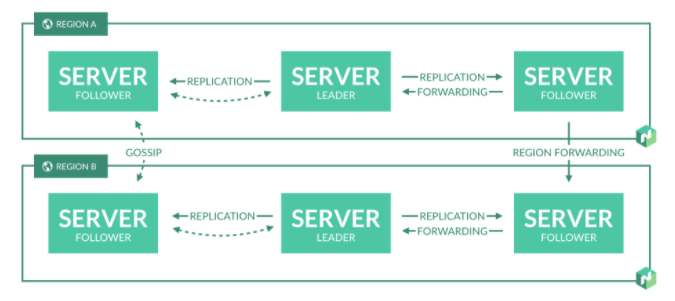

# 架构

## 关键概念

- Job
    Job是一个规范提供给用户表明一个Nomad的工作负载。Job是一组状态。用户希望Job运行起来，但不会说运行到哪一步。Nomad的作用就是保证运行的状态符合用户想要的状态。Job由一个或多个任务组成。
- Task Group
    任务组是必须一起运行的任务的集合。如：一个web服务可能需要一个日志传送进程。任务组必须在相同的客户端节点上运行。
- Driver
    驱动器表示Task执行的基本单元。如：Docker、Qemu、Java、静态二进制文件等。
- Task
    Task是Nomad中最小的运行单元。Task在驱动器上运行。Task制定它的Driver，并制定配置、约束、资源等。
- Client
    Client是Task所运行的机器。所有机器运行Nomad代理。代理负责注册服务，监控已分配的工作以及执行任务。代理是一个常驻进程与服务交互。
- Allocation
    Allocation是一个job的任务组和一个Client节点的映射。一个Job可能拥有多个task group，也就是说要有大量的allocation用于映射client机器的工作。Allocation用于Nomad服务作为调度决策的一部分。
- Evaluation
    Evaluation是Nomad用于调度决策的机制。当期望状态或者实际状态改变时，Nomad就会创造一个新的Evaluation决定是否进行下一步操作。
- Server
    Nomad服务是集群的大脑。集群的Server管理所有的Job和Client，进行评估、创建任务Allocation。Server互相进行备份、主节点选举等保证了高可用。
- Regions and Datacenters
    Reqion和Datacenter作为Nomad模型基础。Regions可能包含多个Datacenter。服务被分配到一个指定的Region。
- Bin Packing
    Bin Packing是一种装箱的过程。Nomad通过有效地安排Task到Client机器上实现资源优化。

## 高级概览

一个Region的架构图

在Region内，同时存在Client和Server。Server主要负责从用户那接收任务，管理Client，以及计算任务执行。

多个Region可以放到同一个集群中。

Region彼此之间是完全独立的，不分享Job、Client以及状态等。通过通信协议实现松耦合。请求会被引导到合适的服务进行处理。

一个Region中的Server都是一个共识组中的一部分。这意味着他们会通过选举leader实现协同。leader负责处理查询以及转换。

每个Region都希望有3或者4个Server。这是可用性和性能之间的平衡，因为共识性会因为server增多而变慢。不过每个region的client数目是没有限制。

client同过RPC调用和server通信实现注册、心跳保活、等待新allocation以及状态更新等。

用户使用Nomad的CLI或者API提交job到server上。job表示一个期望的状态以及提供一系列task。server主要用于调度task。
