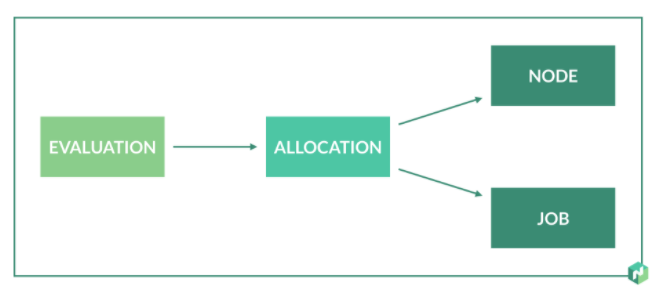
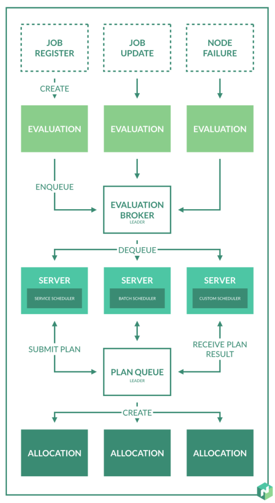

# 调度

调度是Nomad的核心功能。它是从job分配task到client过程的机制。

## Nomad中的调度



job是task在一定约束和资源限制下运行的一种描述。task可以被调度到运行Nomad客户端的集群节点上。使用allocation实现job中的task对客户端的映射关系，表示job中的task应该在哪一个节点上运行。

当外部状态变化时调度器就会进行评估。当提交job、更新job、重新注册job时期望状态就会改变。紧急状态是基于客户端节点，所以需要处理客户端的错误。这些事件触发评估。



evaluation在pending状态时被创建并且被推入evaluation broker队列。在leader server上有一个evaluation broker。这个evaluation broker被用来管理pending evaluation队列，提供权限等级并且保证至少一次交付。

Nomad服务运行调度worker（数量默认与cpu核心数相同）用来处理evaluation。worker从broker队列中出列取出evaluation，然后调用job指定的调度器。Nomad附带一个针对常驻服务优化过的服务调度器，batch调度器用与bantch job的快速替换，system调度器用于在每个节点上运行job，core调度器用于全局维护。

调度器用于处理evaluation并且生成allocation plan。plan用于allocation的驱除、更新、创建。调度器可能会改变生成plan的逻辑，通常调度器首先需要调和desired state和real state再进行决策。新allocation需要被place，旧allocation需要被更新、移动、停止。

分配allocation分为可行性检查和排名两个不同的方面。调度器在第一阶段会查找可用的节点，过滤掉缺少驱动、缺失必要的约束的节点。

第二阶段是排名，调度器对可用的节点进行打分，以便找到最好的节点。分数主要根据是bin packing，bin packing用于资源利用率优化和应用的密度。Nomad自动提供job anti-affinity rule用于减少多个task group实例并置的情况。anti-affinity和bin packing两种策略降低了相关的失败可能性。

一旦调度器对一定的节点进行了排名，就会选择排名最高的节点添加到allocation plan。

当planning完成，调度器会把plan提交到leader，leader将plan添加到plan队列。plan队列管理待定的plan，提供优先级排序，并且允许Nomad处理并发竞赛。多个调度器是在没有加锁和保留的情况下并行运行的，使得Nomad的并发性得到优化。这会导致调度器可能会在同一个节点上叠加工作是的资源过载。plan队列允许leader节点为了避免出现这种情况从而拒绝部分或者全部的plan。

leader处理plan，如果没有冲突就会创建allocation否则就通知调度器plan的失败。plan的结果提供反馈给调度器，调度器可以终止或者替代计划如果上一个计划部分或者全部被否定。

一旦调度器结束evaluation的处理，就会更新evaluation和evaluation broker交付的状态。evaluation的生命周期完成了。client node挑选被创建、修改、删除的allocation然后开始执行。

## 抢占

抢占机制允许Nomad kill已经存在的allocation用于放置有更高优先级的allocation。被停止的allocation被临时displace知道集群有重新运行它的容量。这使得operator甚至可以跨集群抢夺资源运行更高优先级的job。

### Nomad中的抢占

Nomad中的job都有相应的优先级。优先级策略通过对相应队列进行排序影响在evaluation和planning阶段的调度（更高优先级的job被移动到队列的头部）。

新被调度的allocation或者被更新的job依然处于待定状态直到有足够可用的资源。

nomad中service、batch以及system job都有抢占策略。nomad调度器可以被配置来驱逐低优先级的allocation为关联高优先级的job的新allocation释放容量。

### 细节

Nomad使用job优先级来决定哪个allocation可以被抢占。为了避免频繁的抢占，只有优先级差大于10的才能被抢占。

### 抢占可视化

可以使用allocation API或者alloc status命令判断allocation是否被抢占。被抢占的allocation的DesiredStatus会变成evict。API中的allocation对象同样有两个状态关联抢占。

- PreemptedAllocs 进行抢占的allocation会包含这个字段。这个字段包含被抢占allocation的id。
- PreemptedByAllocID 被抢占的allocation会包含这个字段。这个字段包含抢占的allocation的id。

### 集成nomad plan

nomad plan允许操作者可以空运行调度器。如果调度器判定用于放置job的抢占是必要的，就会在CLI输出以下更多关于nomad plan的信息。

```
$ nomad plan example.nomad

+ Job: "test"
+ Task Group: "test" (1 create)
  + Task: "test" (forces create)

Scheduler dry-run:
- All tasks successfully allocated.

Preemptions:

Alloc ID                              Job ID    Task Group
ddef9521                              my-batch   analytics
ae59fe45                              my-batch   analytics
```
