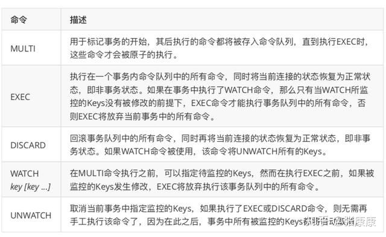

# transaction


MULTI, EXEC, DISCARD and WATCH are the foundation of transactions in Redis. They allow the execution of a group of commands in a single step, with two important guarantees:

1. All the commands in a transaction are serialized and executed sequentially. It can never happen that a request issued by another client is served in the middle of the execution of a Redis transaction. This guarantees that the commands are executed as a single isolated operation.
1. Either all of the commands or none are processed, so a Redis transaction is also atomic. The EXEC command triggers the execution of all the commands in the transaction, so if a client loses the connection to the server in the context of a transaction before calling the MULTI command none of the operations are performed, instead if the EXEC command is called, all the operations are performed. When using the append-only file Redis makes sure to use a single write(2) syscall to write the transaction on disk. However if the Redis server crashes or is killed by the system administrator in some hard way it is possible that only a partial number of operations are registered. Redis will detect this condition at restart, and will exit with an error. Using the redis-check-aof tool it is possible to fix the append only file that will remove the partial transaction so that the server can start again.

## Usage



A Redis transaction is entered using the MULTI command. The command always replies with OK. At this point the user can issue multiple commands. Instead of executing these commands, Redis will queue them. All the commands are executed once EXEC is called.

Calling DISCARD instead will flush the transaction queue and will exit the transaction.

The following example increments keys foo and bar atomically.

```
> MULTI
OK
> INCR foo
QUEUED
> INCR bar
QUEUED
> EXEC
1) (integer) 1
2) (integer) 1
```

As it is possible to see from the session above, EXEC returns an array of replies, where every element is the reply of a single command in the transaction, in the same order the commands were issued.

When a Redis connection is in the context of a MULTI request, all commands will reply with the string QUEUED (sent as a Status Reply from the point of view of the Redis protocol). A queued command is simply scheduled for execution when EXEC is called.

## 引用

1. [redis: transaction](https://redis.io/topics/transactions)