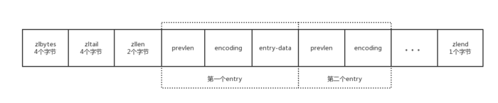
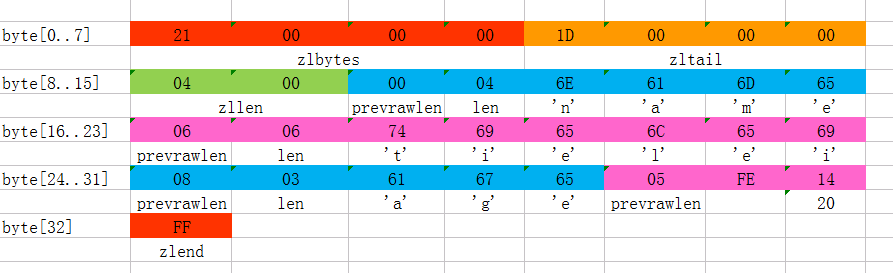

# ziplist

| field | Meaning |
| --- | --- |
| zlbytes | This field is the first field of the compressed linked list. It is an unsigned integer and takes up 4 bytes. Used to represent the number of bytes (including itself) occupied by the entire compressed list. |
| zltail | Unsigned integer, takes 4 bytes. Used to store the offset from the compressed list header to the last entry (not the tail element zlend), in the case of a quick jump to the tail of the list. |
| zllen | Unsigned integer, takes 2 bytes. Used to store the total number of entries contained in a compressed list. |
| zlend | A special entry is used to represent the end of a compressed list. It takes up one byte and has a constant value of 255. |

## ziplistFind

ziplist 查找数据的时候是通过遍历进行查找。

## example

- 这个ziplist一共包含33个字节。字节编号从byte[0]到byte[32]。图中每个字节的值使用16进制表示。
- 头4个字节（0x21000000）是按小端（little endian）模式存储的<zlbytes>字段。什么是小端呢？就是指数据的低字节保存在内存的低地址中（参见维基百科词条Endianness）。因此，这里<zlbytes>的值应该解析成0x00000021，用十进制表示正好就是33。
- 接下来4个字节（byte[4..7]）是<zltail>，用小端存储模式来解释，它的值是0x0000001D（值为29），表示最后一个数据项在byte[29]的位置（那个数据项为0x05FE14）。
- 再接下来2个字节（byte[8..9]），值为0x0004，表示这个ziplist里一共存有4项数据。
- 接下来6个字节（byte[10..15]）是第1个数据项。其中，prevrawlen=0，因为它前面没有数据项；len=4，相当于前面定义的9种情况中的第1种，表示后面4个字节按字符串存储数据，数据的值为”name”。
- 接下来8个字节（byte[16..23]）是第2个数据项，与前面数据项存储格式类似，存储1个字符串”tielei”。
- 接下来5个字节（byte[24..28]）是第3个数据项，与前面数据项存储格式类似，存储1个字符串”age”。
- 接下来3个字节（byte[29..31]）是最后一个数据项，它的格式与前面的数据项存储格式不太一样。其中，第1个字节prevrawlen=5，表示前一个数据项占用5个字节；第2个字节=FE，相当于前面定义的9种情况中的第8种，所以后面还有1个字节用来表示真正的数据，并且以整数表示。它的值是20（0x14）。
- 最后1个字节（byte[32]）表示<zlend>，是固定的值255（0xFF）。

## 引用

1. [Ziplist for redis source code analysis tutorial](https://developpaper.com/ziplist-for-redis-source-code-analysis-tutorial/)
1. [Redis内部数据结构详解(4)——ziplist](http://zhangtielei.com/posts/blog-redis-ziplist.html)