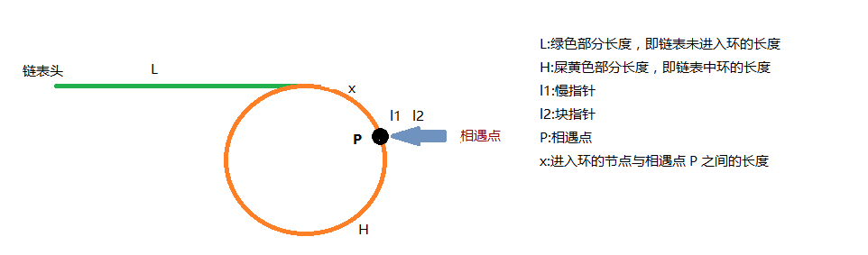

# Floyd's cycle-finding algorithm

用快慢两个指针分别从链表头开始，慢指针 -> next，快指针 -> next -> next，这样如果有环那快指针务必会跑到慢指针后面，随即两者之间的距离一次会缩小一步，最终相遇。若是未相遇且快指针的 next 为 null，则说明链表无环。



一切清晰明了。让我们再来捋一捋。

当两指针在 P 点相遇，我们可列出如下等式：

```
2(L+x) = L+x+n*H        (n >= 1) // n 为快指针在闭环上的圈数
=> 2L+2x = L+x+n*H      (n >= 1)
=> L = n*H-x            (n >= 1)
=> L = n*(H-x)+(n-1)x   (n >= 1)
```

## references

1. [Cycle detection](https://en.wikipedia.org/wiki/Cycle_detection)
1. [链表找环方法证明](http://putop.top/2018/10/23/node-list-close-loop/#%E5%89%8D%E8%A8%80)