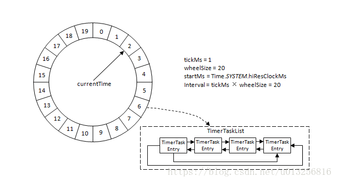
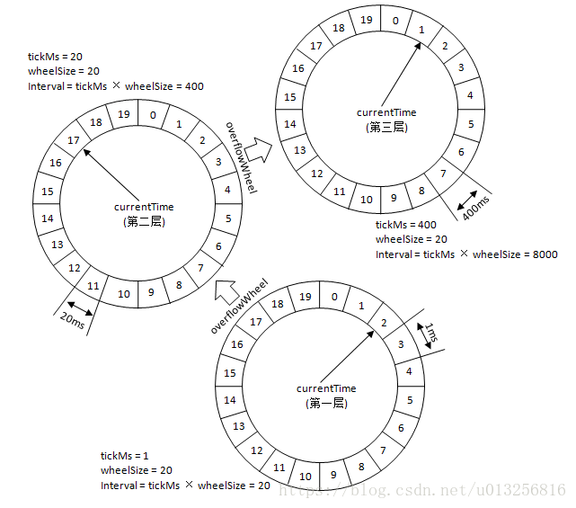

# timing wheel

Kafka中的时间轮（TimingWheel）是一个存储定时任务的环形队列，底层采用数组实现，数组中的每个元素可以存放一个定时任务列表（TimerTaskList）。TimerTaskList是一个环形的双向链表，链表中的每一项表示的都是定时任务项（TimerTaskEntry），其中封装了真正的定时任务TimerTask。

时间轮由多个时间格组成，每个时间格代表当前时间轮的基本时间跨度（tickMs）。时间轮的时间格个数是固定的，可用wheelSize来表示，那么整个时间轮的总体时间跨度（interval）可以通过公式 tickMs × wheelSize计算得出。时间轮还有一个表盘指针（currentTime），用来表示时间轮当前所处的时间，currentTime是tickMs的整数倍。currentTime可以将整个时间轮划分为到期部分和未到期部分，currentTime当前指向的时间格也属于到期部分，表示刚好到期，需要处理此时间格所对应的TimerTaskList的所有任务。

若时间轮的tickMs=1ms，wheelSize=20，那么可以计算得出interval为20ms。初始情况下表盘指针currentTime指向时间格0，此时有一个定时为2ms的任务插入进来会存放到时间格为2的TimerTaskList中。随着时间的不断推移，指针currentTime不断向前推进，过了2ms之后，当到达时间格2时，就需要将时间格2所对应的TimeTaskList中的任务做相应的到期操作。此时若又有一个定时为8ms的任务插入进来，则会存放到时间格10中，currentTime再过8ms后会指向时间格10。如果同时有一个定时为19ms的任务插入进来怎么办？新来的TimerTaskEntry会复用原来的TimerTaskList，所以它会插入到原本已经到期的时间格1中。总之，整个时间轮的总体跨度是不变的，随着指针currentTime的不断推进，当前时间轮所能处理的时间段也在不断后移，总体时间范围在currentTime和currentTime+interval之间。

如果此时有个定时为350ms的任务该如何处理？直接扩充wheelSize的大小么？Kafka中不乏几万甚至几十万毫秒的定时任务，这个wheelSize的扩充没有底线，就算将所有的定时任务的到期时间都设定一个上限，比如100万毫秒，那么这个wheelSize为100万毫秒的时间轮不仅占用很大的内存空间，而且效率也会拉低。Kafka为此引入了层级时间轮的概念，当任务的到期时间超过了当前时间轮所表示的时间范围时，就会尝试添加到上层时间轮中。

参考上图，复用之前的案例，第一层的时间轮tickMs=1ms, wheelSize=20, interval=20ms。第二层的时间轮的tickMs为第一层时间轮的interval，即为20ms。每一层时间轮的wheelSize是固定的，都是20，那么第二层的时间轮的总体时间跨度interval为400ms。以此类推，这个400ms也是第三层的tickMs的大小，第三层的时间轮的总体时间跨度为8000ms。

对于之前所说的350ms的定时任务，显然第一层时间轮不能满足条件，所以就升级到第二层时间轮中，最终被插入到第二层时间轮中时间格17所对应的TimerTaskList中。如果此时又有一个定时为450ms的任务，那么显然第二层时间轮也无法满足条件，所以又升级到第三层时间轮中，最终被插入到第三层时间轮中时间格1的TimerTaskList中。注意到在到期时间在[400ms,800ms)区间的多个任务（比如446ms、455ms以及473ms的定时任务）都会被放入到第三层时间轮的时间格1中，时间格1对应的TimerTaskList的超时时间为400ms。随着时间的流逝，当次TimerTaskList到期之时，原本定时为450ms的任务还剩下50ms的时间，还不能执行这个任务的到期操作。这里就有一个时间轮降级的操作，会将这个剩余时间为50ms的定时任务重新提交到层级时间轮中，此时第一层时间轮的总体时间跨度不够，而第二层足够，所以该任务被放到第二层时间轮到期时间为[40ms,60ms)的时间格中。再经历了40ms之后，此时这个任务又被“察觉”到，不过还剩余10ms，还是不能立即执行到期操作。所以还要再有一次时间轮的降级，此任务被添加到第一层时间轮到期时间为[10ms,11ms)的时间格中，之后再经历10ms后，此任务真正到期，最终执行相应的到期操作。

在Kafka中第一层时间轮的参数同上面的案例一样：tickMs=1ms, wheelSize=20, interval=20ms，各个层级的wheelSize也固定为20，所以各个层级的tickMs和interval也可以相应的推算出来。Kafka在具体实现时间轮TimingWheel时还有一些小细节：

1. TimingWheel在创建的时候以当前系统时间为第一层时间轮的起始时间(startMs)，这里的当前系统时间并没有简单的调用System.currentTimeMillis()，而是调用了Time.SYSTEM.hiResClockMs，这是因为currentTimeMillis()方法的时间精度依赖于操作系统的具体实现，有些操作系统下并不能达到毫秒级的精度，而Time.SYSTEM.hiResClockMs实质上是采用了System.nanoTime()/1_000_000来将精度调整到毫秒级。也有其他的某些骚操作可以实现毫秒级的精度，但是笔者并不推荐，System.nanoTime()/1_000_000是最有效的方法。（如对此有想法，可在留言区探讨。）
1. TimingWheel中的每个双向环形链表TimerTaskList都会有一个哨兵节点（sentinel），引入哨兵节点可以简化边界条件。哨兵节点也称为哑元节点（dummy node），它是一个附加的链表节点，该节点作为第一个节点，它的值域中并不存储任何东西，只是为了操作的方便而引入的。如果一个链表有哨兵节点的话，那么线性表的第一个元素应该是链表的第二个节点。
1. 除了第一层时间轮，其余高层时间轮的起始时间(startMs)都设置为创建此层时间轮时前面第一轮的currentTime。每一层的currentTime都必须是tickMs的整数倍，如果不满足则会将currentTime修剪为tickMs的整数倍，以此与时间轮中的时间格的到期时间范围对应起来。修剪方法为：currentTime = startMs - (startMs % tickMs)。currentTime会随着时间推移而推荐，但是不会改变为tickMs的整数倍的既定事实。若某一时刻的时间为timeMs，那么此时时间轮的currentTime = timeMs - (timeMs % tickMs)，时间每推进一次，每个层级的时间轮的currentTime都会依据此公式推进。
1. Kafka中的定时器只需持有TimingWheel的第一层时间轮的引用，并不会直接持有其他高层的时间轮，但是每一层时间轮都会有一个引用（overflowWheel）指向更高一层的应用，以此层级调用而可以实现定时器间接持有各个层级时间轮的引用。

## 引用

1. [Kafka解惑之时间轮（TimingWheel）](https://blog.csdn.net/u013256816/article/details/80697456)