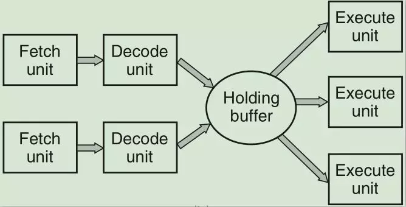

Intel和AMD用X86的指令集，而手机CPU主要用ARM指令集。

CPU有许多寄存器，它们的存在非常重要，如：

- **PC(program counter)**，程序计数器，保存吓一跳指令的地址，保存的是地址值。
- **PSW(program status word)**，程序状态字，保存CPU工作模式（内核态还是用户态）。
- **MAR(memory address register)**，内存地址寄存器，保存将要被访问数据在内存中哪个地址处，保存的是地址值。
- **MDR: memory data register**，内存数据寄存器，保存从内存读取进来的数据或将要写入内存的数据，保存的是数据值。
- **AC: Accumulator**，保存算术运算和逻辑运算的中间结果，保存的是数据值。
- **CIR: current instruction register**，保存当前正在执行的指令。

CPU的工作内容就是：取指->解码->执行,因为取指和解码的周期比较长，现代CPU的设计都是多条流水线同时执行。

用户态转内核态一般是通过系统调用，CPU通过执行trap指令陷入内核态。