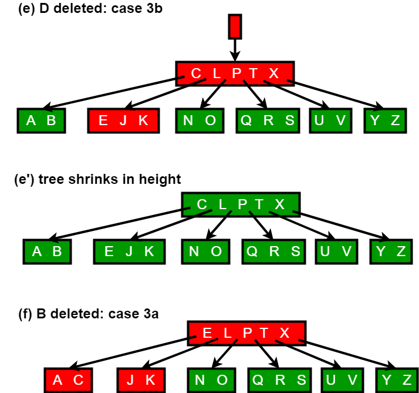

# BTree

## Introduction of B-Tree

In computer science, a B-tree is a self-balancing tree data structure that maintains sorted data and allows searches, sequential access, insertions, and deletions in logarithmic time. The B-tree is a generalization of a binary search tree in that a node can have more than two children. Unlike other self-balancing binary search trees, the B-tree is well suited for storage systems that read and write relatively large blocks of data, such as discs. It is commonly used in databases and file systems.

## Definition

According to Knuth's definition, a B-tree of order m is a tree which satisfies the following properties:

1. Every node has at most m children.
1. Every non-leaf node (except root) has at least ⌈m/2⌉ child nodes.
1. The root has at least two children if it is not a leaf node.
1. A non-leaf node with k children contains k − 1 keys.
1. All leaves appear in the same level and carry no information.

## Applications

- Database index
- File system

## Search

Searching is similar to searching a binary search tree. Starting at the root, the tree is recursively traversed from top to bottom. At each level, the search reduces its field of view to the child pointer (subtree) whose range includes the search value. A subtree's range is defined by the values, or keys, contained in its parent node. These limiting values are also known as separation values.

Binary search is typically (but not necessarily) used within nodes to find the separation values and child tree of interest.

## Insertion

All insertions start at a leaf node. To insert a new element, search the tree to find the leaf node where the new element should be added. Insert the new element into that node with the following steps:

1. If the node contains fewer than the maximum allowed number of elements, then there is room for the new element. Insert the new element in the node, keeping the node's elements ordered.
2. Otherwise the node is full, evenly split it into two nodes so:
    1. A single median is chosen from among the leaf's elements and the new element.
    1. Values less than the median are put in the new left node and values greater than the median are put in the new right node, with the median acting as a separation value.
    1. The separation value is inserted in the node's parent, which may cause it to be split, and so on. If the node has no parent (i.e., the node was the root), create a new root above this node (increasing the height of the tree).

If the splitting goes all the way up to the root, it creates a new root with a single separator value and two children, which is why the lower bound on the size of internal nodes does not apply to the root. The maximum number of elements per node is U−1. When a node is split, one element moves to the parent, but one element is added. So, it must be possible to divide the maximum number U−1 of elements into two legal nodes. If this number is odd, then U=2L and one of the new nodes contains (U−2)/2 = L−1 elements, and hence is a legal node, and the other contains one more element, and hence it is legal too. If U−1 is even, then U=2L−1, so there are 2L−2 elements in the node. Half of this number is L−1, which is the minimum number of elements allowed per node.

An alternative algorithm supports a single pass down the tree from the root to the node where the insertion will take place, splitting any full nodes encountered on the way preemptively. This prevents the need to recall the parent nodes into memory, which may be expensive if the nodes are on secondary storage. However, to use this algorithm, we must be able to send one element to the parent and split the remaining U−2 elements into two legal nodes, without adding a new element. This requires U = 2L rather than U = 2L−1, which accounts for why some textbooks impose this requirement in defining B-trees.

## Deletion

Deletion from a B-tree is more complicated than insertion, because we can delete a key from any node-not just a leaf—and when we delete a key from an internal node, we will have to rearrange the node’s children.

As in insertion, we must make sure the deletion doesn’t violate the B-tree properties. Just as we had to ensure that a node didn’t get too big due to insertion, we must ensure that a node doesn’t get too small during deletion (except that the root is allowed to have fewer than the minimum number t-1 of keys). Just as a simple insertion algorithm might have to back up if a node on the path to where the key was to be inserted was full, a simple approach to deletion might have to back up if a node (other than the root) along the path to where the key is to be deleted has the minimum number of keys.

The deletion procedure deletes the key k from the subtree rooted at x. This procedure guarantees that whenever it calls itself recursively on a node x, the number of keys in x is at least the minimum degree t . Note that this condition requires one more key than the minimum required by the usual B-tree conditions, so that sometimes a key may have to be moved into a child node before recursion descends to that child. This strengthened condition allows us to delete a key from the tree in one downward pass without having to “back up” (with one exception, which we’ll explain). You should interpret the following specification for deletion from a B-tree with the understanding that if the root node x ever becomes an internal node having no keys (this situation can occur in cases 2c and 3b then we delete x, and x’s only child x.c1 becomes the new root of the tree, decreasing the height of the tree by one and preserving the property that the root of the tree contains at least one key (unless the tree is empty).

We sketch how deletion works with various cases of deleting keys from a B-tree.

1. If the key k is in node x and x is a leaf, delete the key k from x.
2. If the key k is in node x and x is an internal node, do the following.
    a. If the child y that precedes k in node x has at least t keys, then find the predecessor k0 of k in the sub-tree rooted at y. Recursively delete k0, and replace k by k0 in x. (We can find k0 and delete it in a single downward pass.)
    b. If y has fewer than t keys, then, symmetrically, examine the child z that follows k in node x. If z has at least t keys, then find the successor k0 of k in the subtree rooted at z. Recursively delete k0, and replace k by k0 in x. (We can find k0 and delete it in a single downward pass.)
    c. Otherwise, if both y and z have only t-1 keys, merge k and all of z into y, so that x loses both k and the pointer to z, and y now contains 2t-1 keys. Then free z and recursively delete k from y.
3. If the key k is not present in internal node x, determine the root x.c(i) of the appropriate subtree that must contain k, if k is in the tree at all. If x.c(i) has only t-1 keys, execute step 3a or 3b as necessary to guarantee that we descend to a node containing at least t keys. Then finish by recursing on the appropriate child of x.
    a. If x.c(i) has only t-1 keys but has an immediate sibling with at least t keys, give x.c(i) an extra key by moving a key from x down into x.c(i), moving a key from x.c(i) ’s immediate left or right sibling up into x, and moving the appropriate child pointer from the sibling into x.c(i).
    b. If x.c(i) and both of x.c(i)’s immediate siblings have t-1 keys, merge x.c(i) with one sibling, which involves moving a key from x down into the new merged node to become the median key for that node.

Since most of the keys in a B-tree are in the leaves, deletion operations are most often used to delete keys from leaves. The recursive delete procedure then acts in one downward pass through the tree, without having to back up. When deleting a key in an internal node, however, the procedure makes a downward pass through the tree but may have to return to the node from which the key was deleted to replace the key with its predecessor or successor (cases 2a and 2b).

The following figures explain the deletion process.

## Reference

1. [GeeksforGeeks: Introduction of B-Tree](https://www.geeksforgeeks.org/introduction-of-b-tree-2/)
1. [GeeksforGeeks: Insert Operation in B-Tree](https://www.geeksforgeeks.org/insert-operation-in-b-tree/)
1. [GeeksforGeeks: Delete Operation in B-Tree](https://www.geeksforgeeks.org/delete-operation-in-b-tree/)
2. [Wikipedia: B-tree](https://en.wikipedia.org/wiki/B-tree)