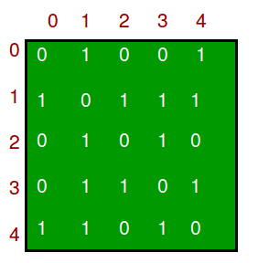

- 图是一个数据结构由下面两个部分组成：
- 一个有限的顶点也叫做节点集合（vertices[nodes]）
- 一个有限并且有序的组合叫做边（edge），之所以说是有序的是因为(u, v)不等于(v, u)，(u, v)说明这是一个从u到v的边，边可能带有权重（值或者花销）
Graph is a data structure that consists of following two components:
1. A finite set of vertices also called as nodes.
2. A finite set of ordered pair of the form (u, v) called as edge. The pair is ordered because (u, v) is not same as (v, u) in case of a directed graph(di-graph). The pair of the form (u, v) indicates that there is an edge from vertex u to vertex v. The edges may contain weight/value/cost.

- 图常被应用到现实生活中：图常被用于表示网，包括电话网络、电线网络。
- 图也常被应用到社交网络中像领英、书脸：书脸中每个人就像一个顶点，每个顶点都是一个结构体包含了许多信息，像person_id, name, gender, locale
Graphs are used to represent many real-life applications: Graphs are used to represent networks. The networks may include paths in a city or telephone network or circuit network. Graphs are also used in social networks like linkedIn, Facebook. For example, in Facebook, each person is represented with a vertex(or node). Each node is a structure and contains information like person id, name, gender and locale. See this for more applications of graph.

- 参考下面这个有五个节点的无向图
Following is an example of an undirected graph with 5 vertices.

- 参考这两个具有代表性的图实例
Following two are the most commonly used representations of a graph.
1. Adjacency Matrix
2. Adjacency List

- 也有其他的表现形式，像关联矩阵和关联链表。要根据使用情况来选择表现形式，大部分都是根据操作的方便性来定
There are other representations also like, Incidence Matrix and Incidence List. The choice of the graph representation is situation specific. It totally depends on the type of operations to be performed and ease of use.

Adjacency Matrix:
- 邻接矩阵是一个V x V的二维数组，V是图顶点的个数。设adj[][], 槽位adj[i][j] = 1表示有一条边从顶点 i 到顶点 j。邻接矩阵表示一个图总是对称的。邻接矩阵同样常用于表示加权图。如果adj[i][j] = w，表示一个从 i 到 j 权重为 w 的边。
Adjacency Matrix is a 2D array of size V x V where V is the number of vertices in a graph. Let the 2D array be adj[][], a slot adj[i][j] = 1 indicates that there is an edge from vertex i to vertex j. Adjacency matrix for undirected graph is always symmetric. Adjacency Matrix is also used to represent weighted graphs. If adj[i][j] = w, then there is an edge from vertex i to vertex j with weight w.

- 一个邻接矩阵的例子
The adjacency matrix for the above example graph is:

Pros: Representation is easier to implement and follow. Removing an edge takes O(1) time. Queries like whether there is an edge from vertex ‘u’ to vertex ‘v’ are efficient and can be done O(1).
Cons: Consumes more space O(V^2). Even if the graph is sparse(contains less number of edges), it consumes the same space. Adding a vertex is O(V^2) time.
Please see this for a sample Python implementation of adjacency matrix.

Adjacency List: 
- 邻接链表，使用一个链表数组。数组的大小等于顶点的个数。设一个数组array[]， array[i]是一个顶点 i 能连接到的顶点链表。这个表示法同样支持加权图。边的权值可以表示为对的列表。
An array of lists is used. Size of the array is equal to the number of vertices. Let the array be array[]. An entry array[i] represents the list of vertices adjacent to the ith vertex. This representation can also be used to represent a weighted graph. The weights of edges can be represented as lists of pairs. Following is adjacency list representation of the above graph.

