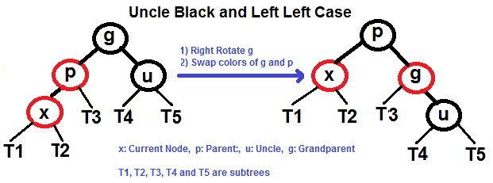
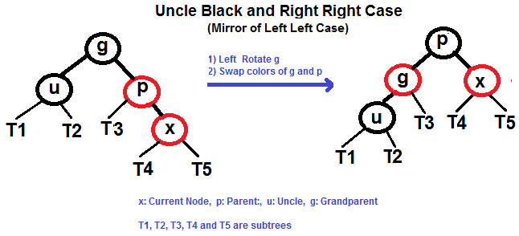
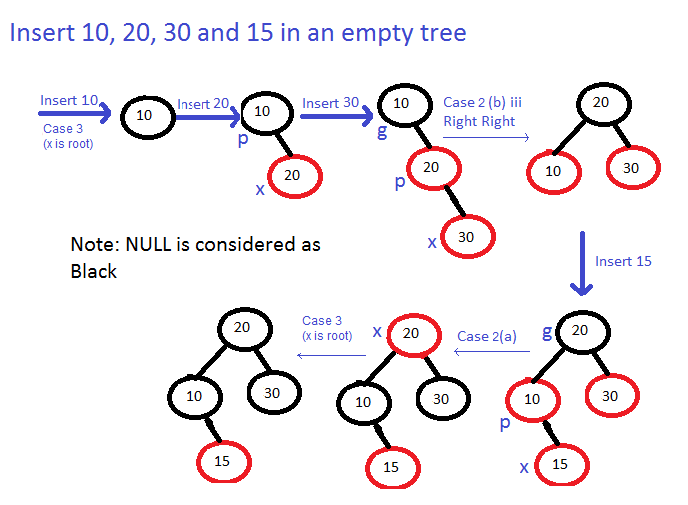

# Red-Black Tree

A red–black tree is a kind of self-balancing binary search tree in computer science. Each node of the binary tree has an extra bit, and that bit is often interpreted as the color (red or black) of the node. These color bits are used to ensure the tree remains approximately balanced during insertions and deletions.

Balance is preserved by painting each node of the tree with one of two colors in a way that satisfies certain properties, which collectively constrain how unbalanced the tree can become in the worst case. When the tree is modified, the new tree is subsequently rearranged and repainted to restore the coloring properties. The properties are designed in such a way that this rearranging and recoloring can be performed efficiently.

The balancing of the tree is not perfect, but it is good enough to allow it to guarantee searching in O(log n) time, where n is the total number of elements in the tree. The insertion and deletion operations, along with the tree rearrangement and recoloring, are also performed in O(log n) time.

Tracking the color of each node requires only 1 bit of information per node because there are only two colors. The tree does not contain any other data specific to its being a red–black tree so its memory footprint is almost identical to a classic (uncolored) binary search tree. In many cases, the additional bit of information can be stored at no additional memory cost.

## Properties

1. Each node is either red or black.
1. The root is black. This rule is sometimes omitted. Since the root can always be changed from red to black, but not necessarily vice versa, this rule has little effect on analysis.
1. All leaves (NIL) are black.
1. If a node is red, then both its children are black.
1. Every path from a given node to any of its descendant NIL nodes contains the same number of black nodes.

## Insert

1. Perform standard BST insertion and make the color of newly inserted nodes as RED.
2. If x is root, change color of x as BLACK (Black height of complete tree increases by 1).
3. Do following if color of x’s parent is not BLACK and x is not root.
    1. If x’s uncle is RED (Grand parent must have been black from property 4)
        1. Change color of parent and uncle as BLACK.
        1. color of grand parent as RED.
        1. Change x = x’s grandparent, repeat steps 2 and 3 for new x.
    
    

    1. If x’s uncle is BLACK, then there can be four configurations for x, x’s parent (p) and x’s grandparent (g) (This is similar to AVL Tree)
        1. Left Left Case (p is left child of g and x is left child of p)
        
        1. Left Right Case (p is left child of g and x is right child of p)
        
        1. Right Right Case (Mirror of case i)
        
        1. Right Left Case (Mirror of case ii)    
        

### Examples of Insertion

Exercise:
Insert 2, 6 and 13 in below tree.

## Delete

## 引用

- [WikiPedia: Red–black tree](https://en.wikipedia.org/wiki/Red%E2%80%93black_tree)
- [GeeksforGeeks: Red-Black Tree | Set 2 (Insert)](https://www.geeksforgeeks.org/red-black-tree-set-2-insert/)