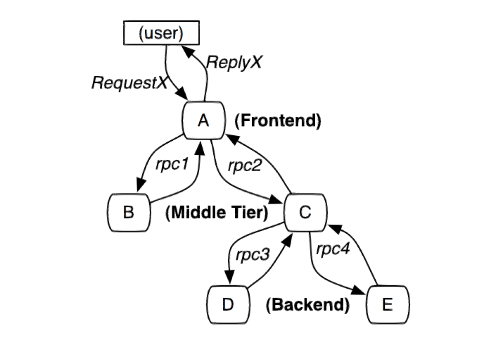
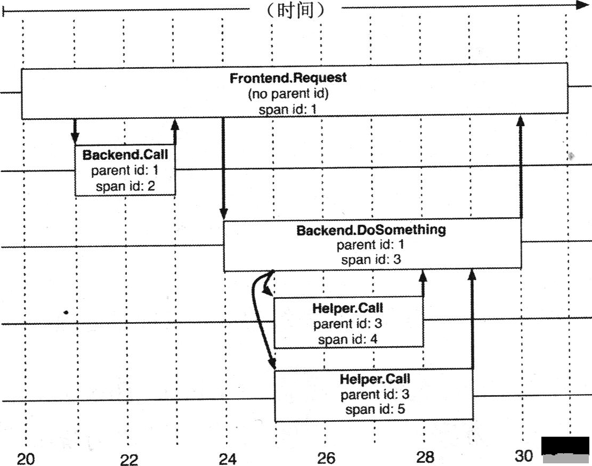
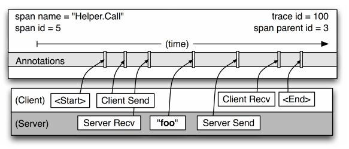
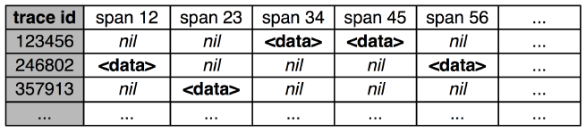

# Dapper

## 服务调用示例：

图中 A~E 分别表示五个服务，用户发起一次 X 请求到前端系统 A，然后 A 分别发送 RPC 请求到中间层 B 和 C，B 处理请求后返回，C 还要发起两个 RPC 请求到后端系统 D 和 E。

以上完整调用回路中，一次请求需要经过多个系统处理完成，并且追踪系统像是内嵌在 RPC 调用链上的树形结构，然而，我们的核心数据模型不只局限于特定的 RPC 框架，我们还能跟踪其他行为，例如外界的 HTTP 请求，和外部对 Kafka 服务器的调用等。从形式上看，分布式追踪模型使用的 Trace 树形结构来记录请求之间的关系（父子关系、先后顺序等）。

## Trace 和 Span

1. Span：基本工作单元，例如，在一个新建的 Span 中发送一个 RPC 等同于发送一个回应请求给 RPC，Span 通过一个 64 位 ID 唯一标识，Trace 以另一个 64 位 ID 表示。Span 还有其他数据信息，比如摘要、时间戳事件、关键值注释 (Tags)、Span 的 ID、以及进度 ID (通常是 IP 地址)。Span 在不断地启动和停止，同时记录了时间信息，当你创建了一个 Span，你必须在未来的某个时刻停止它。
1. Trace 树：一系列 Span 组成的一个树状结构，例如，如果你正在跑一个分布式大数据工程，你可能需要创建一个 Trace 树。
1. Annotation（标注）：用来及时记录一个事件的存在，一些核心 Annotation 用来定义一个请求的开始和结束。

Annotation（标注）：用来及时记录一个事件的存在，一些核心 Annotation 用来定义一个请求的开始和结束。
分布式追踪系统要做的就是记录每次发送和接受动作的标识符和时间戳，将一次请求涉及到的所有服务串联起来，只有这样才能清楚记录每次请求的完整调用链。在分布式追踪系统中使用 Trace 表示对一次请求完整调用链的跟踪，将两个服务例如上面图 1 中的服务 A 和服务 B 的请求/响应过程叫做一次 Span。 我们可以看出每一次跟踪 Trace 都是一个树型结构，Span 可以体现出服务之间的具体依赖关系。

对于每个 Trace 树，Trace 都要定义一个全局唯一的 Trace ID，在这个跟踪中的所有 Span 都将获取到这个 Trace ID。 每个 Span 都有一个 Parent Span ID 和它自己的 Span ID。上面图中 A 服务的 Parent Span ID 为空，Span ID 为 1；然后 B 服务的 Parent Span ID 为 1，Span ID 为 2；C 服务的 Parent Span ID 也为 1，Span ID 为 3，依次类推，如图所示:

### Span 内部结构

下面看一下 Span 的内部结构，Span 除了记录 Parent Span ID 和自身的 Span ID 外，还会记录自己请求其他服务的时间和响应时间。但是每个服务器的时间可能不是完全相同，为了解决这个问题需要约定一个前提，即 RPC 客户端必须发出请求后，服务端才能收到，如果服务端的时间戳比客户端发出请求的时间戳还靠前，那么就按请求时间来算，响应时间也是如此。

任何一个 Span 可以包含来自不同 Server 的信息，这些也要记录下来。事实上，每一个 RPC Span 可能包含客户端和服务器两个过程的 Annotation 内容。由于客户端和服务器上的时间戳来自不同的主机，我们必须考虑到 Server 之间的时间偏差。在链路追踪分析中，每一个请求，总是一方先发送一个请求之后，然后另外一方才接收到；这样一来，每个调用请求就有一个时间戳的上限和下限。

Span 的细节图:

从图中可以可以很清楚的看出，这是一次 Span 名为 Hello.Call 的调用，Span ID 是 5，Parent Span ID 是 3，Trace ID 是 100。 我们重点看一下 Span 对应的四个状态：

- Client Send（CS）：客户端发送时间，客户端发起一个请求，这个 Annotation 描述了这个 Span 的开始。
- Server Received（SR）：服务端接收时间，服务端获得请求并准备开始处理它，如果将其 SR 减去 CS 时间戳便可得到网络延迟。
- Server Send（SS）：服务端发送时间，Annotation 表明请求处理的完成（当请求返回客户端），如果 SS 减去 SR 时间戳便可得到服务端需要的处理请求时间。
- Client Received（CR）：客户端接收时间，表明 Span 的结束，客户端成功接收到服务端的回复，如果 CR 减去 CS 时间戳便可得到客户端从服务端获取回复的所有所需时间。

通过收集这四个时间戳，就可以在一次请求完成后计算出整个 Trace 的执行耗时和网络耗时，以及 Trace 中每个 Span 过程的执行耗时和网络耗时:

- 服务调用耗时 = CR – CS
- 服务处理耗时 = SS – SR
- 网络耗时 = 服务调用耗时 – 服务处理耗时

## 生成 Span

我们已经初步了解了 Span 的组成，那么怎么生成 Span 呢？Google Dapper 中使用到的是基于标注 (Annotation-based) 的监控方案。此方案会有代码侵入，所以应尽可能少改动代码。

基于标注的方式就是根据请求中的 Trace ID 来获取 Trace 这个实例，各种编程语言有各自的方式。获取到 Trace 实例后就可以调用 Recorder 来记录 Span 了，记录值先直接以日志的形式存在本地，然后跟踪系统会启动一个 Collector Daemon 来收集日志，然后整理日志写入数据库。解析的日志结果建议放在 BigTable (Cassandra 或者 HDFS) 这类稀疏表的数据库里。因为每个 Trace 携带的 Span 可能不一样，最终的记录是每一行代表一个 Trace，这一行的每一列代表一个 Span，如图所示：

## 采样率

分布式跟踪系统的实现要求性能低损耗，尤其在生产环境中不能影响到核心业务的性能，也不可能每次请求都跟踪，所以要进行采样，每个应用和服务可以自己设置采样率。采样率应该是在每个应用自己的配置里设置的，这样每个应用可以动态调整，特别是刚应用刚上线时可以适当调高采样率。

一般在系统峰值流量很大的情况下，只需要采样其中很小一部分请求，例如 1/1000 的采样率，即分布式跟踪系统只会在 1000 次请求中采样其中的某一次。

## Trace 收集

分布式跟踪系统的追踪记录和收集管道的过程分为三个阶段：

Span 数据写入本地日志文件中。
Dapper 的守护进程和收集组件把这些数据从生产环境的主机中拉出来。
最终写到 Dapper 的 Bigtable 仓库中。一次跟踪被设计成 Bigtable 中的一行，每一列相当于一个 Span。

## Reference

1. [IBM Developer: 分布式集群环境下调用链路追踪](https://www.ibm.com/developerworks/cn/web/wa-distributed-systems-request-tracing/index.html)