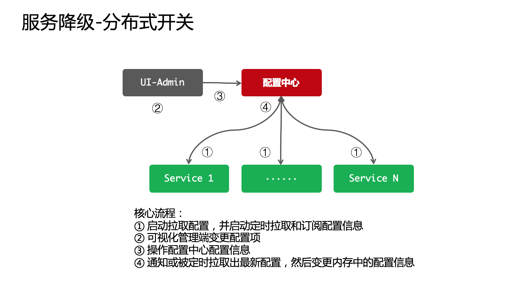
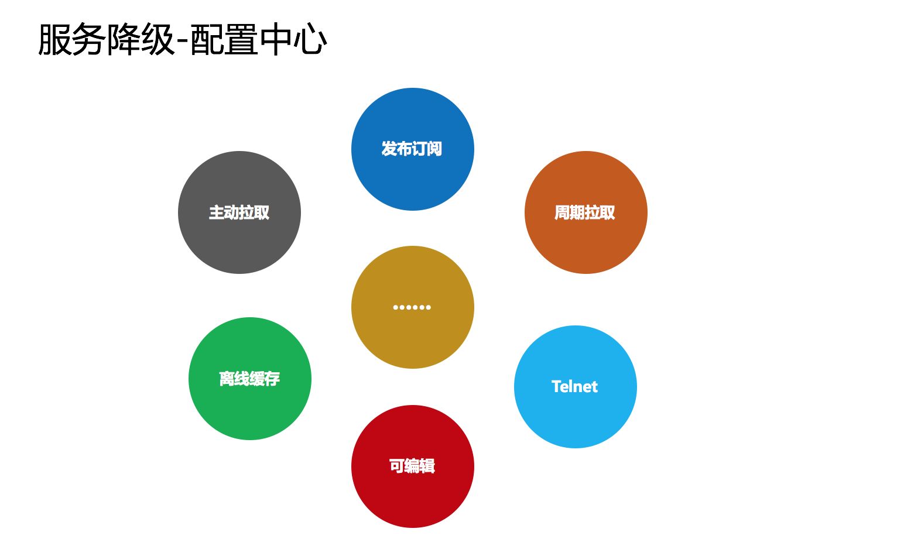

## 服务降级设计

### 什么时候使用降级

1. 超时降级：主要配置好超时时间和超时重试次数和机制，并使用异步机制探测恢复情况
2. 失败次数降级：主要是一些不稳定的API，当失败调用次数达到一定阈值自动降级，同样要使用一部机制探测回复情况
3. 故障降级：如果调用的远程服务挂掉了（网络故障、DNS故障、HTTP服务返回错误码和RPC服务抛出异常），则可以直接降级
4. 限流降级：当触发了限流超额时，可以使用暂时屏蔽的方式来进行短暂的屏蔽

### 配置中心

1. 启动主动拉取配置：用于初始化配置
2. 发布订阅配置：用于实现配置及时变更
2. 定时拉取配置：用于解决发布订阅失效或消息丢失的情况
1. 离线文件缓存配置：用于临时解决重启后连接不上配置中心的问题
1. 可编辑式配置文档：用于直接编辑文档的方式来实现配置的定义
1. 提供Telnet命令变更配置：用于解决配置中心失效而不能变更配置的问题

### 降级策略

1. 页面降级：可视化界面禁用点击按钮、调整静态页面
2. 延迟服务：如定时任务延迟处理、消息入MQ后延迟处理
1. 写降级：直接禁止相关写操作的服务请求
1. 读降级：直接禁止相关读错做的服务请求
1. 缓存降级：使用缓存方式来降级部分读频繁的服务接口

### 后台代码降级实现

1. 抛异常
1. 返回NULL
1. 调用Mock数据
1. 调用Fallback处理逻辑

### 高级特性

分级降级：可以根据服务异常程度对业务分批次进行降级

1. 蓝色风暴：表示需要小规模降级非核心业务
1. 黄色风暴：表示需要中等规模降级非核心服务
1. 橙色风暴：表示需要大规模降级非核心服务
1. 红色风暴：表示必须降级所有给核心服务
