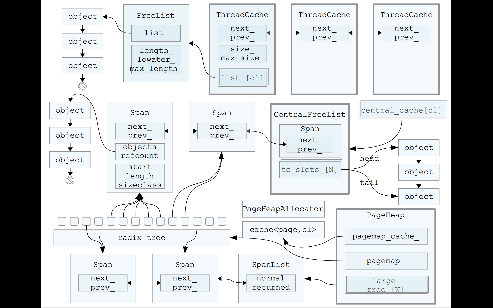

## 主要结构

- fixalloc: 固定堆外对象的空闲分配器链，用于管理被分配器使用的存储。
- mheap: 内存分配堆，以8k的粒度管理。
- mspan: 由mheap管理的一个页面集管理结构。
- mcentral: 集中了所有给定尺寸的span。
- mcache: 逻辑线程P的缓存。
- mstats: 静态变量的内存分配区。

## 分配

- 从mcache中查找所需尺寸的mspan的槽位。有空闲的槽位直接返回。
- 从mcentral获取相应的mspan。
- 如果mecentral中没有相应的mspan，从mheap中获取mspan。
- 如mheap是空的，或者不够，则向系统申请。
- 大对象直接从mheap中分配。

## 回收

- 回收的mspan可以重新分配。
- 如果mspan中的对象还有被分配的槽位则放置到mcentral相应大小的free-list中。
- 如果mspan中的对象都是空闲的则回收到mheap中。
- 如果mheap中的mspan空闲太久可能会被返回给系统。
- 被回收的槽位不会马上清零，除非指定要清零，会等到重新被使用时才会清零。

## 虚拟内存分布

- 堆由arena集合组成，在64位系统中是64M，32位系统中是4M。
- 每个arena都有对应的heapArena来保存数据。bitmap映射了堆中所有的字，span map映射了堆中所有的页。
- 因为arenas都是对齐的，可以把地址空间看成是一系列的arena。arena map映射了heapArean。arena map由两级arena map组成，某些架构中由一个2级arena map管理。

# TCMalloc

主要思想是内存分级分配，降低锁的粒度，从而提升内存分配的效率。

## 结构图：

## 结构化：

PageHeap {
pagemap_cache_

## 主要数据结构：

### page：

内存页，算法中最小粒度的单位，和系统的内存页不是同一个概念。

#### object: 

1. object的尺寸被预设了一些规格（class），比如16字节、32字节、等等，同一个span切出来的object都是相同的规格。
1. object不大于256K，超大的内存将直接分配span来使用。

#### span:

1. span是连续page的内存。大小（包含的object大小）同样也是预设的。

#### ThreadCache: 

1. 最主要的逻辑是维护一组FreeList，针对每一种class的object。

#### CentralCache: 

1. CentralFreeList并不像ThreadCache那样直接维护object的链表，而是维护span的链表，每个span下面再挂一个由这个span切分出来的object的链，这样方便整个span回收到PageHeap。
1. 为了避免频繁执行对object到span归类，设置了一个cache(tc_slots_)，批量（batch_size）放回span。
1. 有empty_和nonempty两个span链表，避免重复判断span是否为空。

#### PageHeap: 

1. 维护page到span的映射关系。
1. page到span的映射关系由一个radix tree来实现，常用的page有一个cache1. 点的radix tree，最大内存为64k）来维护，类似cpu多级缓存的设计。
1. 分配内存时如果小尺寸的span没有了就把大一点的进行拆分，回收的时候也会把相邻的span合并1. radix tree判断是否相邻）。
1. 这里的FreeList也有returned和normal两个链表，优先从normal分配回收，不够从returned拿，再不够就向系统申请。
1. PageHeapAllocator: 用于分配各个控制结构的内存，就是object本身不是一个结构体，可以全部用来存储数据，空闲时会有8B的空间用来做链表指针。

#### 分配：

计算需要分配的object的class => 从ThreadCache中相应class的FreeList获取object => 从CentralCache中的tc_slots_中获取 => 从CentralCache的nonempty中获取 => 从PageHeap的normal中获取 => 从PageHeap的returned中获取 => 向系统申请

#### 回收：

和分配相反

#### 分配和回收都是批量处理的。申请时会多申请，回收时达到阈值才回收到上一级。

## Reference

1. [阿里云：tcmalloc浅析](https://yq.aliyun.com/articles/6045)