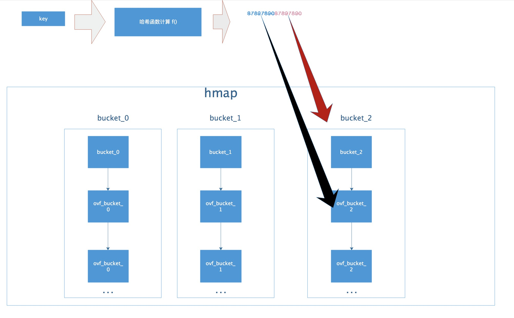
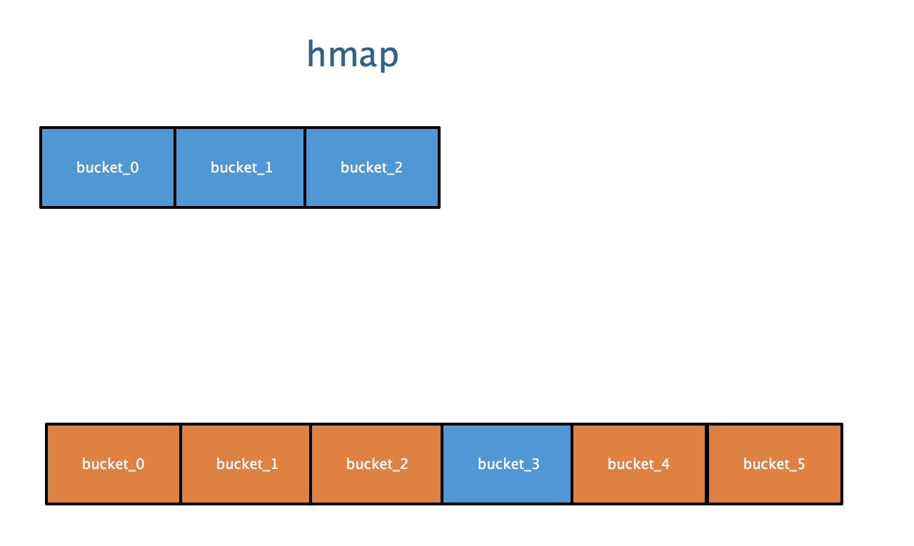

# map

Golang中map的底层实现是一个散列表，因此实现map的过程实际上就是实现散表的过程。在这个散列表中，主要出现的结构体有两个，一个叫hmap(a header for a go map)，一个叫bmap(a bucket for a Go map，通常叫其bucket)。

## hmap


## bucket

图中有很多字段，但是便于理解map的架构，你只需要关心的只有一个，就是标红的字段：buckets数组。Golang的map中用于存储的结构是bucket数组。


相比于hmap，bucket的结构显得简单一些，标红的字段依然是“核心”，我们使用的map中的key和value就存储在这里。“高位哈希值”数组记录的是当前bucket中key相关的“索引”，稍后会详细叙述。还有一个字段是一个指向扩容后的bucket的指针，使得bucket会形成一个链表结构。


## hmap 和 bmap 的关系


哈希表的特点是会有一个哈希函数，对你传来的key进行哈希运算，得到唯一的值，一般情况下都是一个数值。Golang的map中也有这么一个哈希函数，也会算出唯一的值，对于这个值的使用，Golang也是很有意思。

Golang把求得的值按照用途一分为二：高位和低位。


如图所示，蓝色为高位，红色为低位。

然后低位用于寻找当前key属于hmap中的哪个bucket，而高位用于寻找bucket中的哪个key。上文中提到：bucket中有个属性字段是“高位哈希值”数组，这里存的就是蓝色的高位值，用来声明当前bucket中有哪些“key”，便于搜索查找。

需要特别指出的一点是：我们map中的key/value值都是存到同一个数组中的。数组中的顺序是这样的:


并不是key0/value0/key1/value1的形式，这样做的好处是：在key和value的长度不同的时候，可以消除padding带来的空间浪费。

现在，我们可以得到Go语言map的整个的结构图了：



## 扩容

当以上的哈希表增长的时候，Go语言会将bucket数组的数量扩充一倍，产生一个新的bucket数组，并将旧数组的数据迁移至新数组。

### 加载因子

判断扩充的条件，就是哈希表中的加载因子(即loadFactor)。

加载因子是一个阈值，一般表示为：散列包含的元素数 除以 位置总数。是一种“产生冲突机会”和“空间使用”的平衡与折中：加载因子越小，说明空间空置率高，空间使用率小，但是加载因子越大，说明空间利用率上去了，但是“产生冲突机会”高了。

每种哈希表的都会有一个加载因子，数值超过加载因子就会为哈希表扩容。
Golang的map的加载因子的公式是：

```
map长度 / 2^B
```

阈值是6.5。其中B可以理解为已扩容的次数。
当Go的map长度增长到大于加载因子所需的map长度时，Go语言就会将产生一个新的bucket数组，然后把旧的bucket数组移到一个属性字段oldbucket中。注意：并不是立刻把旧的数组中的元素转义到新的bucket当中，而是，只有当访问到具体的某个bucket的时候，会把bucket中的数据转移到新的bucket中。

如下图所示：当扩容的时候，Go的map结构体中，会保存旧的数据，和新生成的数组



上面部分代表旧的有数据的bucket，下面部分代表新生成的新的bucket。蓝色代表存有数据的bucket，橘黄色代表空的bucket。

扩容时map并不会立即把新数据做迁移，而是当访问原来旧bucket的数据的时候，才把旧数据做迁移，如下图：


## references

1. [解剖Go语言map底层实现](https://i6448038.github.io/2018/08/26/map-secret/)