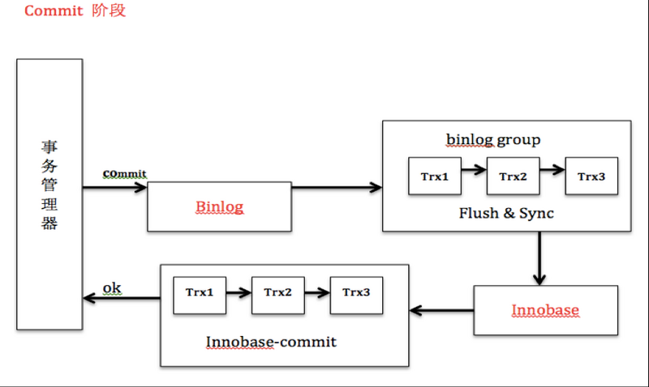
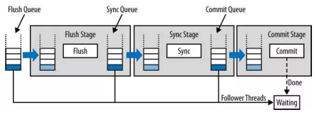

# 2pc and group commit

## 2pc

将事务的commit分为prepare和commit两个阶段：
1、prepare阶段：redo持久化到磁盘（redo group commit），并将回滚段置为prepared状态，此时binlog不做操作。

2、commit阶段：innodb释放锁，释放回滚段，设置提交状态，binlog持久化到磁盘，然后存储引擎层提交

事务的两阶段提交协议保证了无论在任何情况下，事务要么同时存在于存储引擎和binlog中，要么两个里面都不存在，这就保证了主库与从库之间数据的一致性。如果数据库系统发生崩溃，当数据库系统重新启动时会进行崩溃恢复操作，存储引擎中处于prepare状态的事务会去查询该事务是否也同时存在于binlog中，如果存在就在存储引擎内部提交该事务（因为此时从库可能已经获取了对应的binlog内容），如果binlog中没有该事务，就回滚该事务。例如：当崩溃发生在第一步和第二步之间时，明显处于prepare状态的事务还没来得及写入到binlog中，所以该事务会在存储引擎内部进行回滚，这样该事务在存储引擎和binlog中都不会存在；当崩溃发生在第二步和第三步之间时，处于prepare状态的事务存在于binlog中，那么该事务会在存储引擎内部进行提交，这样该事务就同时存在于存储引擎和binlog中。

为了保证数据的安全性，以上列出的3个步骤都需要调用fsync将数据持久化到磁盘。由于在引擎内部prepare好的事务可以通过binlog恢复，所以通常情况下第三个fsync是可以省略的。

## group commit

Binlog组提交的基本思想是，引入队列机制保证Innodb commit顺序与binlog落盘顺序一致，并将事务分组，组内的binlog刷盘动作交给一个事务进行，实现组提交目的。在MySQL数据库上层进行提交时首先按顺序将其放入一个队列中，队列中的第一个事务称为leader，其他事务称为follow，leader控制着follow的行为。

从上图可以看出，每个阶段都有一个队列，每个队列有一个mutex保护，约定进入队列第一个线程为leader，其他线程为follower，所有事情交由leader去做，leader做完所有动作后，通知follower刷盘结束。BLGC就是将事务提交分为了3个阶段，FLUSH阶段，SYNC阶段和COMMIT阶段。

## references

1. [MySQL Redo/Binlog Group Commit , 2pc事务两阶段提交，Crash Recovery浅析](https://segmentfault.com/a/1190000014810628)
1. [MySQL 中Redo与Binlog顺序一致性问题](https://www.cnblogs.com/xibuhaohao/p/10899586.html)