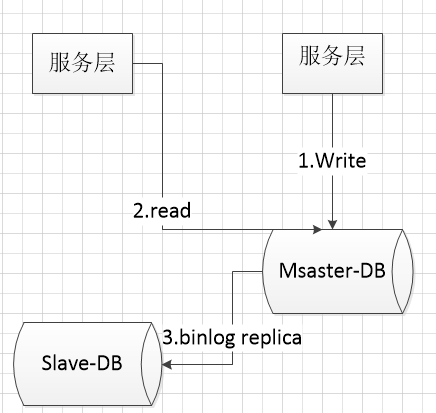
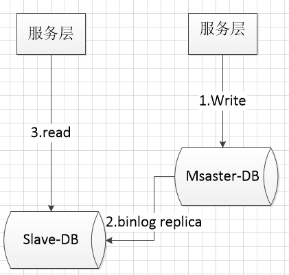
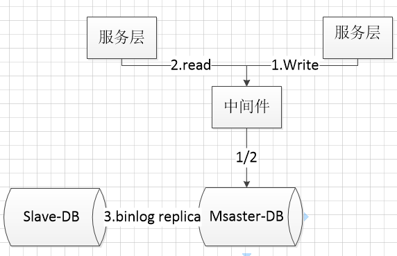
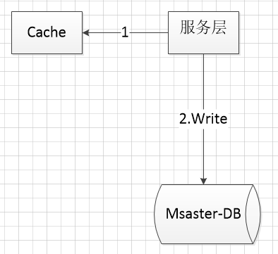
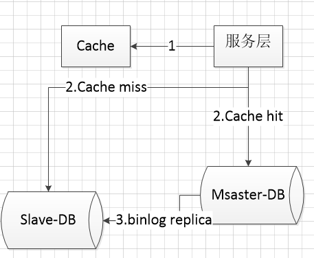

# 主从一致性

## 读写都在主库

## semi-sync（半同步复制）

之所以会读取到旧数据，关键在于主从同步需要一个时间段，而读取请求可能刚好就发生在同步阶段。为了读取到最新的数据，需要等主从同步完成之后，主库上的写请求再返回。示意图如图所示：

1. 系统先对DB-master进行了一个写操作，写主库；
1. 等主从同步完成，写主库的请求才返回；
1. 读从库，读到最新的数据（如果读请求先完成，写请求后完成，读取到的是“当时”最新的数据）。
   
显然带来的后果就是主库的写请求时延会增加，吞吐量会降低。

## 数据库中间件

借助中间件的路由作用，对服务层的读写请求进行分发，从而避免出现不一致问题。示意图如图所示：

1. 所有的读写都走数据库中间件，通常情况下，写请求路由到主库，读请求路由到从库；
1. 记录所有路由到主库的key，在经验主从同步时间窗口内（假设是500ms），如果有读请求访问中间件，此时有可能从库还是旧数据，就把这个key上的读请求路由到主库；
1. 经验主从同步时间过完后，对应key的读请求继续路由到从库

中间件带来的好处就是能保证数据的绝对一致性，但同时也带来成本上升的问题。

## 利用缓存

 原理同方案三类似，当写请求发生时
 

1. 将某个库上的某个key要发生写操作，记录在cache里，并设置“经验主从同步时间”的cache超时时间
1. 修改数据库

而读取请求发生的时候
 

1. 先到cache里查看，对应库的对应key有没有相关数据
2. 如果cache hit，有相关数据，说明这个key上刚发生过写操作，此时需要将请求路由到主库读最新的数据
3. 如果cache miss，说明这个key上近期没有发生过写操作，此时将请求路由到从库，继续读写分离

显然，利用缓存，减少了中间件带来的成本问题，但多了一个Cache组件，并且读写数据库多了一步Cache操作，操作相对其他稍较繁琐。

## 引用

1. [数据库主从一致性问题](https://www.jianshu.com/p/5387bf6b6dec)