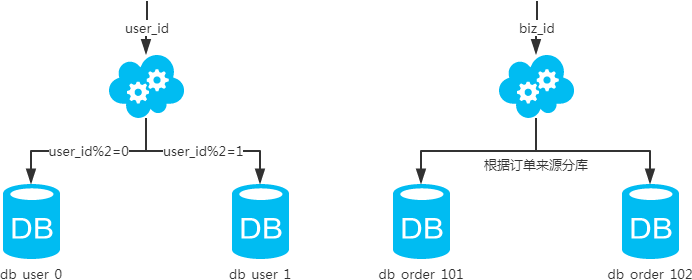

# 分库分表策略

## IO瓶颈

### 磁盘读IO

热点数据太多，数据库缓存放不下，每次查询时会产生大量的IO，降低查询速度

#### 解决方案

- 分库
- 垂直分表

### 网络IO瓶颈

请求的数据太多，网络带宽不够

#### 解决方案

分库

## CPU瓶颈

### SQL问题

如SQL中包含join，group by，order by，非索引字段条件查询等，增加CPU运算的操作

#### 解决方案

SQL优化，建立合适的索引，在业务Service层进行业务计算。

### 单表数据量太大

查询时扫描的行太多，SQL效率低，CPU率先出现瓶颈 

#### 解决方案

水平分表

## 分库

### 水平分库

### 垂直分库

## 分表

### 水平分表

### 垂直分表

## 引用

- [分库分表方案](https://mp.weixin.qq.com/s/GCgKL5CXuVtlEsISbkHd-g)