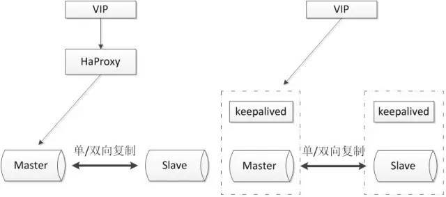
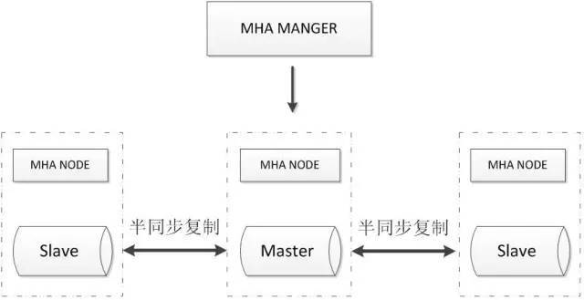
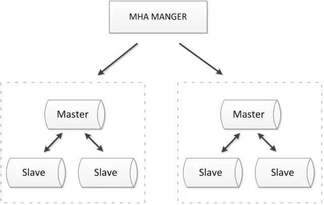
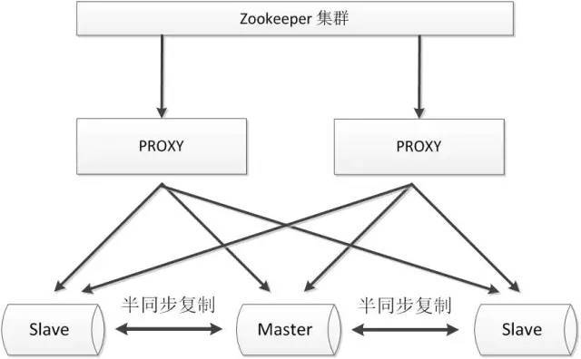
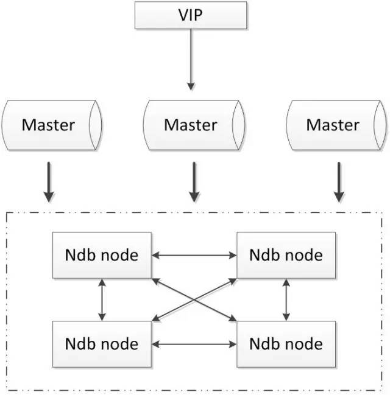

# 高可用方案

## 主从或主主半同步复制

使用双节点数据库，搭建单向或者双向的半同步复制。在5.7以后的版本中，由于lossless replication、logical多线程复制等一些列新特性的引入，使得MySQL原生半同步复制更加可靠。

常见架构如下：

通常会和proxy、keepalived等第三方软件同时使用，即可以用来监控数据库的健康，又可以执行一系列管理命令。如果主库发生故障，切换到备库后仍然可以继续使用数据库。

### 优点

1. 架构比较简单，使用原生半同步复制作为数据同步的依据；
1. 双节点，没有主机宕机后的选主问题，直接切换即可；
1. 双节点，需求资源少，部署简单；

### 缺点

1. 完全依赖于半同步复制，如果半同步复制退化为异步复制，数据一致性无法得到保证；
1. 需要额外考虑haproxy、keepalived的高可用机制。

## 高可用架构优化

将双节点数据库扩展到多节点数据库，或者多节点数据库集群。可以根据自己的需要选择一主两从、一主多从或者多主多从的集群。

由于半同步复制，存在接收到一个从机的成功应答即认为半同步复制成功的特性，所以多从半同步复制的可靠性要优于单从半同步复制的可靠性。并且多节点同时宕机的几率也要小于单节点宕机的几率，所以多节点架构在一定程度上可以认为高可用性是好于双节点架构。

但是由于数据库数量较多，所以需要数据库管理软件来保证数据库的可维护性。可以选择MMM、MHA或者各个版本的proxy等等。常见方案如下：

MHA Manager会定时探测集群中的master节点，当master出现故障时，它可以自动将最新数据的slave提升为新的master，然后将所有其他的slave重新指向新的master，整个故障转移过程对应用程序完全透明。

MHA Node运行在每台MySQL服务器上，主要作用是切换时处理二进制日志，确保切换尽量少丢数据。

MHA也可以扩展到如下的多节点集群：

### 优点：

1. 可以进行故障的自动检测和转移;
1. 可扩展性较好，可以根据需要扩展MySQL的节点数量和结构;
1. 相比于双节点的MySQL复制，三节点/多节点的MySQL发生不可用的概率更低

### 缺点：

1. 至少需要三节点，相对于双节点需要更多的资源;
1. 逻辑较为复杂，发生故障后排查问题，定位问题更加困难;
1. 数据一致性仍然靠原生半同步复制保证，仍然存在数据不一致的风险;
1. 可能因为网络分区发生脑裂现象;

## zookeeper+proxy

Zookeeper使用分布式算法保证集群数据的一致性，使用zookeeper可以有效的保证proxy的高可用性，可以较好的避免网络分区现象的产生。

### 优点：

1. 较好的保证了整个系统的高可用性，包括proxy、MySQL;
1. 扩展性较好，可以扩展为大规模集群;

### 缺点：

1. 数据一致性仍然依赖于原生的mysql半同步复制;
1. 引入zk，整个系统的逻辑变得更加复杂;

##  MySQL cluster

MySQL cluster是官方集群的部署方案，通过使用NDB存储引擎实时备份冗余数据，实现数据库的高可用性和数据一致性。

### 优点：

1. 全部使用官方组件，不依赖于第三方软件；
1. 可以实现数据的强一致性；

### 缺点：

1. 国内使用的较少；
1. 配置较复杂，需要使用NDB储存引擎，与MySQL常规引擎存在一定差异；
1. 至少三节点；

##  POAXS

Paxos 算法解决的问题是一个分布式系统如何就某个值（决议）达成一致。这个算法被认为是同类算法中最有效的。Paxos与MySQL相结合可以实现在分布式的MySQL数据的强一致性。常见架构如下：

### 优点

1. 多主写入，无延迟复制，能保证数据强一致性；
1. 有成熟理论基础；
1. 自动故障转移，自动添加、剔除节点；

### 缺点

1. 只支持innodb储存引擎
1. 至少三节点；

## 引用

1. [五大常见的MySQL高可用方案](https://zhuanlan.zhihu.com/p/25960208)