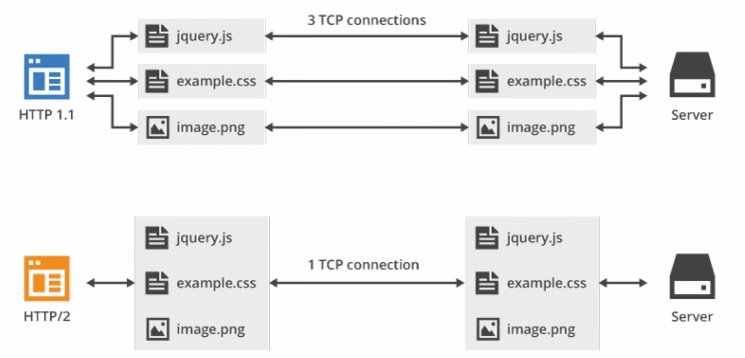

# HTTP2

## 新特性

### 二进制传输

HTTP2采用二进制格式传输数据，解析起来更高效。

#### 重要概念

- 流：流是连接中的一个虚拟信道，可以承载双向的消息；每个流都有一个唯一的整数标识符（1、2…N）；
- 消息：是指逻辑上的 HTTP 消息，比如请求、响应等，由一或多个帧组成。
- 帧：HTTP 2.0 通信的最小单位，每个帧包含帧首部，至少也会标识出当前帧所属的流，承载着特定类型的数据，如 HTTP 首部、负荷，等等

HTTP/2 中，同域名下所有通信都在单个连接上完成，该连接可以承载任意数量的双向数据流。每个数据流都以消息的形式发送，而消息又由一个或多个帧组成。多个帧之间可以乱序发送，根据帧首部的流标识可以重新组装。

### 多路复用

在 HTTP/2 中，有了二进制分帧之后，HTTP /2 不再依赖 TCP 链接去实现多流并行了，在 HTTP/2 中：

1. 同域名下所有通信都在单个连接上完成。
1. 单个连接可以承载任意数量的双向数据流。
1. 数据流以消息的形式发送，而消息又由一个或多个帧组成，多个帧之间可以乱序发送，因为根据帧首部的流标识可以重新组装。
1. 这一特性，使性能有了极大提升：

同个域名只需要占用一个 TCP 连接，使用一个连接并行发送多个请求和响应,消除了因多个 TCP 连接而带来的延时和内存消耗。

1. 并行交错地发送多个请求，请求之间互不影响。
1. 并行交错地发送多个响应，响应之间互不干扰。
1. 在 HTTP/2 中，每个请求都可以带一个 31bit 的优先值，0 表示最高优先级， 数值越大优先级越低。有了这个优先值，客户端和服务器就可以在处理不同的流时采取不同的策略，以最优的方式发送流、消息和帧。

## Header 压缩

在 HTTP/1 中，我们使用文本的形式传输 header，在 header 携带 cookie 的情况下，可能每次都需要重复传输几百到几千的字节。

为了减少这块的资源消耗并提升性能， HTTP/2 对这些首部采取了压缩策略：

- HTTP/2 在客户端和服务器端使用“首部表”来跟踪和存储之前发送的键－值对，对于相同的数据，不再通过每次请求和响应发送；
- 首部表在 HTTP/2 的连接存续期内始终存在，由客户端和服务器共同渐进地更新;
- 每个新的首部键－值对要么被追加到当前表的末尾，要么替换表中之前的值

例如下图中的两个请求， 请求一发送了所有的头部字段，第二个请求则只需要发送差异数据，这样可以减少冗余数据，降低开销

## Server Push

Server Push 即服务端能通过 push 的方式将客户端需要的内容预先推送过去，也叫“cache push”。

可以想象以下情况，某些资源客户端是一定会请求的，这时就可以采取服务端 push 的技术，提前给客户端推送必要的资源，这样就可以相对减少一点延迟时间。当然在浏览器兼容的情况下你也可以使用 prefetch。
例如服务端可以主动把 JS 和 CSS 文件推送给客户端，而不需要客户端解析 HTML 时再发送这些请求。

服务端可以主动推送，客户端也有权利选择是否接收。如果服务端推送的资源已经被浏览器缓存过，浏览器可以通过发送 RST_STREAM 帧来拒收。主动推送也遵守同源策略，换句话说，服务器不能随便将第三方资源推送给客户端，而必须是经过双方确认才行。

## 引用

1. [一文读懂 HTTP/2 及 HTTP/3 特性](https://blog.fundebug.com/2019/03/07/understand-http2-and-http3/)