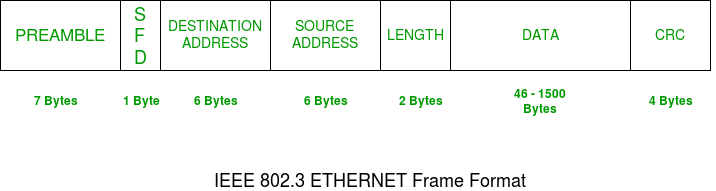
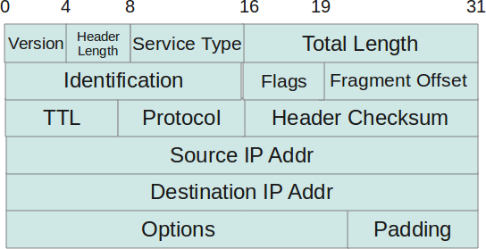
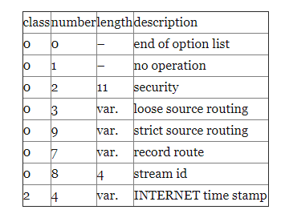
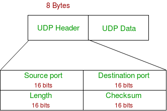

## Ethernet frame

Ethernet (IEEE 802.3) Frame Format

- **PREAMBLE**: Ethernet frame starts with 7-Bytes Preamble. This is a pattern of alternative 0’s and 1’s which indicates starting of the frame and allow sender and receiver to establish bit synchronization. Initially, PRE (Preamble) was introduced to allow for the loss of a few bits due to signal delays. But today’s high-speed Ethernet don’t need Preamble to protect the frame bits.
- **PRE (Preamble) indicates the receiver that frame is coming and allow the receiver to lock onto the data stream before the actual frame begins.
- **Start of frame delimiter (SFD)**: This is a 1-Byte field which is always set to 10101011. SFD indicates that upcoming bits are starting of the frame, which is the destination address. Sometimes SFD is considered the part of PRE, this is the reason Preamble is described as 8 Bytes in many places. The SFD warns station or stations that this is the last chance for synchronization.
- **Destination Address**: This is 6-Byte field which contains the MAC address of machine for which data is destined.
- **Source Address**: This is a 6-Byte field which contains the MAC address of source machine. As Source Address is always an individual address (Unicast), the least significant bit of first byte is always 0.
- **Length**: Length is a 2-Byte field, which indicates the length of entire Ethernet frame. This 16-bit field can hold the length value between 0 to 65534, but length cannot be larger than 1500 because of some own limitations of Ethernet.
- **Data**: This is the place where actual data is inserted, also known as Payload. Both IP header and data will be inserted here if Internet Protocol is used over Ethernet. The maximum data present may be as long as 1500 Bytes. In case data length is less than minimum length i.e. 46 bytes, then padding 0’s is added to meet the minimum possible length.
- **Cyclic Redundancy Check (CRC)**: CRC is 4 Byte field. This field contains a 32-bits hash code of data, which is generated over the Destination Address, Source Address, Length, and Data field. If the checksum computed by destination is not the same as sent checksum value, data received is corrupted.

## IP

- **Protocol Version(4 bits)** : This is the first field in the protocol header. This field occupies 4 bits. This signifies the current IP protocol version being used. Most common version of IP protocol being used is version 4 while version 6 is out in market and fast gaining popularity.
- **Header Length(4 bits)** : This field provides the length of the IP header. The length of the header is represented in 32 bit words. This length also includes IP options (if any). Since this field is of 4 bits so the maximum header length allowed is 60 bytes. Usually when no options are present then the value of this field is 5. Here 5 means five 32 bit words ie 5 *4 = 20 bytes.
- **Type of service(8 bits)** : The first three bits of this field are known as precedence bits and are ignored as of today. The next 4 bits represent type of service and the last bit is left unused. The 4 bits that represent TOS are: minimize delay, maximize throughput, maximize reliability and minimize monetary cost.
- **Total length(16 bits)** : This represents the total IP datagram length in bytes. Since the header length (described above) gives the length of header and this field gives total length so the length of data and its starting point can easily be calculated using these two fields. Since this is a 16 bit field and it represents length of IP datagram so the maximum size of IP datagram can be 65535 bytes. When IP fragmentation takes place over the network then value of this field also changes. There are cases when IP datagrams are very small in length but some data links like ethernet pad these small frames to be of a minimum length ie 46 bytes. So to know the exact length of IP header in case of ethernet padding this field comes in handy.
- **Identification(16 bits)** : This field is used for uniquely identifying the IP datagrams. This value is incremented every-time an IP datagram is sent from source to the destination. This field comes in handy while reassembly of fragmented IP data grams.
- **Flags(3 bits)** : This field comprises of three bits. While the first bit is kept reserved as of now, the next two bits have their own importance. The second bit represents the ‘Don’t Fragment’ bit. When this bit is set then IP datagram is never fragmented, rather its thrown away if a requirement for fragment arises. The third bit represents the ‘More Fragment’ bit. If this bit is set then it represents a fragmented IP datagram that has more fragments after it. In case of last fragment of an IP datagram this bit is not set signifying that this is the last fragment of a particular IP datagram.
- **Fragment offset(13 bits)** : In case of fragmented IP data grams, this field contains the offset( in terms of 8 bytes units) from the start of IP datagram. So again, this field is used in reassembly of fragmented IP datagrams.
- **Time to live(8 bits)** : This value represents number of hops that the IP datagram will go through before being discarded. The value of this field in the beginning is set to be around 32 or 64 (lets say) but at every hop over the network this field is decremented by one. When this field becomes zero, the data gram is discarded. So, we see that this field literally means the effective lifetime for a datagram on network.
- **Protocol(8 bits)** : This field represents the transport layer protocol that handed over data to IP layer. This field comes in handy when the data is demultiplex-ed at the destination as in that case IP would need to know which protocol to hand over the data to.
- **Header Checksum(16 bits)** : This fields represents a value that is calculated using an algorithm covering all the fields in header (assuming this very field to be zero). This value is calculated and stored in header when IP data gram is sent from source to destination and at the destination side this checksum is again calculated and verified against the checksum present in header. If the value is same then the datagram was not corrupted else its assumed that data gram was received corrupted. So this field is used to check the integrity of an IP datagram.
- **Source and destination IP(32 bits each)** : These fields store the source and destination address respectively. Since size of these fields is 32 bits each so an IP address os  maximum length of 32 bits can be used. So we see that this limits the number of IP addresses that can be used. To counter this problem, IP V6 has been introduced which increases this capacity.
- **Options(Variable length)** : This field represents a list of options that are active for a particular IP datagram. This is an optional field that could be or could not be present. If any option is present in the header then the first byte is represented as follows :

In the description above, the ‘copy flag’ means that copy this option to all the fragments in case this IP datagram gets fragmented. The ‘option class’ represents the following values: 0 -> control, 1-> reserved, 2 -> debugging and measurement, and 3 -> reserved. Some of the options are given below :

- **Data** : This field contains the data from the protocol layer that has handed over the data to IP layer. Generally this data field contains the header and data of the transport layer protocols. Please note that each TCP/IP layer protocol attaches its own header at the beginning of the data it receives from other layers in case of source host and in case of destination host each protocol strips its own header and sends the rest of the data to the next layer.

## TCP

- **Source Port Address**: 16 bit field that holds the port address of the application that is sending the data segment.
- **Destination Port Address**: 16 bit field that holds the port address of the application in the host that is receiving the data segment.
- **Sequence Number**: 32 bit field that holds the sequence number, i.e, the byte number of the first byte that is sent in that particular segment. It is used to reassemble the message at the receiving end if the segments are received out of order.
- **Acknowledgement Number**: 32 bit field that holds the acknowledgement number, i.e, the byte number that the receiver expects to receive next. It is an acknowledgment for the previous bytes being received successfully.
- **Header Length (HLEN)**: This is a 4 bit field that indicates the length of the TCP header by number of 4-byte words in the header, i.e, if the header is of 20 bytes(min length of TCP header), then this field will hold 5 (because 5 x 4 = 20) and the maximum length: 60 bytes, then it’ll hold the value 15(because 15 x 4 = 60). Hence, the value of this field is always between 5 and 15.
- **Control flags**: These are 6 1-bit control bits that control connection establishment, connection termination, connection abortion, flow control, mode of transfer etc. Their function is:
    - **URG**: Urgent pointer is valid
    - **ACK**: Acknowledgement number is valid( used in case of cumulative acknowledgement)
    - **PSH**: Request for push
    - **RST**: Reset the connection
    - **SYN**: Synchronize sequence numbers
    - **FIN**: Terminate the connection
- **Window size**: This field tells the window size of the sending TCP in bytes.
- **Checksum**: This field holds the checksum for error control. It is mandatory in TCP as opposed to UDP.
- **Urgent pointer**: This field (valid only if the URG control flag is set) is used to point to data that is urgently required that needs to reach the receiving process at the earliest. The value of this field is added to the sequence number to get the byte number of the last urgent byte.

## UDP (User Datagram Protocol)

- **Source Port** : Source Port is 2 Byte long field used to identify port number of source.
- **Destination Port** : It is 2 Byte long field, used to identify the port of destined packet.
- **Length** : Length is the length of UDP including header and the data. It is 16-bits field.
- **Checksum** : Checksum is 2 Bytes long field. It is the 16-bit one’s complement of the one’s complement sum of the UDP header, pseudo header of information from the IP header and the data, padded with zero octets at the end (if necessary) to make a multiple of two octets.

## Reference

1. [GeeksforGeeks: Ethernet Frame Format](https://www.geeksforgeeks.org/ethernet-frame-format/)
1. [TheGeekStuff:IP Protocol Header Fundamentals Explained with Diagrams](https://www.thegeekstuff.com/2012/03/ip-protocol-header/)
1. [GeeksforGeeks: Services and Segment structure in TCP](https://www.geeksforgeeks.org/services-and-segment-structure-in-tcp/)
1. [GeeksforGeeks: User Datagram Protocol (UDP)](https://www.geeksforgeeks.org/user-datagram-protocol-udp/)