# protobuf

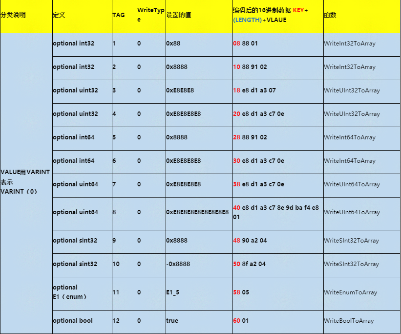
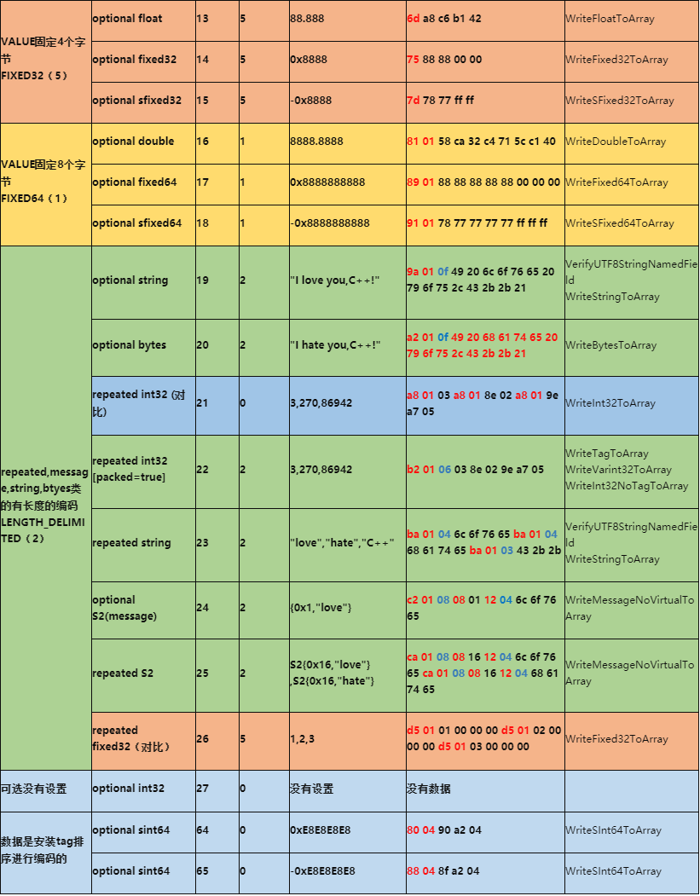

## 整体编码

message中的fields按照tag顺序进行编码，而每个fields的采用key+value的方式保存编码数据。如果一个optional，或者repeated的fields没有被设置，那么他在编码的数据中完全不存在。相应的字段在解码的时候回设置为默认值。如果一个required的标识的fields没有被设置，那么在IsInitialized()检查会失败。编码的顺序和元数据.proto文件内fields的定义数据无关，而是根据tag的从小到大的顺序进行的编码。

key-value的设计保证了protobuf的版本兼容。高<->低，和低<->高都可以适配。（如果高版本编码增加了required 字段，低版本数据解码后会认为IsInitialized() 失败，所以慎用required ）

protobuf的整体数据都是变长的，而且有一定的自描述能力，所以其设计的核心点就是能识别出每一个key，value，(length)。

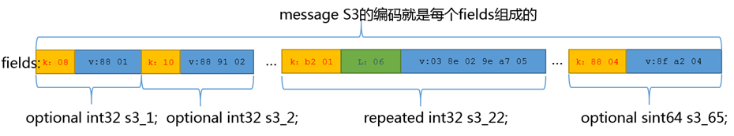

## 编码的key

KEY = VARINT（fields_tag<<3|WireType）

fields_tag就是元数据描述.proto文件里面的tag。

WireType他们就是这个field类型对应的WireType的枚举值。见前面定义表中定义。

生产的数据再用VARINT（后面介绍）进行编码。

当类型VARINT整数数组 （比如repeated int32 ），如果不加packed=true修饰时，key=VARINT（fields_tag<<3|WriteType ：0），视WireType为VARINT ，如果加上packed=true修饰时，仍然KEY = VARINT（fields_tag<<3|WireType:2）,视类型为LENGTH_DELIMITED。

用字段s3_17的key举例：

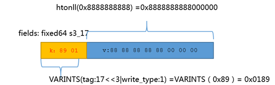

## VARINTS 类型

Base 128 bits VARINS

前面说过变长编码的最大挑战是要找到每个字段边界。所以就必须能用方法能在编码的数据里面找到这个数值。

用连续字节的msb（most significant bit）为1，表示后续的字节仍然是这个数字。当首msb为0，表示结束。这个方法在UTF编码里面也常用。

例子，红色的bit都是表示连续，蓝色bit表示结束。

源： 0x8888 1000 1000 1000 1000
编： 0x029188 0000 0010 1001 0001 1000 1000
源：0xE8E8E8 1110 1000 1110 1000 1110 1000
编：0x07A3D1E8 0000 0111 1010 0011 1101 0001 1110 1000

KEY，LENGTH的编码也是用VARINTS
s3_2的字段例子

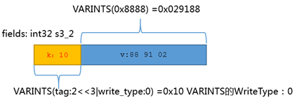

s3_3的走低am的；ozone

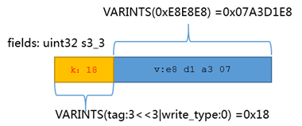

 ZigZag 有符号编码
VARINS大部分时候都可以压缩数值，但如果数值很大时，反而会增加一些消耗，比如int64极限0xFFFFFFFFFFFFFFFF下需要10个字节，所以一看就有一个弱点， VARINS如果直接使用对于有符号数值不利。

所以google对此增加sint32，sint64类型，其会先采用ZigZag编码，然后再VARINS ，不说废话了，直接上google的表格示例：

算法（L我看了示例也没有想到能这样写）

(n << 1) ^ (n >> 31)

(n << 1) ^ (n >> 63)

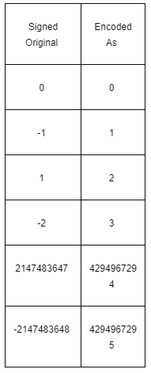

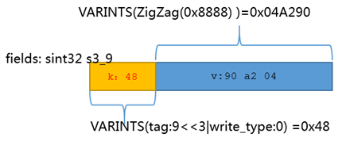

## 4字节和8字节的固定长度编码
 
double，float, 这些都是IEEE规定好的格式。大家反而都老实了。

fixed32，sfixed32，fixed64，fixed64，适合存放大数字数字。编码后变成网络序。

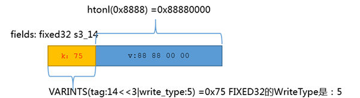

下图是展示repeated fixed32的编码，可以看到其实就是key重复出现。

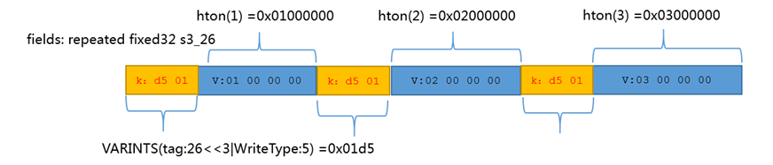

## 变长LENGTH_DELIMITED

### string,bytes

string的编码还是key+value，只是value里面多了一个长度。

string的要求是UTF8的编码的。所以如果不是这个编码最好用bytes。

string的编码带入没有'\0'

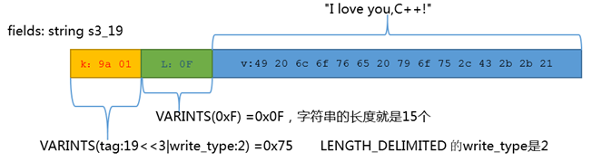

下图是repeated string

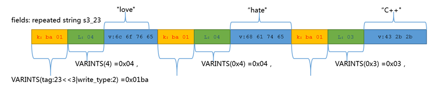

### repeated VARINTS packed

repeated 的VARINTS 有带packed=true 时也是变长，带packed=true的描述会压缩更多，但和普通repeated模式不太一样。

下面的例子是带有packed的字段s3_22的例子

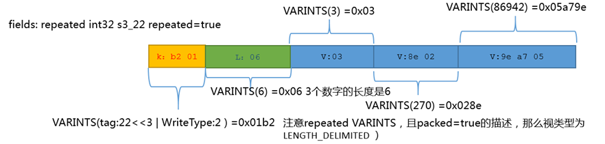

下面是不带packe=true的例子。

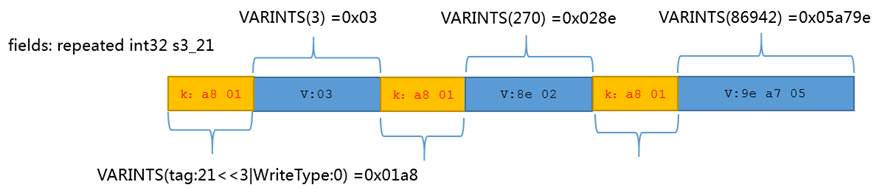

### 内嵌类

内嵌类，中间潜入类S2的例子，s3_24｛1，"love"｝,内嵌类里面的编码方式和外部一样，只是内嵌类的tag使用其自己的tag。

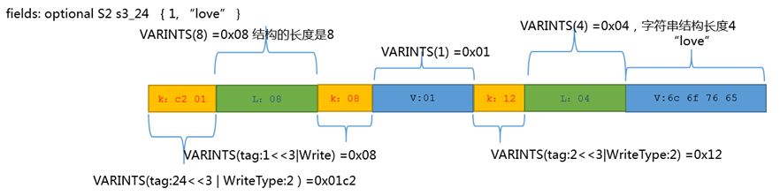

下面的例子是repeated S2 s3_25｛22，"love"｝，{22,"hate"｝

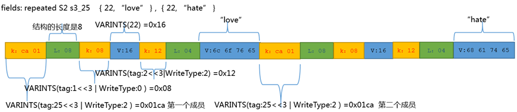

## 引用

1. [C++是促进脑死亡的最佳方式](https://www.cnblogs.com/fullsail/p/4220293.html)
