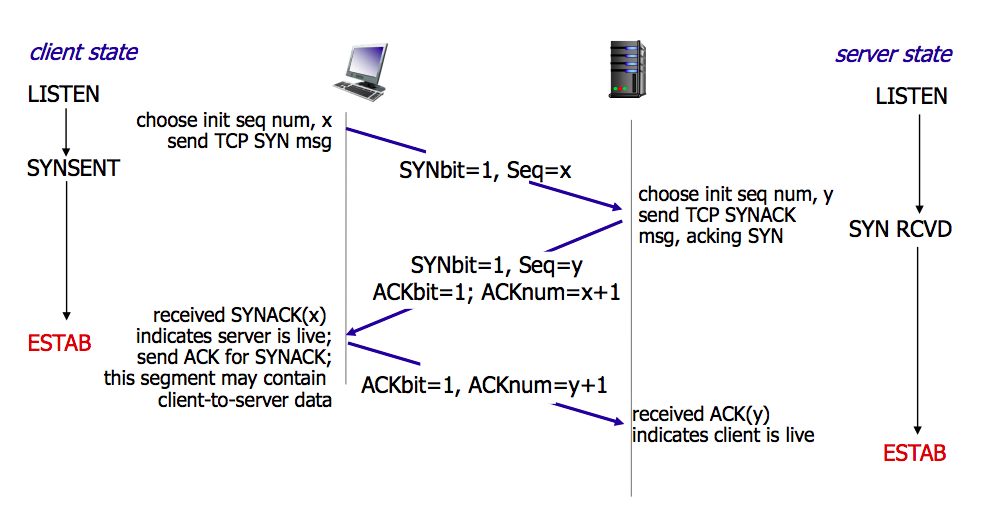
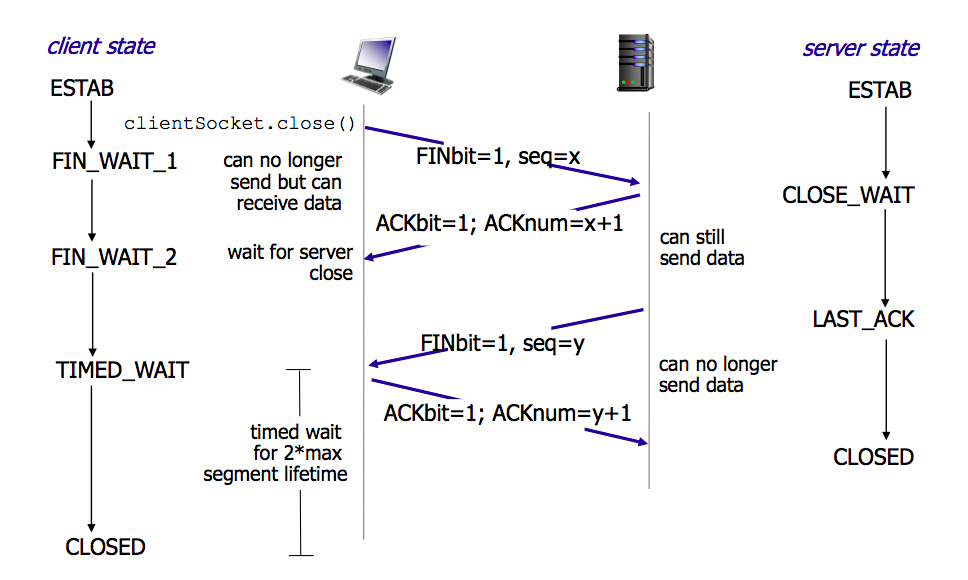
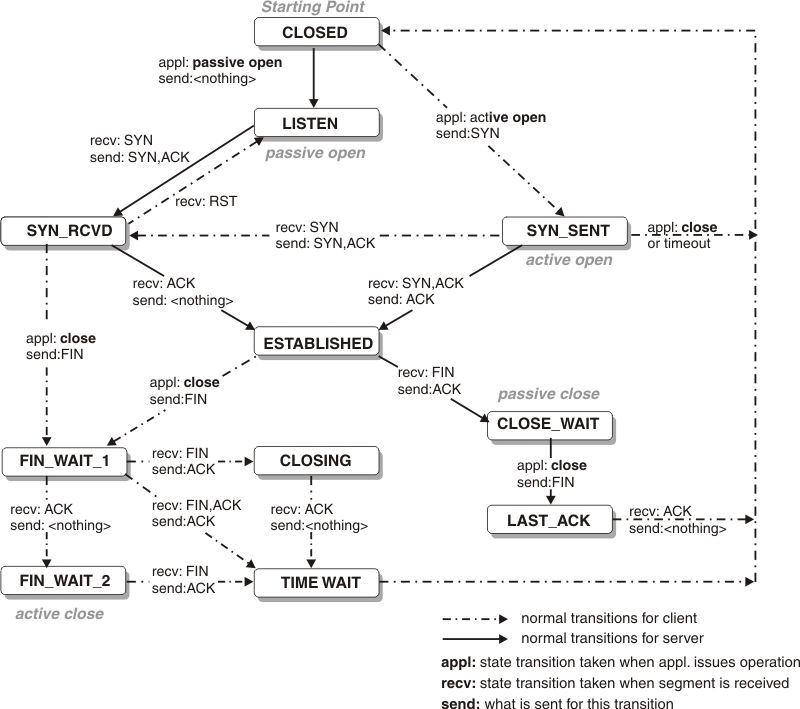

## TCP头部

- **Source Port和Destination Port**: 分别占用16位，表示源端口号和目的端口号；用于区别主机中的不同进程，而IP地址是用来区分不同的主机的，源端口号和目的端口号配合上IP首部中的源IP地址和目的IP地址就能唯一的确定一个TCP连接
- **Sequence Number**: 用来标识从TCP发端向TCP收端发送的数据字节流，它表示在这个报文段中的的第一个数据字节在数据流中的序号；主要用来解决网络报乱序的问题
- **Acknowledgment Number**: 32位确认序列号包含发送确认的一端所期望收到的下一个序号，因此，确认序号应当是上次已成功收到数据字节序号加1。不过，只有当标志位中的ACK标志（下面介绍）为1时该确认序列号的字段才有效。主要用来解决不丢包的问题
- **Offset**: 给出首部中32 bit字的数目，需要这个值是因为任选字段的长度是可变的。这个字段占4bit（最多能表示15个32bit的的字，即4*15=60个字节的首部长度），因此TCP最多有60字节的首部。然而，没有任选字段，正常的长度是20字节
- **TCP Flags**: TCP首部中有6个标志比特，它们中的多个可同时被设置为1，主要是用于操控TCP的状态机的，依次为URG，ACK，PSH，RST，SYN，FIN
- **URG**: 此标志表示TCP包的紧急指针域（后面马上就要说到）有效，用来保证TCP连接不被中断，并且督促中间层设备要尽快处理这些数据
- **ACK**: 此标志表示应答域有效，就是说前面所说的TCP应答号将会包含在TCP数据包中；有两个取值**: 0和1，为1的时候表示应答域有效，反之为0
- **PSH**: 这个标志位表示Push操作。所谓Push操作就是指在数据包到达接收端以后，立即传送给应用程序，而不是在缓冲区中排队
- **RST**: 这个标志表示连接复位请求。用来复位那些产生错误的连接，也被用来拒绝错误和非法的数据包
- **SYN**: 表示同步序号，用来建立连接。SYN标志位和ACK标志位搭配使用，当连接请求的时候，SYN=1，ACK=0；连接被响应的时候，SYN=1，ACK=1；这个标志的数据包经常被用来进行端口扫描。扫描者发送一个只有SYN的数据包，如果对方主机响应了一个数据包回来 ，就表明这台主机存在这个端口；但是由于这种扫描方式只是进行TCP三次握手的第一次握手，因此这种扫描的成功表示被扫描的机器不很安全，一台安全的主机将会强制要求一个连接严格的进行TCP的三次握手
- **Window**: 窗口大小，也就是有名的滑动窗口，用来进行流量控制；这是一个复杂的问题，这篇博文中并不会进行总结的

## 细节

TCP协议规定，只有ACK=1时有效，也规定连接建立后所有发送的报文的ACK必须为1

### 为什么要三次握手

确保是客户端正在请求连接。因为客户端可能在发送一次请求后，这个请求在某个网络节点滞留。客户端后续与服务器建立了新的连接，那么上一个请求就无效了。这时候上一个请求到了服务器，如果没有客户端确认就建立连接，就会占用服务器的资源。

### 为什么要四次分手

- **FIN_WAIT_1**: 这个状态要好好解释一下，其实FIN_WAIT_1和FIN_WAIT_2状态的真正含义都是表示等待对方的FIN报文。而这两种状态的区别是：FIN_WAIT_1状态实际上是当SOCKET在ESTABLISHED状态时，它想主动关闭连接，向对方发送了FIN报文，此时该SOCKET即进入到FIN_WAIT_1状态。而当对方回应ACK报文后，则进入到FIN_WAIT_2状态，当然在实际的正常情况下，无论对方何种情况下，都应该马上回应ACK报文，所以FIN_WAIT_1状态一般是比较难见到的，而FIN_WAIT_2状态还有时常常可以用netstat看到
- **FIN_WAIT_2**: 上面已经详细解释了这种状态，实际上FIN_WAIT_2状态下的SOCKET，表示半连接，也即有一方要求close连接，但另外还告诉对方，我暂时还有点数据需要传送给你(ACK信息)，稍后再关闭连接。
- **CLOSE_WAIT**: 这种状态的含义其实是表示在等待关闭。怎么理解呢？当对方close一个SOCKET后发送FIN报文给自己，你系统毫无疑问地会回应一个ACK报文给对方，此时则进入到CLOSE_WAIT状态。接下来呢，实际上你真正需要考虑的事情是察看你是否还有数据发送给对方，如果没有的话，那么你也就可以 close这个SOCKET，发送FIN报文给对方，也即关闭连接。所以你在CLOSE_WAIT状态下，需要完成的事情是等待你去关闭连接。
- **LAST_ACK**: 这个状态还是比较容易好理解的，它是被动关闭一方在发送FIN报文后，最后等待对方的ACK报文。当收到ACK报文后，也即可以进入到CLOSED可用状态了。
- **TIME_WAIT**: 表示收到了对方的FIN报文，并发送出了ACK报文，就等2MSL后即可回到CLOSED可用状态了。如果FINWAIT1状态下，收到了对方同时带FIN标志和ACK标志的报文时，可以直接进入到TIME_WAIT状态，而无须经过FIN_WAIT_2状态。
- **CLOSED**: 表示连接中断

## 三次握手

1. 第一次握手
客户端发送连接请求报文段，将SYN位置为1，Sequence Number为x
然后，客户端进入SYN_SEND状态，等待服务器的确认服务器收到SYN报文段
1. 第二次握手
服务器收到客户端的SYN报文段，需要对这个SYN报文段进行确认，设置Acknowledgment Number为x+1(Sequence Number+1)
同时，自己自己还要发送SYN请求信息，将SYN位置为1，Sequence Number为y
服务器端将上述所有信息放到一个报文段（即SYN+ACK报文段）中，一并发送给客户端，此时服务器进入SYN_RECV状态
1. 第三次握手
客户端收到服务器的SYN+ACK报文段。然后将Acknowledgment Number设置为y+1，向服务器发送ACK报文段
这个报文段发送完毕以后，客户端和服务器端都进入ESTABLISHED状态，完成TCP三次握手

## 四次挥手

1. 第一次挥手
主机1（可以使客户端，也可以是服务器端），设置Sequence Number和Acknowledgment Number，向主机2发送一个FIN报文段
此时，主机1进入FIN_WAIT_1状态
这表示主机1没有数据要发送给主机2了
1. 第二次挥手
机2收到了主机1发送的FIN报文段，向主机1回一个ACK报文段，Acknowledgment Number为Sequence Number加1
主机1进入FIN_WAIT_2状态
主机2进入CLOSE_WAIT状态
主机2告诉主机1，我“同意”你的关闭请求
此时主机2仍然可以发送数据
1. 第三次挥手
主机2向主机1发送FIN报文段，请求关闭连接，同时主机2进入LAST_ACK状态
1. 第四次挥手
主机1收到主机2发送的FIN报文段，向主机2发送ACK报文段，然后主机1进入TIME_WAIT状态
主机2收到主机1的ACK报文段以后，就关闭连接
此时，主机1等待2MSL后依然没有收到回复，则证明Server端已正常关闭，那好，主机1也可以关闭连接了

## 必须等待 2MSL 的时间

- 第一，为了保证 A 发送的最后一个 ACK 报文段能够到达 B，如果 B 没收到 A 发送的 ack 会重发一个 fin。
- 第二，防止 “已失效的连接请求报文段”出现在本连接中。A 在发送完最后一个 ACK 报文段后，再经过时间 2MSL，就可以使本连接持续的时间内所产生的所有报文段，都从网络中消失。这样就可以使下一个新的连接中不会出现这种旧的连接请求报文段。

## TCP 状态转换

## 引用

1. [TCP和UDP详解](https://zhuanlan.zhihu.com/p/97639908)

