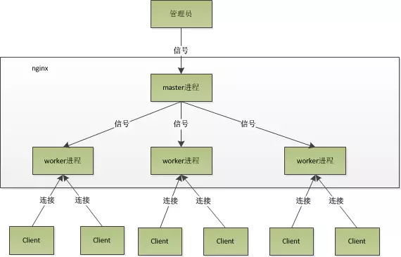
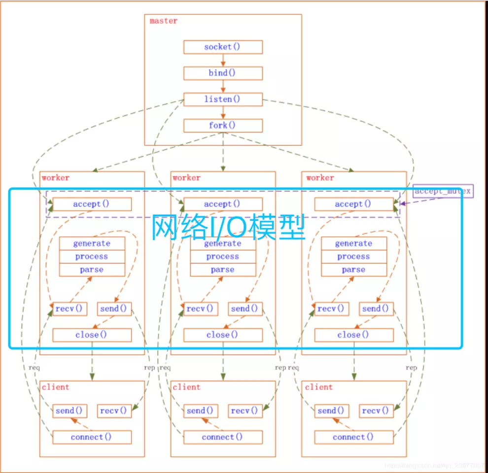

# 架构模型

Nginx之所以为广大码农喜爱，除了其高性能外，还有其优雅的系统架构。与Memcached的经典多线程模型相比，Nginx是经典的多进程模型。Nginx启动后以daemon的方式在后台运行，后台进程包含一个master进程和多个worker进程，具体如下图：

## 网络事件模块

master进程先建好需要listen的socket后，然后再fork出多个woker进程，这样每个work进程都可以去accept这个socket。当一个client连接到来时，所有accept的work进程都会受到通知，但只有一个进程可以accept成功，其它的则会accept失败。Nginx提供了一把共享锁accept_mutex来保证同一时刻只有一个work进程在accept连接，从而解决惊群问题。当一个worker进程accept这个连接后，就开始读取请求，解析请求，处理请求，产生数据后，再返回给客户端，最后才断开连接，这样一个完成的请求就结束了。

## 引用

1. [nginx架构模型分析](https://juejin.im/post/5cdea826e51d4510b934dcb5)