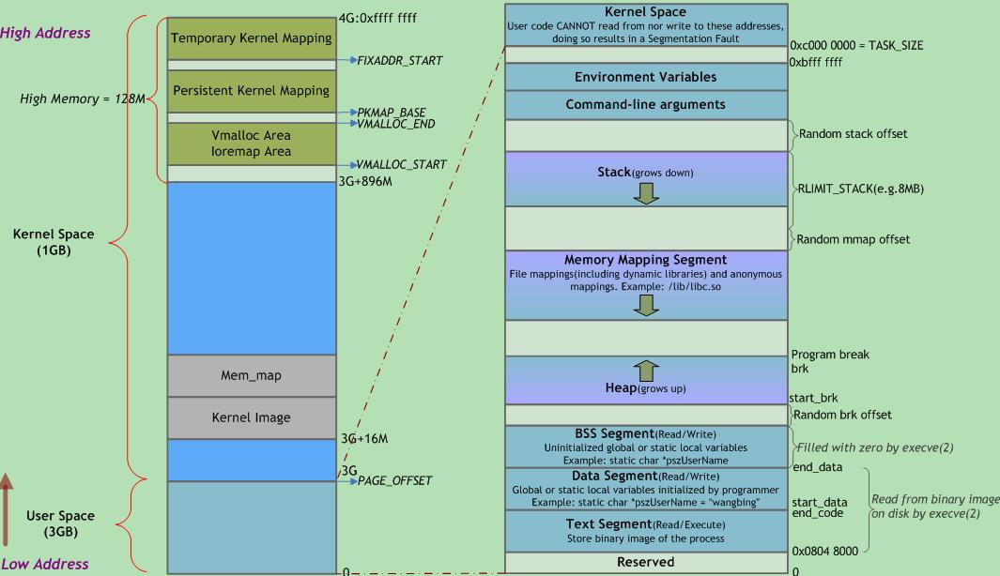

# linux address space

| 名称 | 存储内容 |
| --- | --- |
| 栈 | 局部变量、函数参数、返回地址等 |
| 堆 | 动态分配的内存 |
| BSS段 | 未初始化或初值为0的全局变量和静态局部变量 |
| 数据段 | 已初始化且初值非0的全局变量和静态局部变量 |
| 代码段 | 可执行代码、字符串字面值、只读变量 |

## 引用

1. [Linux虚拟地址空间布局](https://www.cnblogs.com/clover-toeic/p/3754433.html)