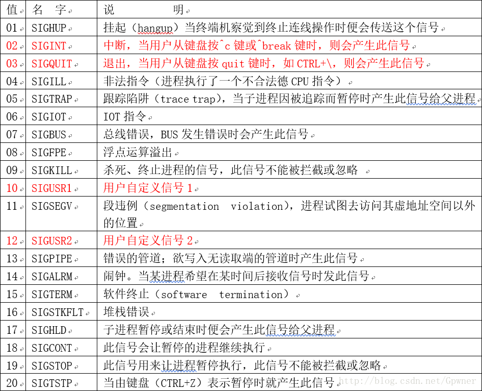

# 信号

## 系统调用

- 发送信号的函数: kill()、raise()。 
- 捕捉信号的函数: alarm()、pause()。
- 处理信号的函数: signal()、sigaction()。

## 引用

1. [请问linux系统发送信号的系统调用是](https://www.nowcoder.com/questionTerminal/8094eec3e01c4694936659cd38c4da99)