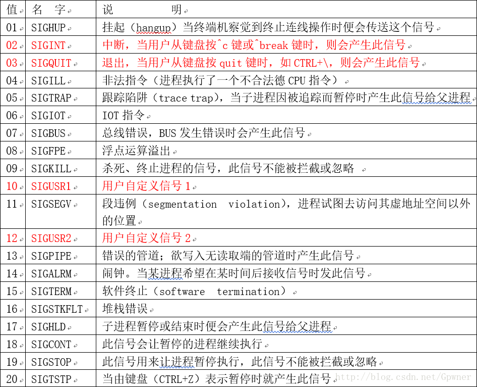

# 信号量

每一个信号都对应一个正整数常量（称为signal number，即信号编号。定义在系统头文件signal.h中），代表同意用户的诸多进程之间的传送事先约定的信号类型，用于通知某进程发生了某异常事件。每个进程在运行的时候，都要通过信号机制来检查是够有信号到达，若有信号到达，便中断正在执行的程序，转向与该信号相对应的处理程序，以完成对该事件的处理；处理结束后再返回到原来的断点继续执行。实质上，信号机制是对中断机制的一种模拟，故在早期的UNIX版本中又把它称为软中断。

## 引用

1. [信号量机制](https://blog.csdn.net/Gpwner/article/details/54135820)
