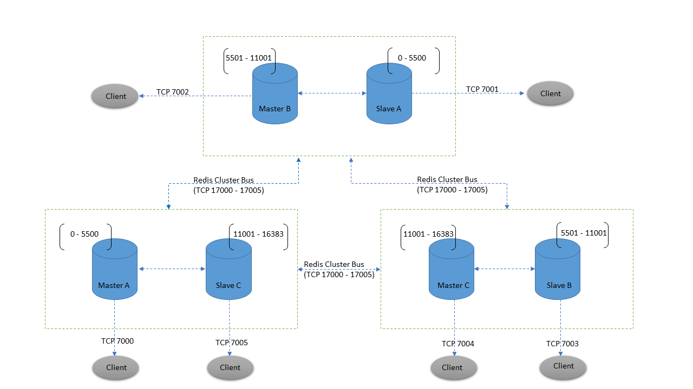

# cluster

## Redis Cluster goals

Redis Cluster is a distributed implementation of Redis with the following goals, in order of importance in the design:

1. High performance and linear scalability up to 1000 nodes. There are no proxies, asynchronous replication is used, and no merge operations are performed on values.
1. Acceptable degree of write safety: the system tries (in a best-effort way) to retain all the writes originating from clients connected with the majority of the master nodes. Usually there are small windows where acknowledged writes can be lost. Windows to lose acknowledged writes are larger when clients are in a minority partition.
1. Availability: Redis Cluster is able to survive partitions where the majority of the master nodes are reachable and there is at least one reachable slave for every master node that is no longer reachable. Moreover using replicas migration, masters no longer replicated by any slave will receive one from a master which is covered by multiple slaves.

## Implemented subset

Redis Cluster implements all the single key commands available in the non-distributed version of Redis. Commands performing complex multi-key operations like Set type unions or intersections are implemented as well as long as the keys all hash to the same slot.

Redis Cluster implements a concept called hash tags that can be used in order to force certain keys to be stored in the same hash slot. However during manual resharding, multi-key operations may become unavailable for some time while single key operations are always available.

Redis Cluster does not support multiple databases like the stand alone version of Redis. There is just database 0 and the SELECT command is not allowed.

### Clients and Servers roles in the Redis Cluster protocol

In Redis Cluster nodes are responsible for holding the data, and taking the state of the cluster, including mapping keys to the right nodes. Cluster nodes are also able to auto-discover other nodes, detect non-working nodes, and promote slave nodes to master when needed in order to continue to operate when a failure occurs.

To perform their tasks all the cluster nodes are connected using a TCP bus and a binary protocol, called the Redis Cluster Bus. Every node is connected to every other node in the cluster using the cluster bus. Nodes use a gossip protocol to propagate information about the cluster in order to discover new nodes, to send ping packets to make sure all the other nodes are working properly, and to send cluster messages needed to signal specific conditions. The cluster bus is also used in order to propagate Pub/Sub messages across the cluster and to orchestrate manual failovers when requested by users (manual failovers are failovers which are not initiated by the Redis Cluster failure detector, but by the system administrator directly).

Since cluster nodes are not able to proxy requests, clients may be redirected to other nodes using redirection errors -MOVED and -ASK. The client is in theory free to send requests to all the nodes in the cluster, getting redirected if needed, so the client is not required to hold the state of the cluster. However clients that are able to cache the map between keys and nodes can improve the performance in a sensible way.

## reference

1. [redis: Redis Cluster Specification](https://redis.io/topics/cluster-spec)