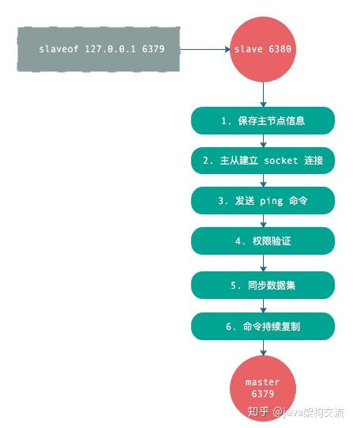
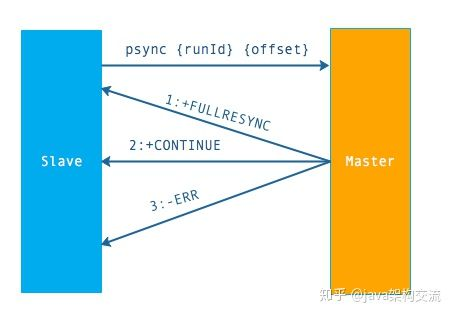
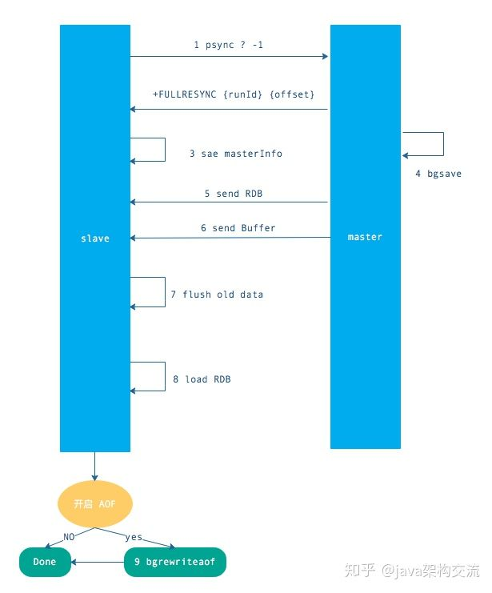
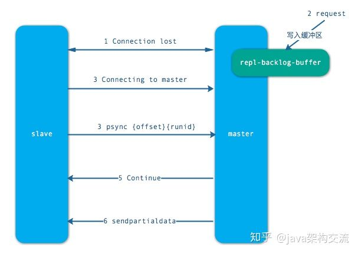
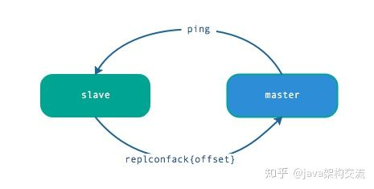
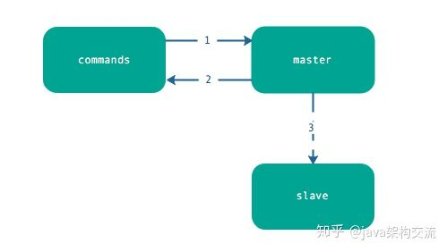

# replication

## 复制过程

1. 从节点执行 slaveof 命令
1. 从节点只是保存了 slaveof 命令中主节点的信息，并没有立即发起复制
1. 从节点内部的定时任务发现有主节点的信息，开始使用 socket 连接主节点
1. 连接建立成功后，发送 ping 命令，希望得到 pong 命令响应，否则会进行重连
1. 如果主节点设置了权限，那么就需要进行权限验证；如果验证失败，复制终止。
1. 权限验证通过后，进行数据同步，这是耗时最长的操作，主节点将把所有的数据全部发送给从节点。
1. 当主节点把当前的数据同步给从节点后，便完成了复制的建立流程。接下来，主节点就会持续的把写命令发送给从节点，保证主从数据一致性。

## 数据间的同步

上面说的复制过程，其中有一个步骤是“同步数据集”，这个就是现在讲的‘数据间的同步’。

redis 同步有 2 个命令：sync 和 psync，前者是 redis 2.8 之前的同步命令，后者是 redis 2.8 为了优化 sync 新设计的命令。我们会重点关注 2.8 的 psync 命令。

### psync 命令需要 3 个组件支持：

1. 主从节点各自复制偏移量
2. 主节点复制积压缓冲区
3. 主节点运行 ID

### 主从节点各自复制偏移量

参与复制的主从节点都会维护自身的复制偏移量。

主节点在处理完写入命令后，会把命令的字节长度做累加记录，统计信息在 info replication 
中的 master_repl_offset 指标中。

从节点每秒钟上报自身的的复制偏移量给主节点，因此主节点也会保存从节点的复制偏移量。

从节点在接收到主节点发送的命令后，也会累加自身的偏移量，统计信息在 info replication 中。

通过对比主从节点的复制偏移量，可以判断主从节点数据是否一致。

### 主节点复制积压缓冲区

复制积压缓冲区是一个保存在主节点的一个固定长度的先进先出的队列。默认大小 1MB。

这个队列在 slave 连接是创建。这时主节点响应写命令时，不但会把命令发送给从节点，也会写入复制缓冲区。

他的作用就是用于部分复制和复制命令丢失的数据补救。

通过 info replication 可以看到相关信息。

### 主节点运行 ID

每个 redis 启动的时候，都会生成一个 40 位的运行 ID。

运行 ID 的主要作用是用来识别 Redis 节点。如果使用 ip+port 的方式，那么如果主节点重启修改
了 RDB/AOF 数据，从节点再基于偏移量进行复制将是不安全的。所以，当运行 id 变化后，从节点将
进行全量复制。也就是说，redis 重启后，默认从节点会进行全量复制。

如果在重启时不改变运行 ID 呢？
可以通过 debug reload 命令重新加载 RDB 并保持运行 ID 不变。从而有效的避免不必要的全量复制。
他的缺点则是：debug reload 命令会阻塞当前 Redis 节点主线程，因此对于大数据量的主节点或者
无法容忍阻塞的节点，需要谨慎使用。

一般通过故障转移机制可以解决这个问题。

### psync 命令的使用方式

命令格式为 `psync {runId} {offset}`

runId : 从节点所复制主节点的运行 id
offset：当前从节点已复制的数据偏移量

### psync 执行流程

流程说明：从节点发送 psync 命令给主节点，runId 就是目标主节点的 ID，如果没有默认为 -1，offset 是从节点保存的复制偏移量，如果是第一次复制则为 -1.

主节点会根据 runid 和 offset 决定返回结果：

如果回复 +FULLRESYNC {runId} {offset} ，那么从节点将触发全量复制流程。
如果回复 +CONTINUE，从节点将触发部分复制。
如果回复 +ERR，说明主节点不支持 2.8 的 psync 命令，将使用 sync 执行全量复制。
到这里，数据之间的同步就讲的差不多了，篇幅还是比较长的。主要是针对 psync 命令相关之间的介绍。

## 全量复制

全量复制是 Redis 最早支持的复制方式，也是主从第一次建立复制时必须经历的的阶段。触发全量复制的命令是 sync 和 psync。之前说过，这两个命令的分水岭版本是 2.8，redis 2.8 之前使用 sync 只能执行全量不同，2.8 之后同时支持全量同步和部分同步。

1. 发送 psync 命令（spync ？ -1）
1. 主节点根据命令返回 FULLRESYNC
1. 从节点记录主节点 ID 和 offset
1. 主节点 bgsave 并保存 RDB 到本地
1. 主节点发送 RBD 文件到从节点
1. 从节点收到 RDB 文件并加载到内存中
1. 主节点在从节点接受数据的期间，将新数据保存到“复制客户端缓冲区”，当从节点加载 RDB 完毕，再发送过去。（如果从节点花费时间过长，将导致缓冲区溢出，最后全量同步失败）
1. 从节点清空数据后加载 RDB 文件，如果 RDB 文件很大，这一步操作仍然耗时，如果此时客户端访问，将导致数据不一致，可以使用配置slave-server-stale-data 关闭.
1. 从节点成功加载完 RBD 后，如果开启了 AOF，会立刻做 bgrewriteaof。

如过 RDB 文件大于 6GB，并且是千兆网卡，Redis 的默认超时机制（60 秒），会导致全量复制失败。可以通过调大 repl-timeout 参数来解决此问题。

Redis 虽然支持无盘复制，即直接通过网络发送给从节点，但功能不是很完善，生产环境慎用。

## 部分复制

当从节点正在复制主节点时，如果出现网络闪断和其他异常，从节点会让主节点补发丢失的命令数据，主节点只需要将复制缓冲区的数据发送到从节点就能够保证数据的一致性，相比较全量复制，成本小很多。

1. 当从节点出现网络中断，超过了 repl-timeout 时间，主节点就会中断复制连接。
1. 主节点会将请求的数据写入到“复制积压缓冲区”，默认 1MB。
1. 当从节点恢复，重新连接上主节点，从节点会将 offset 和主节点 id 发送到主节点
1. 主节点校验后，如果偏移量的数后的数据在缓冲区中，就发送 cuntinue 响应 —— 表示可以进行部分复制
1. 主节点将缓冲区的数据发送到从节点，保证主从复制进行正常状态。

## 心跳

主从节点在建立复制后，他们之间维护着长连接并彼此发送心跳命令。

心跳的关键机制如下：

1. 中从都有心跳检测机制，各自模拟成对方的客户端进行通信，通过 client list 命令查看复制相关客户端信息，主节点的连接状态为 flags = M，从节点的连接状态是 flags = S。
1. 主节点默认每隔 10 秒对从节点发送 ping 命令，可修改配置 repl-ping-slave-period 控制发送频率。
1. 从节点在主线程每隔一秒发送 replconf ack{offset} 命令，给主节点上报自身当前的复制偏移量。
1. 主节点收到 replconf 信息后，判断从节点超时时间，如果超过 repl-timeout 60 秒，则判断节点下线。

## 异步复制

主节点不但负责数据读写，还负责把写命令同步给从节点，写命令的发送过程是异步完成，也就是说主节点处理完写命令后立即返回客户度，并不等待从节点复制完成。

异步复制的步骤很简单，如下：

1. 主节点接受处理命令
1. 主节点处理完后返回响应结果
1. 对于修改命令，异步发送给从节点，从节点在主线程中执行复制的命令。

## reference

1. [知乎：深入Redis：详解 Redis主从复制的原理!](https://zhuanlan.zhihu.com/p/60239657)