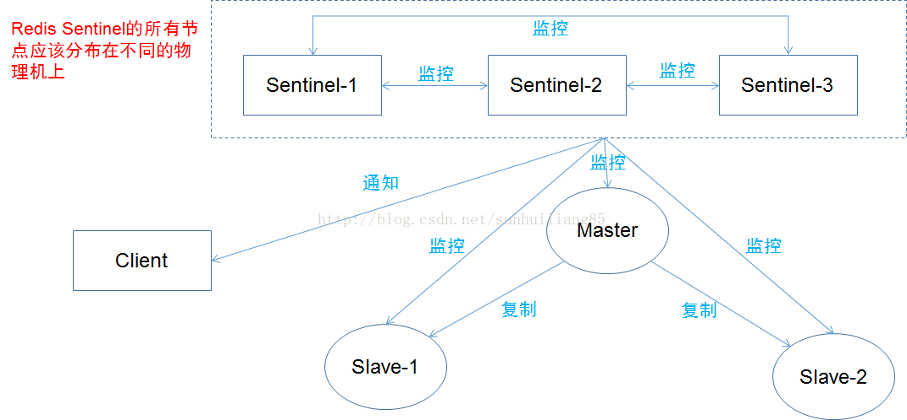

# sentinel

This is the full list of Sentinel capabilities at a macroscopical level (i.e. the big picture):

1. Monitoring. Sentinel constantly checks if your master and replica instances are working as expected.
1. Notification. Sentinel can notify the system administrator, or other computer programs, via an API, that something is wrong with one of the monitored Redis instances.
1. Automatic failover. If a master is not working as expected, Sentinel can start a failover process where a replica is promoted to master, the other additional replicas are reconfigured to use the new master, and the applications using the Redis server are informed about the new address to use when connecting.
1. Configuration provider. Sentinel acts as a source of authority for clients service discovery: clients connect to Sentinels in order to ask for the address of the current Redis master responsible for a given service. If a failover occurs, Sentinels will report the new address.

## 哨兵进程的工作方式

每个 Sentinel（哨兵）进程以每秒钟一次的频率向整个集群中的 Master 主服务器，Slave 从服务器以及其他 Sentinel（哨兵）进程发送一个 PING 命令。（此处我们还没有讲到集群，下一章节就会讲到，这一点并不影响我们模拟哨兵机制）

如果一个实例（instance）距离最后一次有效回复 PING 命令的时间超过 down-after-milliseconds 选项所指定的值， 则这个实例会被 Sentinel（哨兵）进程标记为主观下线（SDOWN）。

如果一个 Master 主服务器被标记为主观下线（SDOWN），则正在监视这个 Master 主服务器的所有 Sentinel（哨兵）进程要以每秒一次的频率确认 Master 主服务器的确进入了主观下线状态。

当有足够数量的 Sentinel（哨兵）进程（大于等于配置文件指定的值）在指定的时间范围内确认 Master 主服务器进入了主观下线状态（SDOWN）， 则 Master 主服务器会被标记为客观下线（ODOWN）。

在一般情况下， 每个 Sentinel（哨兵）进程会以每 10 秒一次的频率向集群中的所有Master 主服务器、Slave 从服务器发送 INFO 命令。

当 Master 主服务器被 Sentinel（哨兵）进程标记为客观下线（ODOWN）时，Sentinel（哨兵）进程向下线的 Master 主服务器的所有 Slave 从服务器发送 INFO 命令的频率会从 10 秒一次改为每秒一次。

若没有足够数量的 Sentinel（哨兵）进程同意 Master 主服务器下线， Master 主服务器的客观下线状态就会被移除。若 Master 主服务器重新向 Sentinel（哨兵）进程发送 PING 命令返回有效回复，Master 主服务器的主观下线状态就会被移除。

## reference

1. [知乎：Redis Sentinel哨兵机制](https://zhuanlan.zhihu.com/p/44474652)