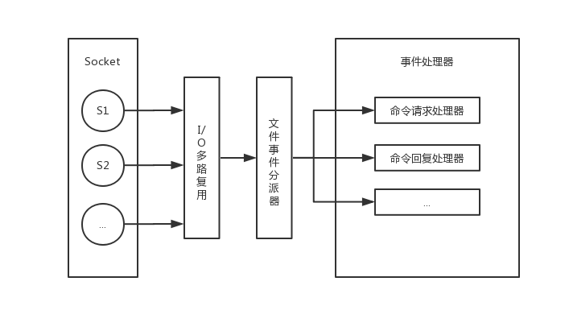

# 线程模型

## Reactor 模式

具体来说，reactor 设计模式定义了以下四种结构：

1. Resources：向系统提供输入或消耗输出的任何资源。
1. Synchronous Event Demultiplexer：同步事件分离器。监听资源信息，当有资源可用时，通知分派器。
1. Dispatcher：负责注册或注销事件处理程序，以及将事件分离器传递过来的资源交付给相应的处理程序。
1. Request Handler：最终处理资源的程序。

在 redis 中，Resources 就是客户端的套接字，Synchronous Event Demultiplexer 由 epoll、select 等 I/O 多路复用相关的系统调用实现，Dispatcher 是文件事件分派器，Request Handler 是注册的命令。如图：

## 引用

1. [Redis 单线程网络模型及 I/O 多路复用](https://arianx.me/2019/04/15/Redis-network-model-introduction/)
