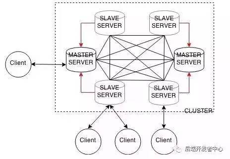
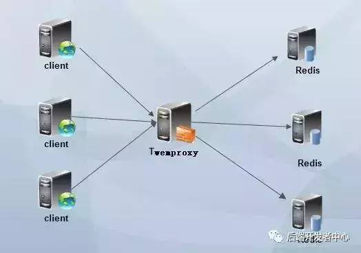

# 集群方案

## 官方cluser方案

1. 每个节点都和n-1个节点通信，这被称为集群总线（cluster bus）。它们使用特殊的端口号，即对外服务端口号加10000。所以要维护好这个集群的每个节点信息，不然会导致整个集群不可用，其内部采用特殊的二进制协议优化传输速度和带宽。
1. redis-cluster把所有的物理节点映射到[0,16383]slot（槽）上，cluster负责维护node--slot--value。
1. 集群预分好16384个桶，当需要在redis集群中插入数据时，根据CRC16(KEY) mod 16384的值，决定将一个key放到哪个桶中。
1. 客户端与redis节点直连，不需要连接集群所有的节点，连接集群中任何一个可用节点即可。
1. redis-trib.rb脚本（rub语言）为集群的管理工具，比如自动添加节点，规划槽位，迁移数据等一系列操作。
1. 节点的fail是通过集群中超过半数的节点检测失效时才生效。

## twemproxy代理方案

## 客户端分片

分区的逻辑在客户端实现，由客户端自己选择请求到哪个节点。方案可参考一致性哈希，这种方案通常适用于用户对客户端的行为有完全控制能力的场景。

## 哨兵模式

1. 每个Sentinel以每秒钟一次的频率向它所知的Master、Slave以及其他Sentinel实例发送一个PING命令。
1. 如果一个实例距离最后一次有效回复PING命令的时间超过down-after-milliseconds选项所指定的值，则这个实例会被Sentinel标记为主观下线。
1. 如果一个Master被标记为主观下线，则正在监视这个Master的所有Sentinel要以每秒一次的频率确认Master的确进入了主观下线状态。
1. 当有足够数量的Sentinel（大于等于配置文件指定的值）在指定的时间范围内确认Master的确进入了主观下线状态，则Master会被标记为客观下线。
1. 在一般情况下，每个Sentinel会以每10秒一次的频率向它所知的所有Master、Slave发送INFO命令。
1. 当Master被Sentinel标记为客观下线时，Sentinel向下线的Master的所有Slave发送INFO命令的频率会从10秒一次改为每秒一次。
1. 若没有足够数量的Sentinel同意Master已经下线，Master的客观下线状态就会被移除。若Master重新向Sentinel的PING命令返回有效值，Master的主观下线状态就会被移除。

## references

1. [Redis集群方案怎么做](https://cloud.tencent.com/developer/article/1163711)
