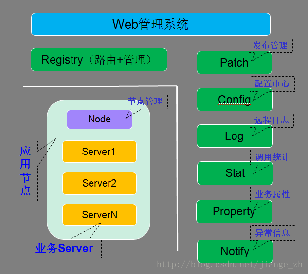
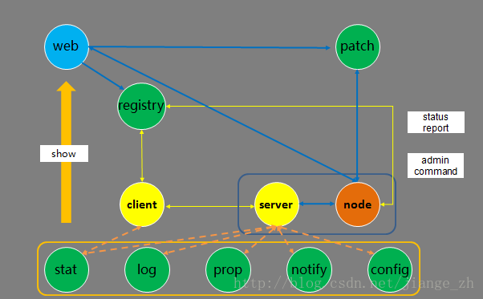
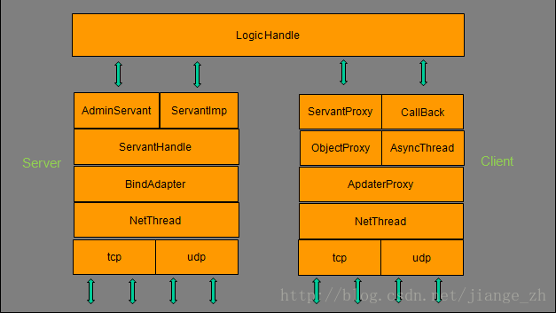

# 架构

## 服务节点

服务节点可以认为是服务所实际运行的一个具体的操作系统实例，可以是物理主机或者虚拟主机、云主机。随着服务的种类扩展和规模扩大，服务节点可能成千上万甚至数以十万计。

每台服务节点上均有一个Node服务节点和N(N>=0)个业务服务节点，Node服务节点会对业务服务节点进行统一管理，提供启停、发布、监控等功能，同时接收业务服务节点上报过来的心跳。

## 公共框架节点

除了服务节点以外的服务，其他服务节点均归为一类。

公共框架节点，数量不定，为了自身的容错容灾，一般也要求在在多个机房的多个服务器上进行部署，具体的节点数量，与服务节点的规模有关，比如，如果某些服务需要打较多的日志，就需要部署更多的日志服务节点。

### Web管理系统

在Web上可以看到服务运行的各种实时数据情况，以及对服务进行发布、启停、部署等操作；

### Registry（路由+管理服务）

提供服务节点的地址查询、发布、启停、管理等操作，以及对服务上报心跳的管理，通过它实现服务的注册与发现；

### Patch（发布管理）

提供服务的发布功能；

### Config（配置中心）

提供服务配置文件的统一管理功能；

### Log（远程日志）

提供服务打日志到远程的功能；

### Stat（调用统计）

统计业务服务上报的各种调用信息，比如总流量、平均耗时、超时率等，以便对服务出现异常时进行告警；

### Property（业务属性）

统计业务自定义上报的属性信息，比如内存使用大小、队列大小、cache命中率等，以便对服务出现异常时进行告警；

### Notify（异常信息）

统计业务上报的各种异常信息，比如服务状态变跟信息、访问db失败信息等，以便对服务出现异常时进行告警；

原则上要求全部的节点之间网络互通，至少每台机器的node能够与公共框架节点之间都是可以连通的。

## 服务交互流程图

框架服务在整个系统中运行时，服务之间的交互分：业务服务之间的交互、业务服务与框架基础服务之间的交互。

### 服务发布流程

在Web系统上传server的发布包到patch，上传成功后，在web上提交发布server请求，由registry服务传达到node，然后node拉取server的发布包到本地，拉起server服务。

### 管理命令流程

Web系统上的可以提交管理server服务命令请求，由registry服务传达到node服务，然后由node向server发送管理命令。

### 心跳上报流程

server服务运行后，会定期上报心跳到node，node然后把服务心跳信息上报到registry服务，由registry进行统一管理。

### 信息上报流程

server服务运行后，会定期上报统计信息到stat，打印远程日志到log，定期上报属性信息到property、上报异常信息到notify、从config拉取服务配置信息。

### Client访问Server流程

client可以通过server的对象名Obj间接访问server(即通过名字服务来路由，而不是写死IP)，Client会从registry上拉取server的路由信息（如ip、port信息），然后根据具体的业务特性（同步或者异步，tcp或者udp方式）访问server(当然client也可以通过ip/port直接访问server)。

## 服务结构图

### 服务端

- NetThread：网络线程，负责收发包，连接管理，多线程(可配置），采用epoll ET触发实现，支持tcp/udp；
- BindAdapter： 绑定端口类，用于管理servent(业务线程)对应的绑定端口的信息操作；
- ServantHandle：业务线程类，根据对象名分派Servant的对象和接口调用；
- AdminServant： 管理端口的对象；
- ServantImp： 继承Servant的业务处理基类（Servent：服务端接口对象的基类）；

### 客户端

- NetThread：网络线程， 收发包，连接管理，多线程(可配置），采用epoll ET触发实现，支持tcp/udp；
- AdapterProxy： 具体服务器某个节点的本地代理，管理到服务器的连接，以及请求超时处理；
- ObjectProxy： 远程对象代理，负责路由分发、负载均衡、容错，支持轮询/hash/权重；
- ServantProxy： 远程对象调用的本地代理，支持同步/异步/单向，Tars协议和非Tars协议；
- AsyncThread： 异步请求的回应包处理线程；
- Callback： 具体业务Callback的处理基类对象；
