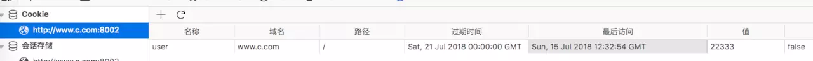
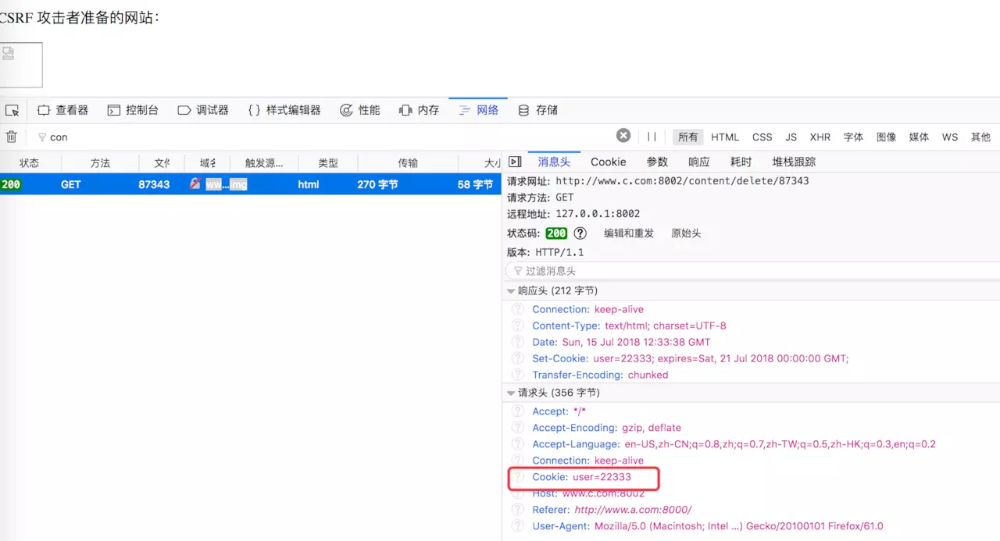
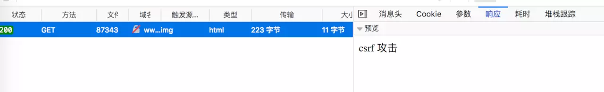

## CSRF是什么？

CSRF（Cross-site request forgery），中文名称：跨站请求伪造，也被称为：one click attack/session riding，缩写为：CSRF/XSRF。

## 危害

1. 冒用身份进行转账、发送私密信息等操作；

## CSRF的原理


### 通过 Cookie 进行 CSRF 攻击

假设有一个 bbs 站点：http://www.c.com，当登录后的用户发起如下 GET 请求时，会删除 ID 指定的帖子：

http://www.c.com:8002/content/delete/:id

如发起 http://www.c.com:8002/content/delete/87343 请求时，会删除 id 为 87343 的帖子。当用户登录之后，会设置如下 cookie：

```
res.setHeader('Set-Cookie', ['user=22333; expires=Sat, 21 Jul 2018 00:00:00 GMT;']);
```



user 对应的值是用户 ID。然后构造一个页面 A：

```
<p>CSRF 攻击者准备的网站：</p>

```

页面 A 使用了一个 img 标签，其地址指向了删除用户帖子的链接：



可以看到，当登录用户访问攻击者的网站时，会向 www.c.com 发起一个删除用户帖子的请求。此时若用户在切换到 www.c.com 的帖子页面刷新，会发现ID 为 87343 的帖子已经被删除。

由于 Cookie 中包含了用户的认证信息，当用户访问攻击者准备的攻击环境时，攻击者就可以对服务器发起 CSRF 攻击。在这个攻击过程中，攻击者借助受害者的 Cookie 骗取服务器的信任，但并不能拿到 Cookie，也看不到 Cookie 的内容。而对于服务器返回的结果，由于浏览器同源策略的限制，攻击者也无法进行解析。因此，攻击者无法从返回的结果中得到任何东西，他所能做的就是给服务器发送请求，以执行请求中所描述的命令，在服务器端直接改变数据的值，而非窃取服务器中的数据。

但若 CSRF 攻击的目标并不需要使用 Cookie，则也不必顾虑浏览器的 Cookie 策略了。

## CSRF的防御

当前，对 CSRF 攻击的防范措施主要有如下几种方式。

### 验证码

验证码被认为是对抗 CSRF 攻击最简洁而有效的防御方法。

从上述示例中可以看出，CSRF 攻击往往是在用户不知情的情况下构造了网络请求。而验证码会强制用户必须与应用进行交互，才能完成最终请求。因为通常情况下，验证码能够很好地遏制 CSRF 攻击。

但验证码并不是万能的，因为出于用户考虑，不能给网站所有的操作都加上验证码。因此，验证码只能作为防御 CSRF 的一种辅助手段，而不能作为最主要的解决方案。

### Referer Check

根据 HTTP 协议，在 HTTP 头中有一个字段叫 Referer，它记录了该 HTTP 请求的来源地址。通过 Referer Check，可以检查请求是否来自合法的"源"。

比如，如果用户要删除自己的帖子，那么先要登录 www.c.com，然后找到对应的页面，发起删除帖子的请求。此时，Referer 的值是 http://www.c.com；当请求是从 www.a.com 发起时，Referer 的值是 http://www.a.com 了。因此，要防御 CSRF 攻击，只需要对于每一个删帖请求验证其 Referer 值，如果是以 www.c.com 开头的域名，则说明该请求是来自网站自己的请求，是合法的。如果 Referer 是其他网站的话，则有可能是 CSRF 攻击，可以拒绝该请求。

针对上文的例子，可以在服务端增加如下代码：

```
if (req.headers.referer !== 'http://www.c.com:8002/') {
    res.write('csrf 攻击');
    return;
}
```



Referer Check 不仅能防范 CSRF 攻击，另一个应用场景是 "防止图片盗链"。

### 添加 token 验证

CSRF 攻击之所以能够成功，是因为攻击者可以完全伪造用户的请求，该请求中所有的用户验证信息都是存在于 Cookie 中，因此攻击者可以在不知道这些验证信息的情况下直接利用用户自己的 Cookie 来通过安全验证。要抵御 CSRF，关键在于在请求中放入攻击者所不能伪造的信息，并且该信息不存在于 Cookie 之中。可以在 HTTP 请求中以参数的形式加入一个随机产生的 token，并在服务器端建立一个拦截器来验证这个 token，如果请求中没有 token 或者 token 内容不正确，则认为可能是 CSRF 攻击而拒绝该请求。

## 引用

1. [浅谈CSRF攻击方式](https://www.cnblogs.com/hyddd/archive/2009/04/09/1432744.html)
1. [浅说 XSS 和 CSRF](https://juejin.im/entry/5b4b56fd5188251b1a7b2ac1)
