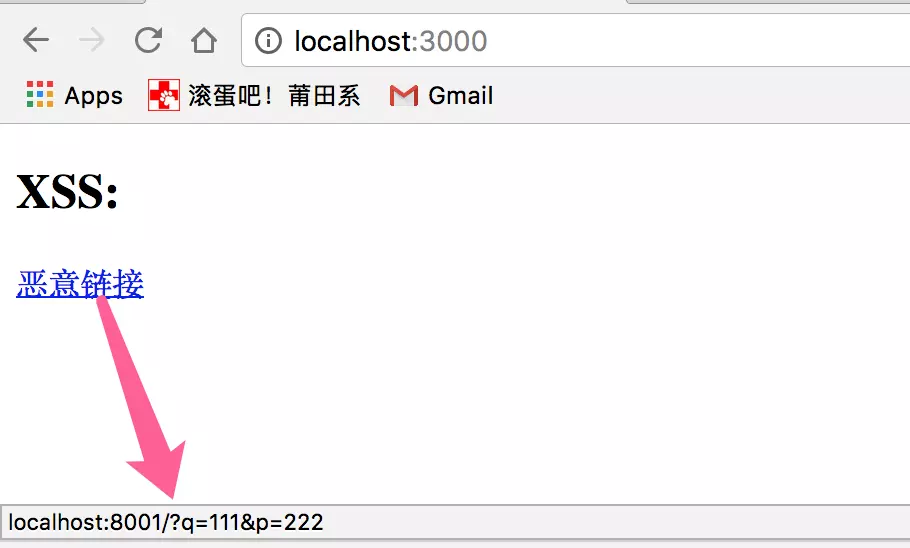
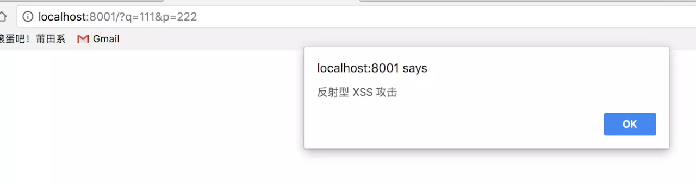
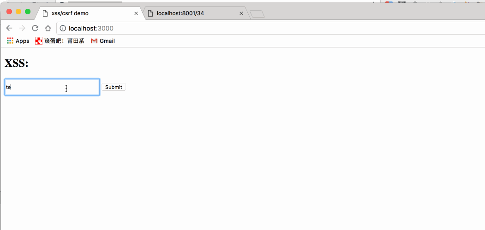

# 跨站脚本攻击

XSS (Cross Site Script) 攻击可以分为3类：反射型（非持久型）、存储型（持久型）、基于DOM。

## 危害

1. 盗窃用户信息；
2. 转账；

## 反射型
反射型 XSS 只是简单地把用户输入的数据 “反射” 给浏览器，这种攻击方式往往需要攻击者诱使用户点击一个恶意链接，或者提交一个表单，或者进入一个恶意网站时，注入脚本进入被攻击者的网站。

看一个示例。我先准备一个如下的静态页：



恶意链接的地址指向了 localhost:8001/?q=111&p=222。然后，我再启一个简单的 Node 服务处理恶意链接的请求：

```
const http = require('http');
function handleReequest(req, res) {
    res.setHeader('Access-Control-Allow-Origin', '*');
    res.writeHead(200, {'Content-Type': 'text/html; charset=UTF-8'});
    res.write('<script>alert("反射型 XSS 攻击")</script>');
    res.end();
}

const server = new http.Server();
server.listen(8001, '127.0.0.1');
server.on('request', handleReequest);
```

当用户点击恶意链接时，页面跳转到攻击者预先准备的页面，会发现在攻击者的页面执行了 js 脚本：



这样就产生了反射型 XSS 攻击。攻击者可以注入任意的恶意脚本进行攻击，可能注入恶作剧脚本，或者注入能获取用户隐私数据(如cookie)的脚本，这取决于攻击者的目的。

## 存储型
存储型 XSS 会把用户输入的数据 "存储" 在服务器端，当浏览器请求数据时，脚本从服务器上传回并执行。这种 XSS 攻击具有很强的稳定性。

比较常见的一个场景是攻击者在社区或论坛上写下一篇包含恶意 JavaScript 代码的文章或评论，文章或评论发表后，所有访问该文章或评论的用户，都会在他们的浏览器中执行这段恶意的 JavaScript 代码。

举一个示例。

先准备一个输入页面：

```
<input type="text" id="input">
<button id="btn">Submit</button>   

<script>
    const input = document.getElementById('input');
    const btn = document.getElementById('btn');

    let val;
     
    input.addEventListener('change', (e) => {
        val = e.target.value;
    }, false);

    btn.addEventListener('click', (e) => {
        fetch('http://localhost:8001/save', {
            method: 'POST',
            body: val
        });
    }, false);
</script>     
```

启动一个 Node 服务监听 save 请求。为了简化，用一个变量来保存用户的输入：

```
const http = require('http');

let userInput = '';

function handleReequest(req, res) {
    const method = req.method;
    res.setHeader('Access-Control-Allow-Origin', '*');
    res.setHeader('Access-Control-Allow-Headers', 'Content-Type')
    
    if (method === 'POST' && req.url === '/save') {
        let body = '';
        req.on('data', chunk => {
            body += chunk;
        });

        req.on('end', () => {
            if (body) {
                userInput = body;
            }
            res.end();
        });
    } else {
        res.writeHead(200, {'Content-Type': 'text/html; charset=UTF-8'});
        res.write(userInput);
        res.end();
    }
}

const server = new http.Server();
server.listen(8001, '127.0.0.1');

server.on('request', handleReequest);
```

当用户点击提交按钮将输入信息提交到服务端时，服务端通过 userInput 变量保存了输入内容。当用户通过 http://localhost:8001/${id} 访问时，服务端会返回与 id 对应的内容(本示例简化了处理)。如果用户输入了恶意脚本内容，则其他用户访问该内容时，恶意脚本就会在浏览器端执行：



## 基于DOM
基于 DOM 的 XSS 攻击是指通过恶意脚本修改页面的 DOM 结构，是纯粹发生在客户端的攻击。

看如下代码：

```
<h2>XSS: </h2>
<input type="text" id="input">
<button id="btn">Submit</button>
<div id="div"></div>
<script>
    const input = document.getElementById('input');
    const btn = document.getElementById('btn');
    const div = document.getElementById('div');

    let val;
     
    input.addEventListener('change', (e) => {
        val = e.target.value;
    }, false);

    btn.addEventListener('click', () => {
        div.innerHTML = `<a href=${val}>testLink</a>`
    }, false);
</script>
```

点击 Submit 按钮后，会在当前页面插入一个链接，其地址为用户的输入内容。如果用户在输入时构造了如下内容：

```
'' onclick=alert(/xss/)
```

用户提交之后，页面代码就变成了：

```
<a href onlick="alert(/xss/)">testLink</a>
```

此时，用户点击生成的链接，就会执行对应的脚本：


## XSS 攻击的防范

### CSP

现在主流的浏览器内置了防范 XSS 的措施，例如 CSP。但对于开发者来说，也应该寻找可靠的解决方案来防止 XSS 攻击。

内容安全策略   (CSP) 是一个额外的安全层，用于检测并削弱某些特定类型的攻击，包括跨站脚本 (XSS) 和数据注入攻击等。无论是数据盗取、网站内容污染还是散发恶意软件，这些攻击都是主要的手段。

CSP 的主要目标是减少和报告 XSS 攻击 ，XSS 攻击利用了浏览器对于从服务器所获取的内容的信任。恶意脚本在受害者的浏览器中得以运行，因为浏览器信任其内容来源，即使有的时候这些脚本并非来自于它本该来的地方。

CSP通过指定有效域——即浏览器认可的可执行脚本的有效来源——使服务器管理者有能力减少或消除XSS攻击所依赖的载体。一个CSP兼容的浏览器将会仅执行从白名单域获取到的脚本文件，忽略所有的其他脚本 (包括内联脚本和HTML的事件处理属性)。

作为一种终极防护形式，始终不允许执行脚本的站点可以选择全面禁止脚本执行。

### HttpOnly 防止劫取 Cookie

HttpOnly 最早由微软提出，至今已经成为一个标准。浏览器将禁止页面的Javascript 访问带有 HttpOnly 属性的Cookie。

上文有说到，攻击者可以通过注入恶意脚本获取用户的 Cookie 信息。通常 Cookie 中都包含了用户的登录凭证信息，攻击者在获取到 Cookie 之后，则可以发起 Cookie 劫持攻击。所以，严格来说，HttpOnly 并非阻止 XSS 攻击，而是能阻止 XSS 攻击后的 Cookie 劫持攻击。

输入检查
不要相信用户的任何输入。 对于用户的任何输入要进行检查、过滤和转义。建立可信任的字符和 HTML 标签白名单，对于不在白名单之列的字符或者标签进行过滤或编码。

在 XSS 防御中，输入检查一般是检查用户输入的数据中是否包含 <，> 等特殊字符，如果存在，则对特殊字符进行过滤或编码，这种方式也称为 XSS Filter。

而在一些前端框架中，都会有一份 decodingMap， 用于对用户输入所包含的特殊字符或标签进行编码或过滤，如 <，>，script，防止 XSS 攻击：

// vuejs 中的 decodingMap
// 在 vuejs 中，如果输入带 script 标签的内容，会直接过滤掉
const decodingMap = {
  '&lt;': '<',
  '&gt;': '>',
  '&quot;': '"',
  '&amp;': '&',
  '&#10;': '\n'
}
输出检查
用户的输入会存在问题，服务端的输出也会存在问题。一般来说，除富文本的输出外，在变量输出到 HTML 页面时，可以使用编码或转义的方式来防御 XSS 攻击。例如利用 sanitize-html 对输出内容进行有规则的过滤之后再输出到页面中。

## 引用

1. [浅说 XSS 和 CSRF](https://juejin.im/entry/5b4b56fd5188251b1a7b2ac1)
1. [内容安全策略( CSP )](https://developer.mozilla.org/zh-CN/docs/Web/HTTP/CSP)