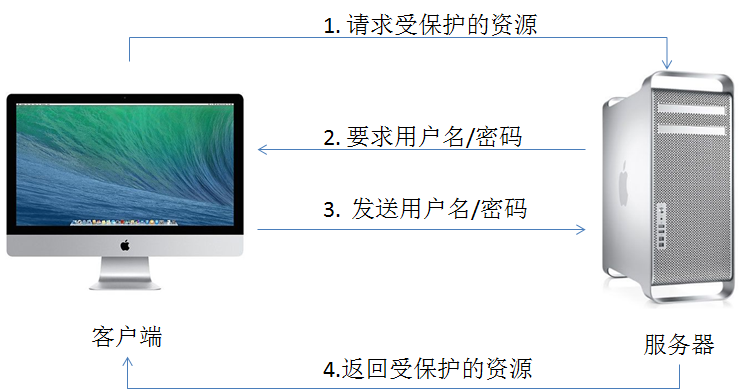
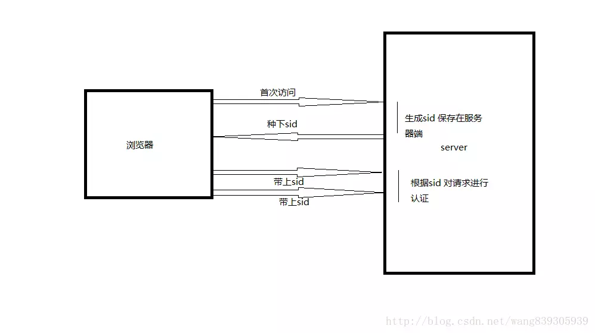
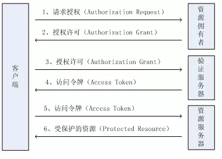

# web 鉴权方案

## base auth

## session-cookie

第一步：服务器在接受客户端首次访问时在服务器端创建seesion，然后保存seesion到内存当中，然后给这个session生成一个唯一的标识字符串,然后在响应头中种下这个唯一标识字符串。
  第二步：浏览器中收到请求响应的时候会解析响应头，然后将session_id保存在本地cookie中，浏览器在下次http请求时请求头中会带上该域名下的cookie信息
  第三步：服务器在接受客户端请求时会去解析请求头cookie中的session_id，然后根据这个session_id去找服务器端保存的该客户端的session，然后判断该请求是否合法.

## Token 验证

第一步：客户端使用用户名跟密码请求登录；
  第二步：服务端收到请求，去验证用户名与密码；
  第三步：验证成功后，服务端会签发一个 Token，再把这个 Token 发送给客户端；
  第四步：客户端收到Token以后可以把它存储起来，比如放在Cookie 里或者Local Storage里；
  第五步：客户端每次向服务端请求资源的时候需要带着服务端签发的Token；
  第六步：服务端收到请求，然后去验证客户端请求里面带着的 Token，如果验证成功，就向客户端返回请求的数据。

## OAuth

 第一步：向用户请求授权，而当我们点击等第三方入口时，第三方授权服务会引导我们进入第三方登陆授权页面；
  第二步：当用户点击授权并登陆后，授权服务器将生成一个用户凭证（code）。这个用户凭证会附加在重定向的地址redirect_uri的后面；
  第三步：用户再去请求时携带用户凭证（code），验证服务器返回一个访问令牌（Access Token）；
  第四步：再去拿着令牌请求资源时，就会得到受保护的资源信息。

## 引用

1. [前端鉴权方案](https://juejin.im/post/5dd140c36fb9a01fdb4b6619)
1. [详解BASIC认证](https://blog.51cto.com/favccxx/1875027)
