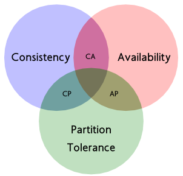

# Consistency in Distributed System

## CAP理论和BASE理论

### CAP理论

谈及分布式系统，就不能不提到 CAP 理论，CAP 理论由 Berkeley 的计算机教授 Eric Brewer 在2000年提出，其核心思想是任何基于网络的数据共享系统最多只能满足数据一致性  (Consistency)、可用性 (Availability) 和网络分区容忍 (Partition Tolerance) 三个特性中的两个

- **一致性（Consistency）**：一致性，这个和数据库ACID的一致性类似，但这里关注的是所有数据节点上的数据一致性和正确性，而数据库的ACID关注的是在一个事务内，对数据的一些约束。系统在执行过某项操作后仍然处于一致的状态。在分布式系统中，更新操作执行成功后所有的用户都应该读取到最新值。
- **可用性（Availability）**：每一个操作总是能够在一定时间内返回结果。需要注意"一定时间"和"返回结果"。"一定时间"是指，系统结果必须在给定时间内返回。"返回结果"是指系统返回操作成功或失败的结果。
- **分区容忍性（Partition Tolerance）**：是否可以对数据进行分区。这是考虑到性能和可伸缩性。
在分布式系统中，同时满足"CAP定律"中的"一致性"、"可用性"和"分区容错性"三者是不可能的。在互联网应用的绝大多数的场景，都需要牺牲强一致性来换取系统的高可用性，系统往往只需要保证"最终一致性"，只要这个最终时间是在用户可以接受的范围内即可。

### BASE理论

BASE是Basically Available（基本可用）、Soft state（软状态）和Eventually consistent（最终一致性）三个短语的缩写。BASE理论是对CAP中一致性和可用性权衡的结果， 是基于CAP定理逐步演化而来的。BASE理论的核心思想是：**即使无法做到强一致性，但每个应用都可以根据自身业务特点，采用适当的方式来使系统达到最终一致性。**

- **基本可用**: 基本可用是指分布式系统在出现不可预知故障的时候，允许损失部分可用性。注意，这绝不等价于系统不可用。
- **软状态**： 软状态是指允许系统存在中间状态，并且该中间状态不会影响系统整体可用性。即允许系统在不同节点间副本同步的时候存在延时。
- **最终一致性**：系统中的所有数据副本经过一定时间后，最终能够达到一致的状态，不需要实时保证系统数据的强一致性。最终一致性是弱一致性的一种特殊情况。

### 其他一致性模型

- **强一致性**: 当更新操作完成之后，任何多个后续进程或者线程的访问都会返回最新的更新过的值。这种是对用户最友好的，就是用户上一次写什么，下一次就保证能读到什么。根据 CAP 理论，这种实现需要牺牲可用性。
- **弱一致性**： 系统并不保证跨进程或者线程的访问都会返回最新的更新过的值。系统在数据写入成功之后，不承诺立即可以读到最新写入的值，也不会具体的承诺多久之后可以读到。
- **最终一致性**：弱一致性的特定形式。系统保证在没有后续更新的前提下，系统最终返回上一次更新操作的值。在没有故障发生的前提下，不一致窗口的时间主要受通信延迟，系统负载和复制副本的个数影响。DNS 是一个典型的最终一致性系统。

## 引用

1. [克莱因瓶：分布式系统数据一致性的解决方案](https://www.cnblogs.com/wangweitr/p/7505712.html)