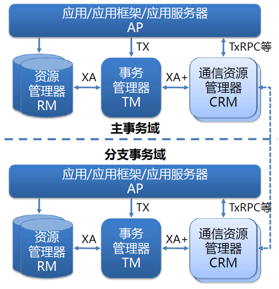
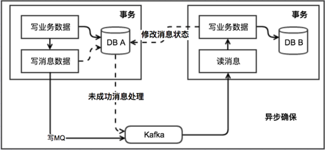
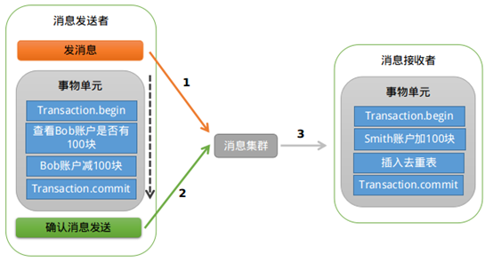

# 分布式事务

## 两阶段提交协议（Two-phase Commit，2PC）

两阶段提交协议（Two-phase Commit，2PC）经常被用来实现分布式事务。一般分为协调器和若干事务执行者两种角色。这里的事务执行者就是具体的数据库，抽象点可以说是可以控制给数据库的程序。 协调器可以和事务执行器在一台机器上。

在分布式系统中，每个节点虽然可以知晓自己的操作的成功或者失败，却无法知道其他节点的操作的成功或失败。当一个事务跨越多个节点时，为了保持事务的ACID特性，需要引入一个作为协调者的组件来统一掌控所有节点(称作参与者)。

这种实现方式实现比较简单，比较适合传统的单体应用，在同一个方法中存在跨数据库操作的情况。但是因为两阶段的提交会创建多次节点的网络通信，通信时间变长后，事务的时间也相对变长，锁定的资源时间也变长，造成资源等待时间也变长，这会带来严重的性能问题，因此大部分高并发服务往往都避免使用二阶段提交协议，所以后来业界又引入了三阶段提交协议来解决该类问题。

## 非事务型消息队列+本地消息表

### 实现

1. 消息生产方，需要额外建一个消息表，并记录消息发送状态。消息表和业务数据要在一个事务里提交。
1. 消息消费方：处理消息并完成自己的业务逻辑。此时如果本地事务处理成功，那发送给生产方一个confirm消息，表明已经处理成功了。如果处理失败，则将消息放回MQ。
1. 生产方定时扫描本地消息表，把还没处理完成的消息重新发送一遍，直到本地消息表中记录的该消息为已成功状态。

通过上图可以看出，消费方会面临一个问题就是，当消费方完成本地事务处理，给生产方发送CONFIRM消息失败时，生产方由于本地消息表的消息状态没有更新，会进行重试，那么这时候就存在了消息重复投递的问题，这时候消费方收到重复投递过来的消息后，要保证消费者调用业务的服务接口的幂等性，即：如果重复消费，也不能因此影响业务结果，同一消息多次被执行会得到相同的结果。

这种方式的根本原理就是：将分布式事务转换为多个本地事务，然后依靠重试等方式达到最终一致性。这种方式比较常见。如果MQ自身和业务都具有高可用性，理论上是可以满足大部分的业务场景的。但是由于可能存在的长时间处于中间状态，不建议交易类业务直接使用。

## 事务型消息队列

### 下面以阿里巴巴的RocketMQ中间件为例，分析下其设计和实现思路。

RocketMQ第一阶段发送Prepared消息时，会拿到消息的地址，第二阶段执行本地事物，第三阶段通过第一阶段拿到的地址去访问消息，并修改状态。细心的读者可能又发现问题了，如果确认消息发送失败了怎么办？RocketMQ会定期扫描消息集群中的事物消息，这时候发现了Prepared消息，它会向消息发送者确认，Bob的钱到底是减了还是没减呢？如果减了是回滚还是继续发送确认消息呢？RocketMQ会根据发送端设置的策略来决定是回滚还是继续发送确认消息。这样就保证了消息发送与本地事务同时成功或同时失败。

## 引用

1. [克莱因瓶：分布式系统数据一致性的解决方案](https://www.cnblogs.com/wangweitr/p/7505712.html)