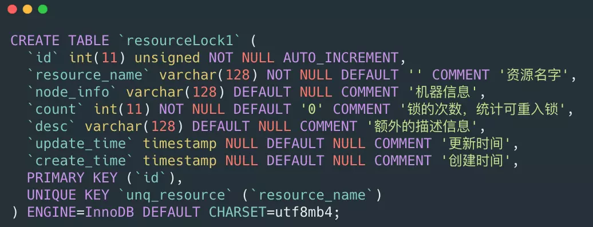

# 分布式锁

## 使用 MySQL 实现分布式锁

创建一个锁表，使用 for update 语句，利用悲观锁的原理实现分布式锁。

## 使用 Redis 的 setNx 实现分布式锁

1. 使用Redis的setNx命令实现分布式锁
1. 设置超时时间保证持有锁的线程意外退出后锁可以正常释放
1. 如果持有锁的线程需要长时间的处理后才能释放锁
    1. 设置足够长的超时时间
    1. 持有锁的线程在进行一些需要很长处理时间的任务时修改锁的超时时间
    1. 创建一个守护线程，保证在持有锁正常运行的情况下自动续期锁

## 引用

1. [再有人问你分布式锁，这篇文章扔给他](https://juejin.im/post/5bbb0d8df265da0abd3533a5)