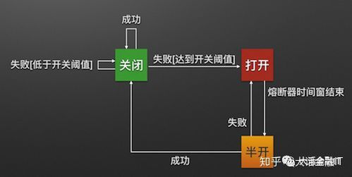
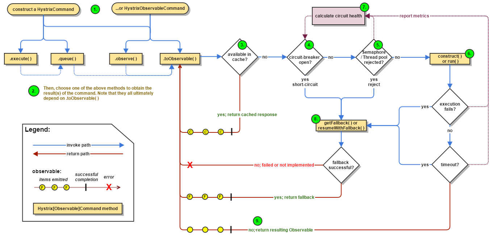

熔断模式是阻止应用继续尝试无意义的请求

熔断模式可以按找：关闭、打开、半开，三个状态来模仿一个断路器的实现，如下图所示，熔断器模式定义了熔断器开关相互转换的逻辑

- 关闭： 应用的请求已经路由到了这个操作。代理应该维护最近一段时间的错误信息，如果调用操作失败，那么大力增加这个错误信息的数量。如果这个错误数量超过给定时间的阈值，代理进入到打开状态。这个时候，代理启动一个超时的Timer，大概Timer过期了，代理进入半开状态。超时Timer的目的是为了给系统一段时间来自我修复之前碰到的问题。
- 打开：令可能失败的外部调用操作立刻失败，所有的外部调用直接抛异常给应用。
- 半开：只有一定数量的应用请求可以进行操作的调用。如果这些请求成功了，那么就假定之前出现的错误已经被系统自动修复了，而熔断转换成关闭状态（同时重置错误计数器）。如果任何请求失败了，那么熔断器会假定错误仍然存在，会重新转换成打开状态，并重启超时Timer给系统更多的时间来自我修复错误。

Hystrix

