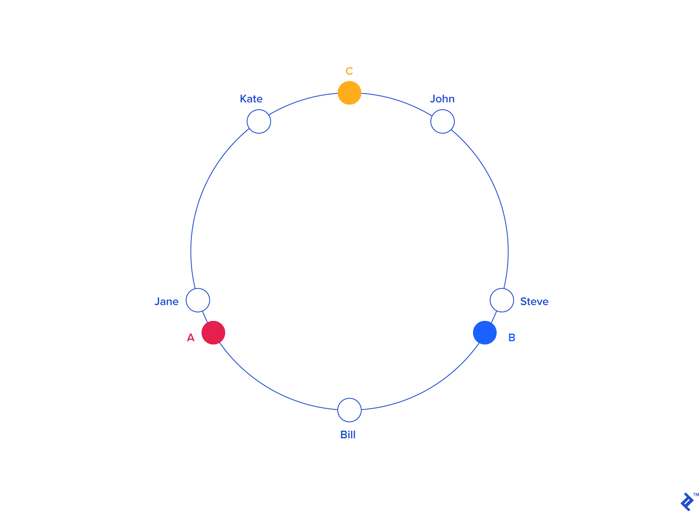

## Consistent Hashing

### What Is Hashing?

What is “hashing” all about? Merriam-Webster defines the noun hash as “chopped meat mixed with potatoes and browned,” and the verb as “to chop (as meat and potatoes) into small pieces.” So, culinary details aside, hash roughly means “chop and mix”—and that’s precisely where the technical term comes from.

### Introducing Hash Tables (Hash Maps)

Assuming that searching by ID were acceptable, we could place all members in an array, with their indexes matching their IDs (for example, a member with ID=10 would be at the index 10 in the array). This would allow us to access each member directly, with no search at all. That would be very efficient, in fact, as efficient as it can possibly be, corresponding to the lowest complexity possible, O(1), also known as constant time.

### Scalling Out: Distributed Hashing

In some situations, it may be necessary or desirable to split a hash table into several parts, hosted by different servers. One of the main motivations for this is to bypass the memory limitations of using a single computer, allowing for the construction of arbitrarily large hash tables (given enough servers).

### The Rehashing Problem

This distribution scheme is simple, intuitive, and works fine. That is, until the number of servers changes. What happens if one of the servers crashes or becomes unavailable? Keys need to be redistributed to account for the missing server, of course. The same applies if one or more new servers are added to the pool;keys need to be redistributed to include the new servers. This is true for any distribution scheme, but the problem with our simple modulo distribution is that when the number of servers changes, most hashes modulo N will change, so most keys will need to be moved to a different server. So, even if a single server is removed or added, all keys will likely need to be rehashed into a different server.

So, most queries will result in misses, and the original data will likely need retrieving again from the source to be rehashed, thus placing a heavy load on the origin server(s) (typically a database). This may very well degrade performance severely and possibly crash the origin servers.

### The Solution: Consistent Hashing

Consistent Hashing is a distributed hashing scheme that operates independently of the number of servers or objects in a distributed hash table by assigning them a position on an abstract circle, or hash ring. This allows servers and objects to scale without affecting the overall system.

Imagine we mapped the hash output range onto the edge of a circle. That means that the minimum possible hash value, zero, would correspond to an angle of zero, the maximum possible value (some big integer we’ll call INT\_MAX) would correspond to an angle of 2𝝅 radians (or 360 degrees), and all other hash values would linearly fit somewhere in between. So, we could take a key, compute its hash, and find out where it lies on the circle’s edge. Assuming an INT\_MAX of 1010 (for example’s sake), the keys from our previous example would look like this:

Now imagine we also placed the servers on the edge of the circle, by pseudo-randomly assigning them angles too. This should be done in a repeatable way (or at least in such a way that all clients agree on the servers’ angles). A convenient way of doing this is by hashing the server name (or IP address, or some ID)—as we’d do with any other key—to come up with its angle.

In our example, things might look like this:

Since we have the keys for both the objects and the servers on the same circle, we may define a simple rule to associate the former with the latter: Each object key will belong in the server whose key is closest, in a counterclockwise direction (or clockwise, depending on the conventions used). In other words, to find out which server to ask for a given key, we need to locate the key on the circle and move in the ascending angle direction until we find a server.

In our example:

To ensure object keys are evenly distributed among servers, we need to apply a simple trick: To assign not one, but many labels (angles) to each server. So instead of having labels A, B and C, we could have, say, A0 .. A9, B0 .. B9 and C0 .. C9, all interspersed along the circle. The factor by which to increase the number of labels (server keys), known as weight, depends on the situation (and may even be different for each server) to adjust the probability of keys ending up on each. For example, if server B were twice as powerful as the rest, it could be assigned twice as many labels, and as a result, it would end up holding twice as many objects (on average).

For our example we’ll assume all three servers have an equal weight of 10 (this works well for three servers, for 10 to 50 servers, a weight in the range 100 to 500 would work better, and bigger pools may need even higher weights):

So, what’s the benefit of all this circle approach? Imagine server C is removed. To account for this, we must remove labels C0 .. C9 from the circle. This results in the object keys formerly adjacent to the deleted labels now being randomly labeled Ax and Bx, reassigning them to servers A and B.

But what happens with the other object keys, the ones that originally belonged in A and B? Nothing! That’s the beauty of it: The absence of Cx labels does not affect those keys in any way. So, removing a server results in its object keys being randomly reassigned to the rest of the servers, leaving all other keys untouched:

Something similar happens if, instead of removing a server, we add one. If we wanted to add server D to our example (say, as a replacement for C), we would need to add labels D0 .. D9. The result would be that roughly one-third of the existing keys (all belonging to A or B) would be reassigned to D, and, again, the rest would stay the same:

## Implementation

### Mapping

In order to accomplish the first part above, we need the following:
- A hash function for computing the position in the ring given an identifier for requests.
- A way to find out which node corresponds to a hashed request.

To find out the node corresponding to a particular request, we can use a simple data structure for it's representation, comprising of the following:
- An array of hashes that correspond to nodes in the ring.
- A map (hash table) for finding the node corresponding to a particular request.

This is essentially a primitive representation of an orderen map.

To find a node responsible for a given hash in the above structure, we need to:
- Perform a modified binary search to find the first node-hash in the array that is equal to or greater than (>=) the hash you wish to look up.
- Look up the node corresponding to the found node-hash in the map.

### Addition or removal of a node

As we saw in the begining of the article, when a new node is added, some portion of the hashring, comprising of various requests, must be assigned to that node. Conversely, when a node is removed, the requests that had been assigned to that node will need to be handled by some other node.

### How do we find those the requests that are affected by a ring change?

One solution is to iterate through all the requests allocated to a node. For each request, we devide whether it falls within the bounds of the ring change that hash occurred, and move it elsewhere if necessary.

However, the work required to do this increases as the number of requests allocated to a given node scales. The situation becomes worse as the number of ring changes that occur tends to increase as the number of nodes increases. In the worst case, since ring changes are often related to localised failures, an instantaneous load associated with a ring change could increase the likelihood of other affected nodes as well, possibly leading to cascading issues across the system.

To counter this, we would like relocation of requests to be as efficient as possible. Ideally, we'd store all requests in a data structure that allows us to find those affected by s single hash change anywhere on the ring.

### Efficiently finding affected hashes

Adding or removing a node from the cluster will change the allocation of requests in some portion of the ring, which we will refer to as the **affected range**. If we know the boouds of the affected range, we will be able to move the requests to their correct location.

To find the bounds of the affected range, starting at the hash H of the added or removed node, we can move backwards (counter-clockwise in the diagram) around the ring from H until another node is found. Let's call the hash of this node S (for start). The requests that are anti-clockwise of this node will be located to it, so they won't affected.

**Note that this is a simplified depiction of what happens; in practice, the structure, and algorithm, are further complicated because we use replication factors of greater than, 1 and specialised replication strategies in which only a subset of nodes is applicable to any given request.**
 
The requests that have placement hashes in the range between the found node and the node that was added (or removed) are those that need to be moved.

### Efficiently finding the requests in the affected range

One solution is simply to iterate through all the requests corresponding to a node, and update the ones that have a hash within the range.

In JavaScript that might look something like this:for (const request of requests) {  if (contains(S, H, request.hash)) {    /* the request is affected by the change */    request.relocate();  }}function contains(lowerBound, upperBound, hash) {   const wrapsOver = upperBound < lowerBound;   const aboveLower = hash >= lowerBound;   const belowUpper = upperBound >= hash;   if (wrapsOver) {     return aboveLower || belowUpper;   } else {     return aboveLower && belowUpper;   }}

Since the ring is circular, it is not enough to just find requests where S <= r < H, since S may be greater than H (meaning that the range wraps over the top of the ring). The function contains() handles that case.

Iterating through all the requests on a given node is fine as long as the number of requests is relatively low or if the addition or removal of nodes is relatively rare.

However, the work required increases as the number of requests at a given node grows, and worse, ring changes tend to occur more frequently as the number of nodes increases, whether due to automated scaling or failover, triggering simultaneous load across the system to rebalance the requests.

In the worst case, load associated with this may increase the likelihood of failures on other nodes, possibly leading to cascading issues across the system.

To mitigate this, we can also store requests in a separate ring data-structure similar to the one discussed earlier. In this ring, a hash maps directly to the request that is located at that hash.

Then we can locate the requests within a range by doing the following:

- Locate the first request following the start of the range, S.
- Iterate clockwise until you find a request that has a hash outside the range.
- Relocate those requests that were inside the range.

The number of requests that need to be iterated for a given hash update will on average be R/N where R is the number of requests located in the range of the node and N is the number of hashes in the ring, assuming an even distribution of requests.

## 引用

1. [toptal: A Guide to Consistent Hashing](https://www.toptal.com/big-data/consistent-hashing)
2. [ably: How we efficiently implemented consistent hashing](https://www.ably.io/blog/implementing-efficient-consistent-hashing/)