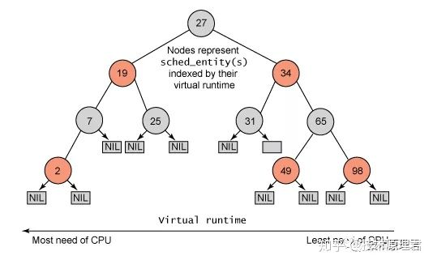

# linux scheduler

Linux内核有两个调度类：CFS和实时调度类。普通任务使用 CFS 策略，实时任务使用实时调度。

## CFS

CFS 调度程序并不采用严格规则来为一个优先级分配某个长度的时间片，而是为每个任务分配一定比例的 CPU 处理时间。每个任务分配的具体比例是根据nice值来计算的。nice值的范围从 -20 到 +19，数值较低的nice值表示较高的相对优先级。具有较低nice值的任务，与具有较高nice值的任务相比，会得到更高比例的处理器处理时间。默认nice值为 0。

为什么叫nice？当一个任务增加了它的nice，说明它的优先级降低了，进而对其他任务变得nice

CFS 调度程序没有直接分配优先级。相反，它通过每个任务的变量 vruntime 以便维护虚拟运行时间，进而记录每个任务运行多久。虚拟运行时间与基于任务优先级的衰减因子有关，更低优先级的任务比更高优先级的任务具有更高衰减速率。对于正常优先级的任务（nice值为 0），虚拟运行时间与实际物理运行时间是相同的。下面分析一下 CFS 调度程序是如何工作的。

假设有两个任务，它们具有相同的nice值。一个任务是 I/O 密集型而另一个为 CPU 密集型。通常，I/O 密集型任务在运行很短时间后就会阻塞以便等待更多的 I/O；而 CPU 密集型任务只要有在处理器上运行的机会，就会用完它的时间片。

因此，I/O 密集型任务的虚拟运行时间最终将会小于 CPU 密集型任务的，从而使得 I/O 密集型任务具有更高的优先级。这时，如果 CPU 密集型任务在运行，而 I/O 密集型任务变得有资格可以运行（如该任务所等待的 I/O 已成为可用)，那么 I/O 密集型任务就会抢占 CPU 密集型任务。

### CFS 性能

Linux CFS 调度程序釆用高效算法，以便选择运行下个任务。每个可运行的任务放置在红黑树上（这是一种平衡的、二分搜索树，它的键是基于虚拟运行时间的）。这种树如下图所示：

当一个任务变成可运行时，它被添加到树上。当一个任务变成不可运行时（例如，当阻塞等待 I/O 时），它从树上被删除。一般来说，得到较少处理时间的任务（虚拟运行时间较小）会偏向树的左侧；得到较多处理时间的任务会偏向树的右侧。

根据二分搜索树的性质，最左侧的结点有最小的键值；从 CFS 调度程序角度而言，这也是具有最高优先级的任务。由于红黑树是平衡的，找到最左侧结点会需要 O(lgN) 操作（这里 N 为树内结点总数）。不过，为高效起见，Linux 调度程序将这个值缓存在变量 rb_leftmost 中，从而确定哪个任务运行只需检索缓存的值。

## 实时调度

在某些情况下我们需要进程或者说任务被实时执行，比如直升机驾驶时，指令需要被实时执行。或者桌面应用交互时，也要求比较高的实时性，保证用户体验。

采用 SCHED_FIFO 或 SCHED_RR 实时策略来调度的任何任务，与普通（非实时的）任务相比，具有更高的优先级。

Linux 采用两个单独的优先级范围，一个用于实时任务，另一个用于正常任务。实时任务分配的静态优先级为 0〜99，而正常任务分配的优先级为 100〜139。

这两个值域合并成为一个全局的优先级方案，其中较低数值表明较高的优先级。正常任务，根据它们的nice值，分配一个优先级；这里 -20 的nice值映射到优先级 100，而 +19 的nice值映射到 139。下图显示了这个方案。

## 引用

1. [Linux进程调度：完全公平调度器CFS](https://zhuanlan.zhihu.com/p/72754729)
1. [Linux 调度器学习](https://zhuanlan.zhihu.com/p/95876285)